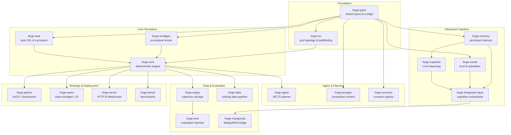

# FORGE

**Fast Open-source Runtime for Generalist Environments**

[](LICENSE)
[](https://www.rust-lang.org/)
[](https://www.python.org/)

A high-performance simulation platform for training and evaluating AI agents, built in Rust with first-class Python and WebAssembly bindings. FORGE provides procedurally generated grid worlds with crafting, combat, multi-agent cooperation, and a composable task curriculum — all running at 130,000+ steps/second from Python.

## Key Features

- **Blazing fast**: 130K+ steps/sec from Python, <8 μs/step including PyO3 overhead
- **Deterministic**: Same seed + actions = byte-identical results. Uses fixed-point arithmetic and `rand_pcg` for RNG
- **Procedural worlds**: Perlin noise terrain with biome classification, resource distribution, and object placement
- **Topology-aware worlds**: Configurable square and hex grids via `forge-civ`, with shared line-of-sight, distance, and pathfinding primitives
- **Rich interaction**: 6 resource types, 9 crafting recipes, combat, push mechanics, day/night cycle
- **Multi-agent**: PettingZoo Parallel API for cooperative/competitive scenarios with communication
- **Task curriculum**: Composable task DSL with 6 difficulty tiers and adaptive difficulty scaling
- **MCTS planning**: Built-in Monte Carlo Tree Search agent with configurable PUCT exploration
- **MangoMAS bridge**: Config-driven curriculum, constitutional pre-training, curiosity-weight search, batch episode collection, and MCTS sweep utilities under `python/forge/mangomas/`
- **Cross-platform**: Native Python bindings (PyO3/maturin) and WebAssembly bindings (wasm-bindgen)
- **Zero allocation hot path**: `WorldState::step()` is designed to avoid heap allocation
- **Structured tracing**: `#[instrument]` on public functions throughout with `tracing` crate
- **Coverage-hardened surfaces**: focused regression tests cover Python fallback imports, vector envs, feature extractors, MangoMAS bridge modules, and Rust edge paths in planning/task evaluation
- **Coverage-gated Python CI**: `pytest` now enforces `--cov-fail-under=85` for the Python package surface

## Quick Start

### Prerequisites

- Rust 1.75+ (`rustup`)
- Python 3.9+
- [maturin](https://github.com/PyO3/maturin) (`pip install maturin`)
- numpy (`pip install numpy`)

### Build and Install

```bash
# Clone the repository
git clone https://github.com/ianshank/FORGE.git
cd FORGE

# Build and install the Python extension
maturin build --release -m crates/forge-python/Cargo.toml
pip install target/wheels/*.whl

# Verify installation
python -c "from forge_env import ForgeEnv; print('FORGE is ready!')"
```

### Hello World

```python
from forge_env import ForgeEnv

env = ForgeEnv()
obs, info = env.reset(seed=42)

for _ in range(100):
    action = 1  # Move Up
    obs, reward, terminated, truncated, info = env.step(action)
    if terminated or truncated:
        obs, info = env.reset(seed=42)

print(env.render())
```

### Run the Demo

```bash
python examples/forge_demo.py              # Full interactive demo
python examples/forge_demo.py --quick      # CI mode (no delays)
python examples/forge_demo.py --section crafting  # Single section
```

### MangoMAS Collection And Pipeline

```bash
# Collect FORGE episodes for MangoMAS transfer
python scripts/train.py \
    --agent mangomas-collect \
    --episodes 8 \
    --scenario hex_patrol \
    --collection-policy mcts \
    --mangomas-config configs/mangomas/default.toml \
    --collection-report-path artifacts/mangomas/collection.json

# Collect episodes and run the stage-based MangoMAS pipeline
python scripts/train.py \
    --agent mangomas \
    --episodes 12 \
    --scenario patrol \
    --mangomas-config configs/mangomas/default.toml \
    --pipeline-run-name drone-smoke
```

The stage pipeline writes manifests, logs, and exported weight bundles under `artifacts/mangomas/` by default.

## Architecture

FORGE is a 23-crate Rust workspace organized in six layers, from shared foundations through cognitive systems to bindings and deployment targets.



```
FORGE/
├── crates/          # 23 Rust crates (see diagram above)
├── python/          # forge_env wrappers, forge training package
├── configs/         # TOML configuration files
├── scripts/         # CLI tools (train, evaluate, demo, replay, export)
├── dashboard/       # React/TypeScript real-time dashboard
├── demo_ui/         # Lightweight SSE-based demo web UI
├── docker/          # Docker Compose deployment
├── examples/        # Python demo scripts
├── docs/            # C4 architecture diagrams
└── tests/           # Integration and Python tests
```

For full C4 architecture diagrams, see [`docs/architecture.md`](docs/architecture.md).

## Environment API

### Observation Space

| Key | Shape | Dtype | Description |
|-----|-------|-------|-------------|
| `grid_view` | `(11, 11, 7)` | `uint8` | 7-channel tile features in agent's vision radius |
| `inventory` | `(capacity, 2)` | `uint16` | `(item_type, count)` per slot; 255 = empty |
| `health` | `()` | `float32` | Normalized health `[0.0, 1.0]` |
| `stamina` | `()` | `float32` | Normalized stamina `[0.0, 1.0]` |
| `position` | `(2,)` | `uint16` | Agent's `(x, y)` grid coordinates |
| `messages` | `(buffer,)` | `uint16` | Received communication tokens |
| `day_phase` | `()` | `uint8` | `0`=Dawn, `1`=Day, `2`=Dusk, `3`=Night |

**Grid view channels** (per tile): terrain, has_agent, has_object, has_resource, elevation, object_type, resource_type.

### Action Space

| Range | Action |
|-------|--------|
| `0` | Noop |
| `1-4` | Move (Up, Down, Left, Right) |
| `5` | Pick Up resource at current tile |
| `6-15` | Drop item from inventory slot 0-9 |
| `16-25` | Use item from inventory slot 0-9 |
| `26-34` | Craft recipe 0-8 |
| `35-38` | Push object (Up, Down, Left, Right) |
| `39` | Interact with adjacent object |
| `40+` | Communicate token (vocabulary-sized) |

When `world.grid_type = "Hex"`, the action space appends 6 hex-movement actions after any enabled drone and agricultural action blocks, so the final discrete size is configuration-dependent.

### Configuration

```python
config = {
    "world": {
        "width": 64,              # Grid width
        "height": 64,             # Grid height
        "grid_type": "Square",   # "Square" or "Hex"
        "seed": 42,               # World generation seed
        "biome_scale": 0.1,       # Noise frequency (higher = more detail)
        "resource_density": 0.3,  # Resource spawn probability
        "day_night_cycle_length": 1000,  # Ticks per full cycle
    },
    "agents": {
        "num_agents": 1,          # Number of agents
        "comm_vocab_size": 0,     # Communication vocabulary (0 = disabled)
    },
    "crafting": {
        "enabled": True,          # Enable crafting system
    },
    "task": {
        "max_episode_length": 1000,  # Steps before truncation
        "dense_rewards": True,       # Enable progress-based rewards
    },
}
env = ForgeEnv(config=config)
```

## Crafting System

FORGE ships with 9 default recipes:

| Recipe | Inputs | Output | Tier |
|--------|--------|--------|------|
| Axe | 2 Wood + 1 Stone | 1 Axe | 1 |
| Pickaxe | 2 Wood + 2 Stone | 1 Pickaxe | 1 |
| Plank | 2 Wood | 2 Plank | 1 |
| Bridge | 4 Plank | 1 Bridge | 2 |
| Sword | 1 Wood + 2 Ore | 1 Sword | 2 |
| Rope | 3 Fiber | 1 Rope | 1 |
| Brick | 2 Clay | 1 Brick | 1 |
| Torch | 1 Wood + 1 Fiber | 1 Torch | 1 |
| Shield | 2 Plank + 1 Ore | 1 Shield | 2 |

Resources spawn on terrain-appropriate tiles: Wood on Forest, Stone/Ore on Mountain (requires Pickaxe), Fish on Water, Fiber on Ground/Forest, Clay on Sand.

## World Generation

Worlds are procedurally generated using multi-octave Perlin noise:

1. **Terrain**: Two noise layers (elevation + moisture) classified into 7 biome types
2. **Resources**: Terrain-aware placement with configurable density
3. **Objects**: Boulders, crafting stations, containers, torches
4. **Spawn points**: Walkable tiles with Manhattan distance spreading

Biome thresholds are scale-responsive — increasing `biome_scale` creates more varied, detailed terrain.

## Task System

The task DSL supports composable objectives with 7 logical operators:

```
Atom(predicate)           — single goal (navigate, collect, etc.)
And([tasks])              — all must be completed
Or([tasks])               — any may be completed
Sequence([tasks])         — must be completed in order
Before(task, deadline)    — must complete before tick N
While(condition, goal)    — maintain condition while achieving goal
Without(task, action)     — achieve without using forbidden action
```

**10 predicates**: AgentAt, AgentHas, AgentNear, AgentOnTerrain, TimeElapsed, HealthAbove, ResourceCount, TeamAlive, ObjectAt, ObjectInState.

**6 difficulty tiers** with adaptive curriculum that adjusts task distribution based on agent success rate.

## Multi-Agent

```python
from forge_env import ForgeParallelEnv

env = ForgeParallelEnv(config={
    "agents": {"num_agents": 3, "comm_vocab_size": 8},
    "world": {"width": 32, "height": 32},
})

observations, infos = env.reset()
for agent_id in env.agents:
    action = env.action_space(agent_id)  # Get space
    # ... select action per agent
```

## MCTS Planning

```python
# Conceptual usage (Rust-side API)
from forge_agent import MctsAgent, MctsConfig, UniformPolicy, DefaultForwardModel

config = MctsConfig(
    num_simulations=100,
    c_puct=1.41,
    max_depth=50,
    discount=0.99,
    temperature=1.0,
)
```

The MCTS planner uses PUCT selection (`Q(s,a) + c * P(s,a) * sqrt(N_parent) / (1 + N_child)`), pluggable policy/value functions, and the forward model for state simulation.

## Python Wrappers

| Wrapper | Purpose |
|---------|---------|
| `ForgeGymnasiumEnv` | Single-agent [Gymnasium](https://gymnasium.farama.org/) compatibility |
| `ForgeParallelEnv` | Multi-agent [PettingZoo](https://pettingzoo.farama.org/) Parallel API |
| `ForgeJaxEnv` | JAX-vectorized batched environment for hardware acceleration |
| `FlattenObservationWrapper` | Dict obs → 1D float32 array |
| `NormalizeRewardWrapper` | Running mean/variance reward normalization |
| `TimeLimit` | Episode step limit with truncation |
| `RecordEpisodeStatistics` | Track episode return, length, and wall-clock time |

## WebAssembly

```javascript
import { ForgeWasmEnv } from 'forge_wasm';

const env = new ForgeWasmEnv('{"world": {"width": 32, "height": 32}}');
const obsJson = env.reset(42);
const stepJson = env.step(1); // Move Up
console.log(env.render_ascii());
```

All WASM I/O uses JSON strings for JavaScript compatibility.

## Interactive Demo UI

Launch a dark-mode web UI that streams live FORGE output in a browser:

```bash
# Windows (one-click launcher — installs deps, starts server, opens browser)
.\demo_ui\run_demo.ps1

# Or manually:
python -m pip install -r demo_ui/backend/requirements.txt
python -m uvicorn demo_ui.backend.main:app --host 127.0.0.1 --port 8765
# Then open http://127.0.0.1:8765
```

**Features:** Live terminal streaming via SSE, ASCII world canvas with colored tiles, real-time stats panel (steps/sec, seed, progress), section navigation, PASS/FAIL badges, and quick mode toggle.

## MangoMAS Integration

FORGE includes a Python-side MangoMAS bridge for training and evaluation workflows that need a configurable control plane on top of the deterministic Rust simulator.

- `python/forge/mangomas/config.py` — bridge defaults for action adaptation, observation shaping, curriculum tiers, constitutional constraints, curiosity channels, batch collection, and MCTS sweep bounds
- `python/forge/mangomas/constitutional_trainer.py` — maps safety signals into constitutional penalties for offline pre-training
- `python/forge/mangomas/curriculum_controller.py` — manages tier progression using rolling success windows
- `python/forge/mangomas/curiosity_optimizer.py` — lightweight evolutionary search over curiosity-channel weights
- `python/forge/mangomas/batch.py` and `sweep_runner.py` — batch episode collection and repeatable MCTS parameter sweeps

## Development

```bash
# Build all crates
cargo build --workspace

# Run all tests (2,186+ Rust library tests + 29 integration tests)
cargo test --workspace

# Lint (must pass with zero warnings)
cargo clippy --workspace --all-targets -- -D warnings

# Format
cargo fmt --check

# Run benchmarks
cargo bench -p forge-bench

# Python tests (requires maturin develop first)
maturin develop
pytest tests/python/ -v

# Focused PR validations used on this branch
cargo test -p forge-task predicate
cargo test -p forge-agent search
pytest tests/python/test_forge_env.py tests/python/test_feature_extractors.py tests/python/test_vecenv.py -q

# Python lint + type check
ruff check python/ tests/python/ scripts/ demo_ui/
mypy python/ scripts/ --config-file pyproject.toml
```

## Performance

Benchmarked on a single core:

| Metric | Value |
|--------|-------|
| Steps/second (from Python) | 130,000+ |
| Microseconds/step | ~7.5 μs |
| World creation (64x64) | ~3.5 ms |
| Zero-alloc step | Yes (hot path) |

The simulation engine uses fixed-point arithmetic (`fixed` crate) for deterministic physics and `Pcg64Mcg` for fast, reproducible random number generation.

## Examples

| File | Description |
|------|-------------|
| [`forge_demo.py`](examples/forge_demo.py) | Comprehensive 8-section showcase of all capabilities |
| [`basic_navigation.py`](examples/basic_navigation.py) | Random walk with position/health/stamina tracking |
| [`crafting_demo.py`](examples/crafting_demo.py) | Resource gathering and crafting system |
| [`multi_agent_coop.py`](examples/multi_agent_coop.py) | PettingZoo multi-agent cooperation |
| [`mcts_planning.py`](examples/mcts_planning.py) | Monte Carlo Tree Search planning concept |
| [`train_ppo.py`](examples/train_ppo.py) | PPO training with Stable Baselines3 integration |
| [`train_sac_cleanrl.py`](examples/train_sac_cleanrl.py) | Config-driven discrete SAC training with CleanRL-style structure |

## Scripts

| File | Description |
|------|-------------|
| [`scripts/train.py`](scripts/train.py) | Training loop with checkpointing |
| [`scripts/evaluate.py`](scripts/evaluate.py) | Model evaluation and metrics |
| [`scripts/demo.py`](scripts/demo.py) | Launch demo server |
| [`scripts/replay_viewer.py`](scripts/replay_viewer.py) | Replay visualization tool |
| [`scripts/export_edge.py`](scripts/export_edge.py) | Export models for edge deployment |

## Configuration

FORGE uses TOML configuration files under `configs/`:

```
configs/
├── agents/          # Agent configs (mappo_default, mcts_default, hybrid_default, mousedroid)
├── cognitive/       # Cognitive system configs
├── curriculum/      # Curriculum tiers (beginner, intermediate, advanced)
├── integration/     # Integration layer configs
├── mangomas/        # MangoMAS bridge configs (curriculum, constitutional, sweep)
├── memory/          # Memory system configs
├── scenarios/       # Scenario configs (patrol, escort, search_and_rescue, adversarial_recon, area_denial)
├── social/          # Social system configs
└── training/        # Training configs
```

All config structs derive `Clone, Debug, Serialize, Deserialize` and implement `Default` for programmatic use without config files.

## Docker

FORGE ships a production-ready three-service Docker Compose stack:

| Service | Image | URL | Description |
|---------|-------|-----|-------------|
| `simulation` | `rust:1.85` + `python:3.11-slim` | `http://localhost:8080` | Rust simulation server + `forge_env` native extension |
| `dashboard` | `node:20` → `nginx:1.27-alpine` | `http://localhost:3000` | React dashboard via nginx reverse proxy |
| `demo` | `python:3.11-slim` | `http://localhost:8765` | FastAPI/uvicorn demo UI |

```bash
# Build all images and start the stack
docker compose -f docker/docker-compose.yml up -d --build

# Check service health
docker compose -f docker/docker-compose.yml ps

# View logs
docker compose -f docker/docker-compose.yml logs -f

# Stop
docker compose -f docker/docker-compose.yml down
```

**Smoke test after startup:**

```bash
curl http://localhost:8080/health  # → {"status":"ok","uptimeSeconds":N}
curl -I http://localhost:3000/     # → HTTP/1.1 200 OK (React SPA)
curl http://localhost:8765/health  # → {"status":"ok"}
```

Ports are bound to `127.0.0.1` by default for security. The dashboard's nginx instance reverse-proxies `/api/` and `/ws` to the simulation service, so all traffic can be addressed through port 3000.

**Build individual images:**

```bash
docker build -f docker/Dockerfile -t forge-simulation .
docker build -f docker/Dockerfile.dashboard -t forge-dashboard .
docker build -f docker/Dockerfile.demo -t forge-demo .
```

## Project Stats

| | |
|---|---|
| Rust workspace | 23 crates (2,186+ unit tests, 29 integration tests) |
| Rust coverage | `cargo-tarpaulin` gated at 85% line coverage |
| Python surface | `forge_env` wrappers plus `forge` training, MangoMAS bridge, traces, and utilities |
| Python tests | 21 MangoMAS smoke tests, coverage-gated at 85% |
| Python lint | `ruff` + `mypy --strict` — 86 source files, 0 errors |
| CI pipeline | 10 GitHub Actions jobs (fmt, clippy, test, bench, coverage, python-lint, python-test, python-test-fast, demo-ui, docker) |
| Deployment | Docker Compose (3 services), GHCR multi-arch images (amd64 + arm64) |
| Dependencies | See [`Cargo.toml`](Cargo.toml) for full list |

## Developed By

Ian Cruickshank

## License

Apache-2.0. See [LICENSE](LICENSE) for details.
