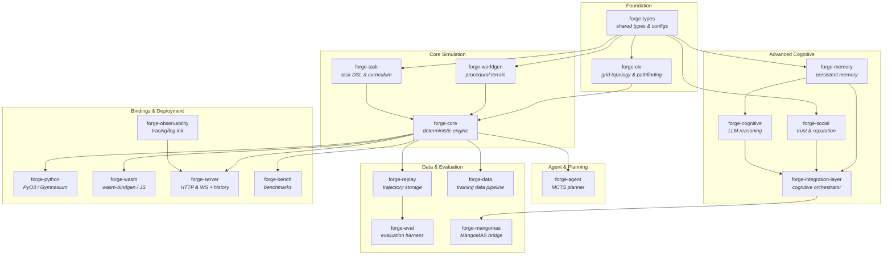

# FORGE

Fast Open-source Runtime for Generalist Environments

[](LICENSE)
[](https://www.rust-lang.org/)
[](https://www.python.org/)

A high-performance simulation platform for training and evaluating AI agents, built in Rust with first-class Python and WebAssembly bindings. FORGE provides procedurally generated grid worlds with crafting, combat, multi-agent cooperation, and a composable task curriculum — all running at 130,000+ steps/second from Python
([`cloud_agent` PyO3 measurement](benchmarks/baselines/cloud_agent/pyo3_step.json): 189k steps/sec). See [`BENCHMARKS.md`](BENCHMARKS.md) for every published number and its reproduction command.

See [`docs/CHARTER.md`](docs/CHARTER.md) for the project's mission, scope boundaries, and Seven Core Invariants.

## Versioning

GitHub Releases and GHCR image tags use **`v0.2.0`** as the public channel
tag for the first tagged cut. The Cargo workspace and the `forge-env` Python
wheel remain **`0.5.0`** (`pyproject.toml` reads the version from Cargo). The
two version lines are intentional: do not treat the GitHub tag as a crate
SemVer bump.

## Key Features

- **Blazing fast**: 130K+ steps/sec from Python, <8 μs/step including PyO3 overhead (189k / 5.3 μs measured on the labeled `cloud_agent` profile)
- **Deterministic**: Same seed + actions = byte-identical results. Uses fixed-point arithmetic and `rand_pcg` for RNG
- **Procedural worlds**: Perlin noise terrain with biome classification, resource distribution, and object placement
- **Topology-aware worlds**: Configurable square and hex grids via `forge-civ`, with shared line-of-sight, distance, and pathfinding primitives
- **Rich interaction**: 6 resource types, 9 crafting recipes, combat, push mechanics, day/night cycle
- **Multi-agent**: PettingZoo Parallel API for cooperative/competitive scenarios with communication
- **Cooperative swarm planning**: CTDE cooperative MCTS (`forge-mangomas::swarm`) that reuses the single-agent PUCT search to produce coordinated joint actions, with a centralized/independent critic and deterministic seeded sampling — a drop-in swap for the no-coordination baseline. See [`docs/architecture.md` §3.8.1](docs/architecture.md)
- **REST + WASM env API**: drive the simulation over HTTP (`POST /api/env/{reset,step}`, `GET /api/env/render`) or fully in-browser via WebAssembly — the two surfaces mirror the same JSON shapes
- **Live dashboard + persistent history**: `forge-server` accepts training metrics / decision traces (`POST /api/training-metrics`, `/api/decision-traces`), persists them to JSONL (configurable via `FORGE_SERVER_HISTORY_*`), and serves them back for the dashboard's Training/Runs/Live views via `GET /api/training-metrics/history`, `/api/decision-traces/history`, and `/api/runs` (with `runId`/`limit` filters)
- **Task curriculum**: Composable task DSL with 6 difficulty tiers and adaptive difficulty scaling
- **MCTS planning**: Built-in Monte Carlo Tree Search agent with configurable PUCT exploration
- **MangoMAS bridge**: Config-driven curriculum, constitutional pre-training, curiosity-weight search, batch episode collection, and MCTS sweep utilities under `python/forge/mangomas/`
- **LM Studio offline teacher**: Behavioural-cloning data pipeline driven by a locally-served Gemma 4 e4b / Qwen 2.5 14B (or any OpenAI-compatible endpoint). Every URL, timeout, retry-backoff base, init scale, numerical epsilon, and shard size flows through `TeacherConfig` / `BCTrainerConfig` / `OpenAIProvider` kwargs — no hard-coded values. See [`docs/architecture.md` §3.9](docs/architecture.md) for the full pipeline + config surface.
- **Cross-platform**: Native Python bindings (PyO3/maturin) and WebAssembly bindings (wasm-bindgen)
- **Zero allocation hot path**: `WorldState::step_into(&mut StepResult)` performs no heap allocations after warmup — verified in CI by `crates/forge-bench/src/bin/allocation_audit.rs` (a `dhat`-gated harness) and `benchmarks/runner/check_zero_alloc.py`. The audit sweeps `1,8,16,32,64,128` agents per action variant (override via `--agents` or `FORGE_BENCH_AGENT_COUNTS`) so the contract holds under fan-out, not just at `num_agents=1`. The convenience `step()` wrapper allocates a fresh `StepResult`; pass a reused buffer via `step_into` to honour the contract
- **Structured logging & observability**: `#[instrument]` on public functions throughout with `tracing`. Log init is centralized in the `forge-observability` crate (`init_tracing`), and the output format is env-driven via `FORGE_LOG_FORMAT` (`text` default, `json` for aggregation) — the same switch flips structured logging across Rust, Python (`forge.utils.logging_config`), and the Node mc-bot (`createLogger`). An opt-in Prometheus + Grafana stack (`docker compose --profile monitoring`) scrapes the runner's `forge_mc_*` metrics
- **Enterprise architecture governance & crate layering**: 26 workspace crates formalized into 6 immutable dependency tiers (Tiers L0–L5) with circular-dependency prevention and layer bans enforced in CI via `deny.toml`. See [`docs/architecture.md` §4.2](docs/architecture.md) and [`docs/config-catalog.md`](docs/config-catalog.md)
- **Air-gapped evaluation & artifact generation**: Configurable offline telemetry and Plotly JS mirroring via `FORGE_PLOTLY_JS_URL`, Prometheus endpoint override via `FORGE_MC_METRICS_URL`, and strict `#[serde(deny_unknown_fields)]` schema enforcement
- **Coverage-hardened surfaces**: focused regression tests cover Python fallback imports, vector envs, feature extractors, MangoMAS bridge modules, and Rust edge paths in planning/task evaluation
- **Coverage-gated Python & UI CI**: `pytest` enforces `--cov-fail-under=85` for the Python package surface and `--cov-fail-under=70` for `demo_ui/backend` (with blocking `cargo-machete` and `pip-audit` security gates)

## Quick Start

### Prerequisites

- Rust 1.85+ (`rustup`)
- Python 3.9+
- [maturin](https://github.com/PyO3/maturin) (`pip install maturin`)
- numpy (`pip install numpy`)

### Build and Install

```bash
# Clone the repository
git clone https://github.com/ianshank/FORGE.git
cd FORGE

# Build and install the Python extension
maturin build --release -m crates/forge-python/Cargo.toml
pip install target/wheels/*.whl

# Verify installation
python -c "from forge_env import ForgeEnv; print('FORGE is ready!')"
```

### Hello World

```python
from forge_env import ForgeEnv

env = ForgeEnv()
obs, info = env.reset(seed=42)

for _ in range(100):
    action = 1  # Move Up
    obs, reward, terminated, truncated, info = env.step(action)
    if terminated or truncated:
        obs, info = env.reset(seed=42)

print(env.render())
```

### Run the Demo

```bash
python examples/forge_demo.py              # Full interactive demo
python examples/forge_demo.py --quick      # CI mode (no delays)
python examples/forge_demo.py --section crafting  # Single section
```

### MangoMAS Collection And Pipeline

```bash
# Collect FORGE episodes for MangoMAS transfer
python scripts/train.py \
    --agent mangomas-collect \
    --episodes 8 \
    --scenario hex_patrol \
    --collection-policy mcts \
    --mangomas-config configs/mangomas/default.toml \
    --collection-report-path artifacts/mangomas/collection.json

# Collect episodes and run the stage-based MangoMAS pipeline
python scripts/train.py \
    --agent mangomas \
    --episodes 12 \
    --scenario patrol \
    --mangomas-config configs/mangomas/default.toml \
    --pipeline-run-name drone-smoke
```

The stage pipeline writes manifests, logs, and exported weight bundles under `artifacts/mangomas/` by default.

#### LM Studio Teacher (offline behavioural cloning)

For high-leverage but slow guidance, FORGE can use a locally-served LLM (e.g.
Gemma 4 e4b via [LM Studio](https://lmstudio.ai/) — Qwen 2.5-14B preset retained
as `configs/cognitive/qwen14b_teacher.toml`) as an **offline teacher** that
produces structured `(action_id, intention, subgoals, rationale, value_hat,
constraint_critique, top_k_probs)` decisions. The collector amortises one LLM
call across four trainers — BC, BDI, Constitutional, and (future) RSSM — by
writing rich teacher traces to JSONL shards.

Quick smoke check (no training, just a one-shot ping):

```bash
python scripts/run_lmstudio_demo.py --check \
    --config configs/cognitive/gemma_e4b_teacher.toml
```

```bash
# 1. Start LM Studio with google/gemma-4-e4b exposed at http://localhost:1234
# 2. Collect 4 parallel-episode teacher traces and run the BC stage
python scripts/train.py \
    --agent mangomas-collect \
    --collection-policy llm \
    --episodes 4 \
    --scenario hex_patrol \
    --mangomas-config configs/cognitive/gemma_e4b_teacher.toml \
    --teacher-concurrency 4 \
    --teacher-output-root artifacts/teacher_traces \
    --collection-report-path artifacts/teacher_traces/report.json
```

To use the prior Qwen 2.5-14B preset, swap `gemma_e4b_teacher.toml` for
`qwen14b_teacher.toml` — both presets are first-class.

The BC stage runs automatically inside `MangoMASPipeline` whenever
`CollectedTrainingData` carries teacher labels — no extra flag needed. Use
`--agent mangomas` (instead of `mangomas-collect`) to chain collection +
the BC / BDI / Constitutional pipeline in one invocation.

Per-episode JSONL shards are written under
`<output_root>/<scenario_id>/ep<episode:06d>-<shard:04d>.jsonl[.gz]` in
deterministic `episode_index` order — concurrency at the episode level does
not affect the on-disk byte order for the same `base_seed`. Override any
`[teacher]` field via the `FORGE_TEACHER_<UPPER_SNAKE>` env variable or the
CLI flags listed in `--help`.

## Architecture

FORGE is a 26-crate Rust workspace organized in six layers, from shared foundations through cognitive systems to bindings and deployment targets.



```text
FORGE/
├── crates/          # 26 Rust crates (see diagram above)
├── python/          # forge_env wrappers, forge training package
├── configs/         # TOML configuration files
├── scripts/         # CLI tools (train, evaluate, demo, replay, export)
├── dashboard/       # React/TypeScript real-time dashboard
├── demo_ui/         # Lightweight SSE-based demo web UI
├── docker/          # Docker Compose deployment
├── examples/        # Python demo scripts
├── docs/            # C4 architecture diagrams
└── tests/           # Integration and Python tests
```

For full C4 architecture diagrams, see [`docs/architecture.md`](docs/architecture.md).

## Environment API

### Observation Space

| Key | Shape | Dtype | Description |
| --- | --- | --- | --- |
| `grid_view` | `(11, 11, 7)` | `uint8` | 7-channel tile features in agent's vision radius |
| `inventory` | `(capacity, 2)` | `uint16` | `(item_type, count)` per slot; 255 = empty |
| `health` | `()` | `float32` | Normalized health `[0.0, 1.0]` |
| `stamina` | `()` | `float32` | Normalized stamina `[0.0, 1.0]` |
| `position` | `(2,)` | `uint16` | Agent's `(x, y)` grid coordinates |
| `messages` | `(buffer,)` | `uint16` | Received communication tokens |
| `day_phase` | `()` | `uint8` | `0`=Dawn, `1`=Day, `2`=Dusk, `3`=Night |

**Grid view channels** (per tile): terrain, has_agent, has_object, has_resource, elevation, object_type, resource_type.

### Action Space

| Range | Action |
| --- | --- |
| `0` | Noop |
| `1-4` | Move (Up, Down, Left, Right) |
| `5` | Pick Up resource at current tile |
| `6-15` | Drop item from inventory slot 0-9 |
| `16-25` | Use item from inventory slot 0-9 |
| `26-34` | Craft recipe 0-8 |
| `35-38` | Push object (Up, Down, Left, Right) |
| `39` | Interact with adjacent object |
| `40+` | Communicate token (vocabulary-sized) |

When `world.grid_type = "Hex"`, the action space appends 6 hex-movement actions after any enabled drone and agricultural action blocks, so the final discrete size is configuration-dependent.

#### Encoder API

`forge_types::action::Action` provides both panicking and fallible encoder variants:

| Method | Returns | Use when |
| --- | --- | --- |
| `to_discrete()` | `u32` | Base actions only; you've already validated parameters |
| `to_discrete_full(comm_vocab_size)` | `u32` | Canonical full layout; you've already validated parameters |
| `to_discrete_configured(...)` | `u32` | Config-driven layout; you've already validated parameters |
| `try_to_discrete()` | `Result<u32, ActionEncodingError>` | Untrusted input; base actions only |
| `try_to_discrete_full(comm_vocab_size)` | `Result<u32, ActionEncodingError>` | Untrusted input; canonical full layout |
| `try_to_discrete_configured(...)` | `Result<u32, ActionEncodingError>` | Untrusted input; config-driven layout |

Both encoder paths share the same bounds-checking helpers (`param_check`, `drone_check`, `agri_check`) so that out-of-range parameters — `Drop(slot >= 10)`, `Communicate(token >= comm_vocab_size)`, `MoveHex` on a square grid, etc. — are rejected uniformly instead of silently producing a colliding ID. The fallible variants surface the violation as a typed `ActionEncodingError::{DroneActionRequiresFullEncoder, AgriActionUnsupported, HexActionUnsupported, ParameterOutOfRange}`; the panicking variants delegate to the same logic and panic with the same message. See `docs/architecture.md` §4.5 / §4.7 for the full taxonomy.

### Configuration

```python
config = {
    "world": {
        "width": 64,              # Grid width
        "height": 64,             # Grid height
        "grid_type": "Square",   # "Square" or "Hex"
        "seed": 42,               # World generation seed
        "biome_scale": 0.1,       # Noise frequency (higher = more detail)
        "resource_density": 0.3,  # Resource spawn probability
        "day_night_cycle_length": 1000,  # Ticks per full cycle
    },
    "agents": {
        "num_agents": 1,          # Number of agents
        "comm_vocab_size": 0,     # Communication vocabulary (0 = disabled)
    },
    "crafting": {
        "enabled": True,          # Enable crafting system
    },
    "task": {
        "max_episode_length": 1000,  # Steps before truncation
        "dense_rewards": True,       # Enable progress-based rewards
    },
}
env = ForgeEnv(config=config)
```

#### Server & observability environment variables

`forge-server` is configured entirely via environment variables (all with
defaults):

| Variable | Default | Purpose |
| --- | --- | --- |
| `FORGE_LOG_FORMAT` | `text` | Log output format (`text` or `json`); shared by Rust, Python, and the Node mc-bot |
| `FORGE_SERVER_BIND` / `FORGE_SERVER_PORT` | `127.0.0.1:8080` | HTTP/WebSocket bind address. Loopback by default — the API can reset/step the simulation and write history, so it is not exposed off-host unless you ask. Set `0.0.0.0:8080` to serve externally. `FORGE_SERVER_BIND` wins over `FORGE_SERVER_PORT`. The simulation image (`docker/Dockerfile`) sets the all-interfaces bind inside the container; compose interpolates the port and publishes host ports on `127.0.0.1`. |
| `FORGE_SERVER_AUTH_TOKEN` | unset | When set, mutating routes require `Authorization: Bearer <token>`. Unset leaves them unauthenticated and logs a startup warning. |
| `FORGE_SERVER_REQUEST_TIMEOUT_MS` | `30000` | Per-request deadline (not applied to the `/ws` upgrade). |
| `FORGE_SERVER_MAX_BODY_BYTES` | `1048576` | Request body cap; oversize requests get 413. |
| `FORGE_SERVER_TICK_MS` | `100` | Simulation broadcast tick interval |
| `FORGE_SERVER_BROADCAST_CAPACITY` | `64` | WebSocket fan-out channel capacity |
| `FORGE_SERVER_ALLOWED_ORIGINS` | `http://localhost:5173` | CORS allow-list (comma-separated) |
| `FORGE_SERVER_HISTORY_DIR` | `forge-history` | Directory for persisted training/trace JSONL |
| `FORGE_SERVER_HISTORY_RETENTION` | `10000` | Max records kept per history file |
| `FORGE_SERVER_HISTORY_QUERY_LIMIT` | `500` | Default cap on history GET responses |

## Crafting System

FORGE ships with 9 default recipes:

| Recipe | Inputs | Output | Tier |
| --- | --- | --- | --- |
| Axe | 2 Wood + 1 Stone | 1 Axe | 1 |
| Pickaxe | 2 Wood + 2 Stone | 1 Pickaxe | 1 |
| Plank | 2 Wood | 2 Plank | 1 |
| Bridge | 4 Plank | 1 Bridge | 2 |
| Sword | 1 Wood + 2 Ore | 1 Sword | 2 |
| Rope | 3 Fiber | 1 Rope | 1 |
| Brick | 2 Clay | 1 Brick | 1 |
| Torch | 1 Wood + 1 Fiber | 1 Torch | 1 |
| Shield | 2 Plank + 1 Ore | 1 Shield | 2 |

Resources spawn on terrain-appropriate tiles: Wood on Forest, Stone/Ore on Mountain (requires Pickaxe), Fish on Water, Fiber on Ground/Forest, Clay on Sand.

## World Generation

Worlds are procedurally generated using multi-octave Perlin noise:

1. **Terrain**: Two noise layers (elevation + moisture) classified into 7 biome types
2. **Resources**: Terrain-aware placement with configurable density
3. **Objects**: Boulders, crafting stations, containers, torches
4. **Spawn points**: Walkable tiles with Manhattan distance spreading

Biome thresholds are scale-responsive — increasing `biome_scale` creates more varied, detailed terrain.

## Task System

The task DSL supports composable objectives with 7 logical operators:

```text
Atom(predicate)           — single goal (navigate, collect, etc.)
And([tasks])              — all must be completed
Or([tasks])               — any may be completed
Sequence([tasks])         — must be completed in order
Before(task, deadline)    — must complete before tick N
While(condition, goal)    — maintain condition while achieving goal
Without(task, action)     — achieve without using forbidden action
```

**10 predicates**: AgentAt, AgentHas, AgentNear, AgentOnTerrain, TimeElapsed, HealthAbove, ResourceCount, TeamAlive, ObjectAt, ObjectInState.

**6 difficulty tiers** with adaptive curriculum that adjusts task distribution based on agent success rate.

## Multi-Agent

```python
from forge_env import ForgeParallelEnv

env = ForgeParallelEnv(config={
    "agents": {"num_agents": 3, "comm_vocab_size": 8},
    "world": {"width": 32, "height": 32},
})

observations, infos = env.reset()
for agent_id in env.agents:
    action = env.action_space(agent_id)  # Get space
    # ... select action per agent
```

For **coordinated** multi-agent control, the Rust `forge-mangomas::swarm`
module provides a cooperative CTDE MCTS planner that produces a joint action
vector for all agents:

```rust
use forge_mangomas::swarm::{CooperativeMctsConfig, CooperativeMctsProtocol, SwarmProtocol};

let protocol = CooperativeMctsProtocol::new(CooperativeMctsConfig {
    num_agents: 3,
    ..CooperativeMctsConfig::default()
});
// `coordinate_stateful` returns one Action per agent; swap in
// `IndependentProtocol` for the no-coordination baseline behind `dyn SwarmProtocol`.
let actions = protocol.coordinate_stateful(&world, &observations, &comm_tokens);
let result = world.step(&actions);
```

## MCTS Planning

```python
# Conceptual usage (Rust-side API)
from forge_agent import MctsAgent, MctsConfig, UniformPolicy, DefaultForwardModel

config = MctsConfig(
    num_simulations=100,
    c_puct=1.41,
    max_depth=50,
    discount=0.99,
    temperature=1.0,
)
```

The MCTS planner uses PUCT selection (`Q(s,a) + c * P(s,a) * sqrt(N_parent) / (1 + N_child)`), pluggable policy/value functions, and the forward model for state simulation.

## Python Wrappers

| Wrapper | Purpose |
| --- | --- |
| `ForgeGymnasiumEnv` | Single-agent [Gymnasium](https://gymnasium.farama.org/) compatibility |
| `ForgeParallelEnv` | Multi-agent [PettingZoo](https://pettingzoo.farama.org/) Parallel API |
| `ForgeJaxEnv` | JAX-vectorized batched environment for hardware acceleration |
| `FlattenObservationWrapper` | Dict obs → 1D float32 array |
| `NormalizeRewardWrapper` | Running mean/variance reward normalization |
| `TimeLimit` | Episode step limit with truncation |
| `RecordEpisodeStatistics` | Track episode return, length, and wall-clock time |

## WebAssembly

```javascript
// wasm-pack's `--target web` output is an ES module with a default export that
// must be awaited before any binding is touched.
import init, { ForgeWasmEnv } from './pkg/forge_wasm.js';

await init();

const env = new ForgeWasmEnv('{"world": {"width": 32, "height": 32}}');
// Seeds are `bigint`, not `number`: `reset` takes a Rust `Option<u64>`, and
// wasm-bindgen maps 64-bit integers to JS BigInt. `env.reset(42)` throws a
// TypeError; pass `42n`. Omitting the argument entirely selects a random seed.
const obsJson = env.reset(42n);
const stepJson = env.step(1); // Move Up
console.log(env.render_ascii());
```

All WASM I/O uses JSON strings for JavaScript compatibility. An invalid config
string makes the constructor throw a JavaScript `Error` naming the problem.

### Live in-browser demo (GitHub Pages)

`.github/workflows/gh-pages.yml` builds `crates/forge-wasm` with `wasm-pack`
and deploys the static client in [`web/`](web/) — a fully client-side,
server-free simulation.

> **Not currently published.** The build is green and gated on every PR, but the
> deploy needs GitHub Pages enabled on the repository with
> *Source = "GitHub Actions"*; until then `actions/deploy-pages` 404s. The
> companion Hugging Face Space needs a write-scoped `HF_TOKEN` secret. See
> [`docs/next_steps.md`](docs/next_steps.md) §6.

Build and run it locally with:

```bash
# Wraps wasm-pack with an absolute --out-dir: wasm-pack resolves a relative one
# against the *crate* directory, so `--out-dir web/pkg` would silently emit to
# crates/forge-wasm/web/pkg.
make wasm            # or: scripts/build_wasm_demo.sh

# then serve web/ statically (ES modules need http://, not file://):
node tests/web-e2e/serve.mjs
```

## Interactive Demo UI

Launch a dark-mode web UI that streams live FORGE output in a browser:

```bash
# Linux/macOS
bash demo_ui/run_demo.sh

# Windows
.\demo_ui\run_demo.ps1

# Or manually:
python -m pip install -e 'demo_ui/'
python -m uvicorn demo_ui.backend.main:app --host 127.0.0.1 --port 8765
# Then open http://127.0.0.1:8765
```

**Features:** Live terminal streaming via SSE, ASCII world canvas with colored tiles, real-time stats panel (steps/sec, seed, progress), section navigation, PASS/FAIL badges, and quick mode toggle.

## Minecraft Integration

FORGE ships an env-agnostic Minecraft RL bridge so the same `latent_mcts`
planner that drives `WorldState` can act in a real Minecraft server.
Architecture and contracts are documented in
[`docs/plans/minecraft_rl_integration_plan_v2.md`](docs/plans/minecraft_rl_integration_plan_v2.md);
the v2 plan supersedes v1 with peer-review fixes (reward subsystem,
episode reset, dynamic env names, dyn-compatible trait).

**v0.5 Phase 1 — first-real-run readiness** ([`docs/results/v0.5-first-real-run.md`](docs/results/v0.5-first-real-run.md)).
Adds the ego-centric block-grid observation encoder (`mc-bot/src/observation_grid.ts`,
`11×11×1×7 + 73 = 920 floats`), the `Hello.grid_shape` cross-language
handshake gate, a `forge.training.muzero_mc.cli capture-baseline` CLI
subcommand for random-vs-trained snapshots, the `mc_plot_baseline.py`
report generator, a Python `scripts/v05_handshake_probe.py` that
validates the v0.5 contract against a live bot, and the
`docker/mc-runner.Dockerfile` for a from-source runner image. The
v0.5 grid_shape handshake has been verified end-to-end against a real
`itzg/minecraft-server`. Mid-episode `RECONNECTING`/`BUSY` now discard
the partial trajectory and continue the run (do not retry `recv` /
resend Step). Trained compose identity is the env-var ladder
(`FORGE_MC_RANDOM_ACTIONS=false` + `FEATURES=mc-live-bundled`); shipped
`runner.toml` stays `random_actions = true`. Remaining live Paper/MC
ops: [`docs/results/v0.5-loop-survival.md`](docs/results/v0.5-loop-survival.md).
The trained-mode docker image's `ort` rc.13 build/runtime break (see
CHANGELOG) has since been fixed.

### Quickstart

**v0.4 self-improving loop** (Minecraft server + mc-bot + runner +
**continuous trainer**, one command):

```bash
# 1. Accept Mojang's EULA
cp docker/compose.minecraft.env.example docker/compose.minecraft.env
# edit and set MC_EULA=TRUE

# 2. Bring the self-play stack up (CPU). Operator host needs ONLY
#    docker compose v2 — no torch / Python extras locally (bootstrap
#    runs inside the trainer-bootstrap container).
scripts/mc_self_play.sh --detach

# 3. With a CUDA host + nvidia-container-toolkit:
scripts/mc_self_play.sh --gpu --detach

# 4. Watch the bot's first-person view in the browser
open http://localhost:3007

# 5. Tear down:
scripts/mc_self_play.sh --down
```

The orchestrator computes `schema_id` (nested reward **contents**
folded in), runs `bootstrap` inside a one-shot container if no
manifest exists, exports `FORGE_MC_SCHEMA_ID` plus trained identity
(`FORGE_MC_RANDOM_ACTIONS=false`, `RUNNER_FEATURES=mc-live-bundled`),
and brings up all four services (`minecraft`, `mc-bot`, `runner`,
`trainer`). Use `--baseline-only` to leave shipped
`random_actions=true` / `FEATURES=mc-live`. The trainer continuously
consumes runner-emitted trajectories and bumps the manifest the
runner's `HotReloadWatcher` picks up.

**v0.5 Phase 1 — capture a random-vs-trained baseline** (after the
self-play stack is up):

```bash
# 1. Validate the v0.5 grid_shape handshake against the live bot.
#    Returns EXIT_OK + prints obs_dim=920 / grid_shape={11,11,1,7,73}
#    on success; non-zero for any contract mismatch.
python scripts/v05_handshake_probe.py 127.0.0.1 8765

# 2. Capture a random-policy baseline (100 episodes, ~30-60 min).
#    Per-variant trajectory dir so `_trim_replay_buffer` can't
#    evict baseline files mid-capture.
python -m forge.training.muzero_mc.cli capture-baseline \
    --variant random --episodes 100 \
    --trajectory-dir trajectories.random/ \
    --out baseline_random.json

# 3. Same for the trained variant once the trainer has run.
python -m forge.training.muzero_mc.cli capture-baseline \
    --variant trained --episodes 100 \
    --trajectory-dir trajectories.trained/ \
    --out baseline_trained.json

# 4. Render the Markdown comparison report + matplotlib PNGs.
python scripts/mc_plot_baseline.py \
    --random baseline_random.json \
    --trained baseline_trained.json \
    --out docs/results/v0.5-first-real-run.md
```

**Legacy quickstart (v0.3-pre — runner only, no trainer)**:

```bash
cp docker/compose.minecraft.env.example docker/compose.minecraft.env
# edit MC_EULA=TRUE

pip install -e ".[minecraft]"
python -m forge.training.muzero_mc.cli bootstrap \
    --obs-dim 31 --action-dim 12 \
    --schema-id "$(python -m forge.training.muzero_mc.cli \
        compute-schema-id --action-map configs/minecraft/action_map.toml \
        --rewards configs/minecraft/rewards.toml --quiet)" \
    --out models/

scripts/mc_run.sh --build
```

Full walkthrough including troubleshooting:
[`examples/minecraft/quickstart.md`](examples/minecraft/quickstart.md).

### What's landed

**PR #53 (`claude/minecraft-rl-agent-integration-xnJjt`)** — env-trait
foundation, Phases 1, 2, 3 (Rust + Node):

- **`forge-env`** — generic `Env` / `FlatObsEnv` trait crate with
  buffer-filling `reset_into` / `step_into` and allocating convenience
  wrappers (no FORGE deps).
- **`forge-env-forge`** — `WorldEnv` + `FlatForgeEnv` (single-agent
  `Env` impl over `WorldState`, parity-tested for 200-step lockstep).
- **`forge-env-mc`** — sync WebSocket client to a Node mc-bot;
  `schema_id` cross-checked at handshake against
  `configs/minecraft/{action_map,rewards}.toml`.
- **`forge-replay::v2`** — env-agnostic `TrajectoryV2` (flat-tensor obs
  + MCTS policy/value targets; `format_version=2` pinned).
- **`mc-bot/`** — Node 22 ESM package with protocol, action map,
  reward registry, and episode reset; xlang regression gates pin the
  canonical sha256 of both action map and rewards config plus the
  `SCHEMA_VERSION` constant.

**PR #56 (`claude/minecraft-phase3-wireup-runner-foundation`)** — Phase 4
foundation:

- **`forge-mc-runner`** — episode-runner foundation. Four modules:
  `RunnerConfig` (TOML + `validate()`), `ModelManifest` (atomic save,
  sha256-per-role, pinned `MANIFEST_SCHEMA_VERSION = 1`),
  `HotReloadWatcher` (between-episode poll-only contract; no
  downgrade), `TrajectoryWriter` (atomic `TrajectoryV2` save).
- **`forge-bench/benches/latent_mcts_inference.rs`** — Criterion
  bench at sim budgets `1 / 8 / 25 / 50 / 100 / 200` using
  `StubLatentModel` (no ONNX dep).

**Branch `feat/mc-phase4-runner-loop` (this PR)** — Phases 4 loop, 5,
and 6:

- **`forge-mc-runner::Runner<E,M>`** — full episode loop
  (reset → plan → step → record → finalize) on top of the foundation
  modules. Hot-reload via opt-in `ReloadFn` callback applied strictly
  between episodes; obs buffers swapped in place for zero per-step
  allocation. Reusable `LatentMctsSearch::model_mut()` accessor lets
  the runner mutate the underlying model only when no search borrow is
  live.
- **`forge-mc-runner` binary** — clap CLI with `--config`,
  `--episodes`, `--dry-run`. Dry-run exercises the loop with an
  in-process stub env + stub model so the CLI plumbing is verifiable
  without docker or a Minecraft server.
- **`python/forge/training/muzero_mc/`** — Python mirror of the Rust
  `ModelManifest`, streaming `TrajectoryV2` JSONL reader (`StepBatch`
  with optional `as_torch()` conversion), random-init bootstrap that
  reuses the existing `MuZeroExporter` to write a v1 ONNX bundle, plus
  a `bootstrap` / `validate-manifest` CLI.
- **`docker/compose.minecraft.yml`** + **`docker/mc-bot.Dockerfile`** +
  **`scripts/mc_run.sh`** — three-service compose stack (Minecraft +
  mc-bot + runner) with multi-arch images. Every port / image tag /
  filename flows through `${VAR:-default}` so CI / developers can
  override without editing YAML. Orchestration script is idempotent,
  supports `--dry-run`, `--build`, `--detach`, `--down`.
- **CI:** new `mc-bot-test` (Node 22 + Biome + `node:test`) and
  `forge-mc-runner-bin` (`--dry-run` smoke) jobs in `.github/workflows/ci.yml`.
- **`mc-bot/biome.json`** — Biome 1.9.4 replaces ESLint for JS lint +
  formatting.

### What landed on `feat/mc-completion-onnx-trainer-metrics-e2e-ts-gzip`

The five follow-ups above all landed:

- **`OnnxMuZeroModel::reload(&mut self, new_config)`** in
  `crates/forge-agent/src/latent_mcts/onnx_model.rs` — build-first-then-
  swap atomicity (three new `Session` handles are constructed in stack
  locals before any mutex is acquired) plus
  `crates/forge-mc-runner/src/onnx_reload.rs::into_reload_fn` (behind
  the `onnx-reload` feature) wires it into the existing `ReloadFn`
  builder hook.
- **`python/forge/training/muzero_mc/trainer.py`** + a `train` CLI
  subcommand — reuses the extracted `train_with_gradients` /
  `compute_n_step_return` primitives so the new loop and the existing
  `MuZeroTrainer` / `MuZeroReplayBuffer` share a single source of
  truth. Periodically exports an ONNX bundle and bumps the manifest
  the runner's `HotReloadWatcher` picks up.
- **`crates/forge-mc-runner/src/metrics.rs`** — axum + prometheus
  server on `cfg.metrics_bind:cfg.metrics_port` exposing the five
  v2-plan §3.6 signals. `metrics_port = 0` disables the server (the
  existing `RunnerConfig::metrics_disabled` helper). The runner
  binary is now `#[tokio::main]` with `tokio::select!` SIGINT
  shutdown that joins the runner loop + metrics task.
- **`tests/python/integration/test_minecraft_e2e.py`** — opt-in
  pytest suite (marker `minecraft_e2e`) driving the compose stack
  through two episodes; runs only via the `python-test-minecraft-e2e`
  workflow_dispatch job (with EULA acceptance scoped to the job's
  lifetime).
- **mc-bot TypeScript toolchain** — `tsconfig.json` + `typescript` /
  `@types/node` / `@types/ws` / `tsx` devDeps + a `tsc --noEmit`
  CI gate. The file-by-file `.js → .ts` rewrite is the remaining
  v0.4 follow-up; the toolchain is in place.
- **Opt-in `TrajectoryV2` gzip compression** — additive
  `save_json_gz` + extension-based `load_json` auto-detect, with a
  `MAX_DECOMPRESSED_TRAJECTORY_BYTES = 512 MiB` cap defusing gzip
  bombs. Opt-in via `RunnerConfig.trajectory_compression = "gzip"`
  + `trajectory_gzip_level` (typed enum accepting `"fastest"` /
  `"default"` / `"best"` or `0..=9`).

Example post-`v0.3-pre` runner config (everything additive, defaults
match pre-`v0.3` behaviour):

```toml
# configs/minecraft/runner.toml
metrics_port = 9090            # 0 disables the endpoint
metrics_bind = "127.0.0.1"     # bind interface
trajectory_compression = "gzip"
trajectory_gzip_level = "default"
```

### What's still out of scope (deferred to v1.0)

- Multi-threaded shared `Arc<OnnxMuZeroModel>` reload via
  `ArcSwap<Sessions>` (today's `reload(&mut self)` is borrow-checker
  safe for the single-owner runner).
- DPO / preference trainer consuming teacher decision traces.
- Complex learned block embeddings (T3 Phase 2 candidate).

See [`docs/next_steps.md`](docs/next_steps.md) for the status table.

Coverage on Minecraft-integration code: every branch-modified file
**>85% line coverage** (most 90-100%), overall Python coverage
**92.01%** (well above the 85% gate).
`cargo test -p forge-mc-runner --lib`: **79 unit tests** + 5
integration tests (v0.4: +7 vs v0.3-pre from T3 + T4a + the
consolidated env-var test); `cargo test -p forge-replay --lib`:
**85 tests** (includes the cross-language
`MAX_DECOMPRESSED_TRAJECTORY_BYTES` pin and the `.tar.gz` extension
regression).
`pytest tests/python/`: **1,455+ tests** passing on PR-CI Linux
(was 1,393+ pre-v0.4; +60+ from T1 schema-id + T2 device + T4
continuous + T4a atomic bundles + T5 compose validation +
T6 mc_self_play unit + T7 self-improvement smoke). The opt-in
`lmstudio`, `e2e_long`, and `minecraft_e2e` markers stay deselected
by default; the new `minecraft_e2e_smoke` marker (v0.4) runs on
every PR.
`pytest tests/python/training`: 73+ pass on hosts with the
`[minecraft]` extras (`torch`, `onnx`, `onnxscript`).
`npm test` (mc-bot): 116 / 116 pass; `npm run typecheck` clean.

## MangoMAS Integration

FORGE includes a Python-side MangoMAS bridge for training and evaluation workflows that need a configurable control plane on top of the deterministic Rust simulator.

- `python/forge/mangomas/config.py` — bridge defaults for action adaptation, observation shaping, curriculum tiers, constitutional constraints, curiosity channels, batch collection, and MCTS sweep bounds
- `python/forge/mangomas/constitutional_trainer.py` — maps safety signals into constitutional penalties for offline pre-training
- `python/forge/mangomas/curriculum_controller.py` — manages tier progression using rolling success windows
- `python/forge/mangomas/curiosity_optimizer.py` — lightweight evolutionary search over curiosity-channel weights
- `python/forge/mangomas/batch.py` and `sweep_runner.py` — batch episode collection and repeatable MCTS parameter sweeps

## Development

```bash
# Build all crates
cargo build --workspace

# Run all tests (Rust workspace lib + integration; Python suite)
cargo test --workspace
pytest tests/python/ --cov=python --cov-fail-under=85

# Lint (must pass with zero warnings)
cargo clippy --workspace --all-targets -- -D warnings

# Format
cargo fmt --check

# Run benchmarks
cargo bench -p forge-bench

# Python tests (requires maturin develop first)
maturin develop
pytest tests/python/ -v

# Focused PR validations used on this branch
cargo test -p forge-task predicate
cargo test -p forge-agent search
pytest tests/python/test_forge_env.py tests/python/test_feature_extractors.py tests/python/test_vecenv.py -q

# Python lint + type check
ruff check python/ tests/python/ scripts/ demo_ui/ examples/
mypy python/ scripts/ tests/python/type_checking/ demo_ui/backend --config-file pyproject.toml
```

## Performance

Benchmarked on a single core. The Python steps/second floor is gated
against [`benchmarks/baselines/cloud_agent/pyo3_step.json`](benchmarks/baselines/cloud_agent/pyo3_step.json)
(`tests/python/test_throughput_claim.py`). Rust multi-agent scaling is a
separate Criterion measurement ([`cloud_agent/multi_agent_scaling.json`](benchmarks/baselines/cloud_agent/multi_agent_scaling.json)) and is not the headline.

| Metric | Value |
| --- | --- |
| Steps/second (from Python) | 130,000+ |
| Microseconds/step | ~5.3 μs (measured); <8 μs claimed |
| World creation (64x64) | ~3.5 ms |
| Zero-alloc step | Yes (hot path) |

The simulation engine uses fixed-point arithmetic (`fixed` crate) for deterministic physics and `Pcg64Mcg` for fast, reproducible random number generation.

## Examples

| File | Description |
| --- | --- |
| [`forge_demo.py`](examples/forge_demo.py) | Comprehensive 8-section showcase of all capabilities |
| [`basic_navigation.py`](examples/basic_navigation.py) | Random walk with position/health/stamina tracking |
| [`crafting_demo.py`](examples/crafting_demo.py) | Resource gathering and crafting system |
| [`multi_agent_coop.py`](examples/multi_agent_coop.py) | PettingZoo multi-agent cooperation |
| [`mcts_planning.py`](examples/mcts_planning.py) | Monte Carlo Tree Search planning concept |
| [`train_ppo.py`](examples/train_ppo.py) | PPO training with Stable Baselines3 integration |
| [`train_sac_cleanrl.py`](examples/train_sac_cleanrl.py) | Config-driven discrete SAC training with CleanRL-style structure |

## Scripts

| File | Description |
| --- | --- |
| [`scripts/train.py`](scripts/train.py) | Training loop with checkpointing |
| [`scripts/evaluate.py`](scripts/evaluate.py) | Model evaluation and metrics |
| [`scripts/demo.py`](scripts/demo.py) | Launch demo server |
| [`scripts/replay_viewer.py`](scripts/replay_viewer.py) | Replay visualization tool |
| [`scripts/export_edge.py`](scripts/export_edge.py) | Export models for edge deployment |

## Configuration Files

FORGE uses TOML configuration files under `configs/` and provides a comprehensive configuration index in [`docs/config-catalog.md`](docs/config-catalog.md):

```text
configs/
├── agents/          # Agent configs (mappo_default, mcts_default, hybrid_default, mousedroid)
├── cognitive/       # Cognitive system configs (qwen14b, gemma_e4b, default)
├── curriculum/      # Curriculum tiers (beginner, intermediate, advanced, agriculture)
├── eval/            # Evaluation presets (e2e_long_preset)
├── integration/     # Integration layer configs
├── mangomas/        # MangoMAS bridge configs (curriculum, constitutional, sweep, muzero, bdi)
├── memory/          # Memory system configs
├── minecraft/       # Minecraft env, rewards, action_map, reset, embeddings, runner configs
├── scenarios/       # Scenario configs (patrol, escort, search_and_rescue, adversarial_recon, area_denial)
├── social/          # Social system configs
└── training/        # Training configs (PPO, SAC, distributed)
```

All config structs derive `Clone, Debug, Serialize, Deserialize`, implement `Default` for programmatic use without config files, and enforce strict deserialization (`#[serde(deny_unknown_fields)]`) to eliminate silent config drift.

## Docker

FORGE ships a production-ready three-service Docker Compose stack:

| Service | Image | URL | Description |
| --- | --- | --- | --- |
| `simulation` | `rust:1.85` + `python:3.11-slim` | `http://localhost:8080` | Rust simulation server + `forge_env` native extension |
| `dashboard` | `node:20` → `nginx:1.27-alpine` | `http://localhost:3000` | React dashboard via nginx reverse proxy |
| `demo` | `python:3.11-slim` | `http://localhost:8765` | FastAPI/uvicorn demo UI |

```bash
# Build all images and start the stack
docker compose -f docker/docker-compose.yml up -d --build

# Check service health
docker compose -f docker/docker-compose.yml ps

# View logs
docker compose -f docker/docker-compose.yml logs -f

# Stop
docker compose -f docker/docker-compose.yml down
```

**Smoke test after startup:**

```bash
curl http://localhost:8080/health  # → {"status":"ok","uptimeSeconds":N}
curl -I http://localhost:3000/     # → HTTP/1.1 200 OK (React SPA)
curl http://localhost:8765/health  # → {"status":"ok"}
```

Ports are bound to `127.0.0.1` by default for security. The dashboard's nginx instance reverse-proxies `/api/` and `/ws` to the simulation service, so all traffic can be addressed through port 3000.

**Resource limits:** every service in the compose files declares env-driven
`deploy.resources` (CPU/memory limits + reservations) with conservative
defaults — override per host via the documented `*_CPU_LIMIT` / `*_MEM_LIMIT`
variables (see `docker/compose.minecraft.env.example`).

**Opt-in monitoring (Prometheus + Grafana):** the Minecraft stack ships a
profile-gated monitoring stack that scrapes the runner's `forge_mc_*` metrics.
It is off by default; bring it up with:

```bash
docker compose -f docker/compose.minecraft.yml --profile monitoring up -d prometheus grafana
# Prometheus → http://localhost:9091, Grafana → http://localhost:3001 (admin/admin)
```

Provisioning (scrape config, datasource, starter dashboard) lives under
`docker/monitoring/`. For Prometheus to reach the runner, set
`metrics_bind = "0.0.0.0"` in `configs/minecraft/runner.toml` (container-internal only).

**Build individual images:**

```bash
docker build -f docker/Dockerfile -t forge-simulation .
docker build -f docker/Dockerfile.dashboard -t forge-dashboard .
docker build -f docker/Dockerfile.demo -t forge-demo .
# Image ENV listens on 0.0.0.0:8080 (binary default stays loopback).
# Publish on loopback so the unauthenticated mutating API is not off-host.
docker run --rm -p 127.0.0.1:8080:8080 forge-simulation
```

## Project Stats

| Area | Details |
| --- | --- |
| Rust workspace | 26 crates; `forge-mc-runner` ships 79 lib + 5 integration tests on the v0.4 branch (see CHANGELOG for full counts) |
| Rust coverage | `cargo-tarpaulin` gated at 85% line coverage |
| Python surface | `forge_env` wrappers plus `forge` training, MangoMAS bridge, traces, and utilities |
| Python tests | 21 MangoMAS smoke tests, coverage-gated at 85% |
| Python lint | `ruff` + `mypy --strict` — 86 source files, 0 errors |
| CI pipeline | `.github/workflows/ci.yml` (blocking: fmt, clippy `-D warnings`, test, alloc-audit, coverage, python-lint, python-test, mc-bot-test, forge-mc-runner-bin; advisory: machete, dashboard-e2e; plus opt-in `workflow_dispatch` jobs) and `security.yml` (advisory: cargo-deny, pip-audit, npm-audit, trivy-fs, CodeQL) |
| Deployment | Docker Compose (3 services), GHCR multi-arch images (amd64 + arm64) |
| Dependencies | See [`Cargo.toml`](Cargo.toml) for full list |

## Developed By

Ian Cruickshank

## License

Apache-2.0. See [LICENSE](LICENSE) for details.
