# FORGE C4 Architecture

This document describes the FORGE architecture using the [C4 model](https://c4model.com/) — four levels of abstraction from system context down to code-level detail.

See [`CHARTER.md`](CHARTER.md) for the project's durable mission, scope boundaries, and the Seven Core Invariants that every change is expected to preserve — the "why" layer above this "how".

---

## Level 1: System Context

Shows FORGE and its external actors.

```
┌─────────────────────────────────────────────────────────────────────────┐
│                          FORGE Platform                                 │
│    Fast Open-source Runtime for Generalist Environments                 │
│                                                                         │
│  Deterministic grid-world simulation for training AI agents.            │
│  Procedural square/hex worlds, crafting, combat, multi-agent, tasks.    │
│  130K+ steps/sec from Python, <8 μs/step.                              │
└──────┬──────────────┬──────────────────┬──────────────┬────────────────┘
       │              │                  │              │
┌──────▼──────┐ ┌─────▼────────┐ ┌──────▼──────┐ ┌────▼────────────────┐
│ RL          │ │  Demo User   │ │   Web       │ │  Rust Application   │
│ Researcher  │ │              │ │   Browser   │ │                     │
│             │ │ Watches live │ │             │ │ Embeds simulation   │
│ Trains      │ │ FORGE demo   │ │ Runs FORGE  │ │ engine directly     │
│ agents via  │ │ at           │ │ via WASM in │ │ as a Rust library   │
│ Python API  │ │ localhost:   │ │ browser     │ │ dependency          │
│ (Gymnasium, │ │ 8765 via the │ │ with JS/    │ │                     │
│  PettingZoo,│ │ Demo UI      │ │ JSON API    │ │                     │
│  JAX, SB3)  │ │              │ │             │ │                     │
└─────────────┘ └──────────────┘ └─────────────┘ └─────────────────────┘
```

Python throughput floor: 130K+ steps/sec from Python, evidenced by
[`benchmarks/baselines/cloud_agent/pyo3_step.json`](../benchmarks/baselines/cloud_agent/pyo3_step.json)
(`cloud_agent` profile; 189k measured). `ForgeAsyncVecEnv` SPS @ N is a
separate process-parallel measurement
([`vecenv_step.json`](../benchmarks/baselines/cloud_agent/vecenv_step.json));
`ForgeJaxEnv` is `io_callback` around native envs, not a JAX `vmap` of the
physics. CompactReplay golden replay fidelity is 100% on the format-v2 corpus.

### External Actors

| Actor | Interface | Description |
|-------|-----------|-------------|
| RL Researcher | Python (PyO3) | Trains agents using Gymnasium/PettingZoo/JAX APIs |
| Demo User | HTTP (localhost:8765) | Interacts with the live demo via the web UI |
| Web Browser | WASM (JSON) | Runs visualization or interactive demos |
| Rust Application | Cargo crate | Embeds simulation as a library dependency |

---

## Level 2: Container Diagram

Shows the major containers (deployable units) within FORGE.

```
┌─────────────────────────────────────────────────────────────────────────┐
│                          FORGE Platform                                 │
│                                                                         │
│  ┌──────────────────────────────────────────────────────────────────┐   │
│  │                     Rust Workspace                               │   │
│  │                                                                  │   │
│  │  ┌────────────┐  ┌────────────┐  ┌────────────┐  ┌───────────┐  │   │
│  │  │forge-types │  │forge-core  │  │forge-      │  │forge-task │  │   │
│  │  │            │  │            │  │worldgen    │  │           │  │   │
│  │  │ Shared     │  │ Simulation │  │            │  │ Task DSL  │  │   │
│  │  │ types,     │  │ engine,    │  │ Perlin     │  │ Curriculum│  │   │
│  │  │ configs,   │  │ step(),    │  │ noise,     │  │ Evaluator │  │   │
│  │  │ errors     │  │ systems    │  │ biomes,    │  │ 6 tiers   │  │   │
│  │  │            │  │            │  │ resources  │  │           │  │   │
│  │  └────────────┘  └────────────┘  └────────────┘  └───────────┘  │   │
│  │                                                                  │   │
│  │  ┌────────────┐  ┌────────────┐  ┌────────────┐  ┌───────────┐  │   │
│  │  │forge-agent │  │forge-env   │  │forge-server│  │forge-bench│  │   │
│  │  │            │  │            │  │            │  │           │  │   │
│  │  │ MCTS       │  │ Env /      │  │ HTTP/WS    │  │ Criterion │  │   │
│  │  │ planner,   │  │ FlatObsEnv │  │ API,       │  │ benchmarks│  │   │
│  │  │ baselines, │  │ traits,    │  │ metrics,   │  │ step      │  │   │
│  │  │ policies   │  │ impls      │  │ live state │  │ throughput│  │   │
│  │  └────────────┘  └────────────┘  └────────────┘  └───────────┘  │   │
│  │                                                                  │   │
│  │  ┌────────────┐  ┌────────────┐  ┌────────────┐  ┌───────────┐  │   │
│  │  │forge-cloud │  │forge-edge  │  │forge-data  │  │forge-     │  │   │
│  │  │            │  │            │  │            │  │replay     │  │   │
│  │  │ Distributed│  │ Adaptive   │  │ Dataset    │  │           │  │   │
│  │  │ training,  │  │ MCTS,      │  │ loaders,   │  │ Compact   │  │   │
│  │  │ worker     │  │ telemetry, │  │ expert     │  │ replay,   │  │   │
│  │  │ pool,      │  │ EdgeAgent, │  │ demos,     │  │ trajectory│  │   │
│  │  │ storage    │  │ latency    │  │ edge       │  │ export    │  │   │
│  │  │ backends   │  │ estimator  │  │ replay     │  │           │  │   │
│  │  └────────────┘  └────────────┘  └────────────┘  └───────────┘  │   │
│  │                                                                  │   │
│  │  ┌────────────┐  ┌────────────┐                                  │   │
│  │  │forge-python│  │forge-wasm  │                                  │   │
│  │  │            │  │            │                                  │   │
│  │  │ PyO3       │  │ wasm-      │                                  │   │
│  │  │ bindings,  │  │ bindgen,   │                                  │   │
│  │  │ numpy obs  │  │ JSON I/O   │                                  │   │
│  │  │ GIL release│  │            │                                  │   │
│  │  └────────────┘  └────────────┘                                  │   │
│  └──────────────────────────────────────────────────────────────────┘   │
│                                                                         │
│  ┌──────────────────────────────────────────────────────────────────┐   │
│  │                   Python Package (forge_env)                     │   │
│  │                                                                  │   │
│  │  ┌──────────────┐ ┌──────────────┐ ┌─────────┐ ┌────────────┐   │   │
│  │  │ gymnasium_   │ │ pettingzoo_  │ │ jax_env │ │ wrappers   │   │   │
│  │  │ env.py       │ │ env.py       │ │ .py     │ │ .py        │   │   │
│  │  │              │ │              │ │         │ │            │   │   │
│  │  │ Single-agent │ │ Multi-agent  │ │ Batched │ │ Flatten,   │   │   │
│  │  │ Gymnasium    │ │ PettingZoo   │ │ JAX     │ │ Normalize, │   │   │
│  │  │ wrapper      │ │ Parallel API │ │ vectorize│ │ TimeLimit  │   │   │
│  │  └──────────────┘ └──────────────┘ └─────────┘ └────────────┘   │   │
│  └──────────────────────────────────────────────────────────────────┘   │
│                                                                         │
│  ┌──────────────────────────────────────────────────────────────────┐   │
│  │               Python Package (forge — training & agents)        │   │
│  │                                                                  │   │
│  │  ┌──────────────┐ ┌──────────────┐ ┌─────────┐ ┌────────────┐   │   │
│  │  │ agents/      │ │ training/    │ │ models/ │ │ traces/    │   │   │
│  │  │              │ │              │ │         │ │            │   │   │
│  │  │ BaseAgent,   │ │ Trainer,     │ │ Policy  │ │ Decision   │   │   │
│  │  │ RandomAgent, │ │ RolloutBuffer│ │ network,│ │ trace      │   │   │
│  │  │ MCTSAgent    │ │ Checkpointing│ │ world   │ │ logging    │   │   │
│  │  │              │ │              │ │ model   │ │            │   │   │
│  │  └──────────────┘ └──────────────┘ └─────────┘ └────────────┘   │   │
│  │  ┌──────────────┐ ┌──────────────┐                               │   │
│  │  │ config.py    │ │ utils/       │                               │   │
│  │  │              │ │              │                               │   │
│  │  │ TOML config  │ │ Device,      │                               │   │
│  │  │ loader       │ │ logging,     │                               │   │
│  │  │              │ │ metrics,seed │                               │   │
│  │  └──────────────┘ └──────────────┘                               │   │
│  └──────────────────────────────────────────────────────────────────┘   │
└─────────────────────────────────────────────────────────────────────────┘
```

### Container Descriptions

| Container | Technology | Purpose |
|-----------|-----------|---------|
| **forge-types** | Rust crate | Shared types, config structs, error types. Zero heavy dependencies. |
| **forge-civ** | Rust crate | Grid topology primitives for square and hex worlds: neighbors, distance, LOS, disk queries, and A* pathfinding. |
| **forge-core** | Rust crate | Deterministic simulation engine. `WorldState::step()` is the hot path. |
| **forge-worldgen** | Rust crate | Procedural world generation: Perlin noise terrain, biome classification, resource/object placement. |
| **forge-task** | Rust crate | Composable task DSL with 7 operators, 10 predicates, 6 tiers, and adaptive curriculum. |
| **forge-agent** | Rust crate | MCTS planner with PUCT selection, forward model, baseline agents, and a LatentMctsSearch for `.onnx` PyTorch MuZero models via `ort`. |
| **forge-server** | Rust crate | HTTP/WebSocket API server: REST endpoints, metrics collection, live simulation state streaming, and persistent training/trace history (`HistoryStore`/JSONL) served via `/api/{training-metrics,decision-traces}/history` + `/api/runs`. |
| **forge-observability** | Rust crate | Shared tracing/log initialization (`init_tracing`/`TracingOptions`); env-driven text/JSON output via `FORGE_LOG_FORMAT`. No FORGE deps; reused by `forge-server` + `forge-mc-runner`. |
| **forge-python** | Rust crate (PyO3) | Python bindings exposing `ForgeEnv` with numpy observations, GIL release during step. |
| **forge-wasm** | Rust crate (wasm-bindgen) | WebAssembly bindings with JSON-string I/O for browser environments. |
| **forge-bench** | Rust crate (Criterion) | Performance benchmarks: step throughput, world creation, serialization; hosts the `allocation_audit` binary behind the `dhat-heap` feature. |
| **forge-env** | Rust crate | Generic `Env` / `FlatObsEnv` traits with the buffer-filling `reset_into` / `step_into` contract. No FORGE dependencies. |
| **forge-env-forge** | Rust crate | Single-agent `Env` implementation over `WorldState`. Additive shim; does not replace `forge-python::ForgeEnv` or classical `mcts`. |
| **forge-env-mc** | Rust crate | Sync WebSocket client to the Node `mc-bot`, exposing Minecraft as an `Env` + `FlatObsEnv`. Owns the wire `SCHEMA_VERSION` and the xlang `schema_id` pins. |
| **forge-mc-runner** | Rust crate (binary) | End-to-end episode runner: `RunnerConfig`, `ModelManifest`, `HotReloadWatcher`, `TrajectoryWriter`, generic `Runner<E, M>`, and the Prometheus metrics endpoint. |
| **forge-replay** | Rust crate | Versioned trajectory storage: v1 plus the env-agnostic flat-tensor `v2::TrajectoryV2`, compact replay, and HuggingFace export. |
| **forge-eval** | Rust crate | Agent-agnostic evaluation harness: `Scorecard`, reproducibility manifest, MLflow / HuggingFace exporters (HTTP exporter behind `http-mlflow`). |
| **forge-data** | Rust crate | Training-data loaders, dataset adapters, and expert-demonstration generation. |
| **forge-memory** | Rust crate | Persistent agent memory: episodic, semantic, and preference stores with strength decay and eviction. |
| **forge-social** | Rust crate | Social interaction primitives: trust and reputation models. |
| **forge-cognitive** | Rust crate | LLM-backed cognitive agent: completion-provider abstraction plus configs. |
| **forge-integration** | Rust crate (`forge-integration-layer`) | Cross-layer orchestrator wiring memory, social, and cognitive subsystems together. |
| **forge-mangomas** | Rust crate | MangoMAS control plane: parameter sweeps, swarm, curriculum, adapters, transfer. Rust twin of `python/forge/mangomas`. |
| **forge-cloud** | Rust crate | Cloud training pipeline: workers, replay transport, storage backends (GCS behind the `gcs` feature), model registry. |
| **forge-edge** | Rust crate | Edge deployment runtime: inference, telemetry, adaptive MCTS, latency estimation. |
| **forge-proposal** | Rust crate | Composable proposal / document-template engine: agency profiles, cost volumes, technical and validation sections. |
| **Python wrappers** | Python package (forge_env) | Gymnasium, PettingZoo, JAX wrappers, observation/reward transforms. |
| **Python framework** | Python package (forge) | Training pipeline, agent implementations, policy networks, MangoMAS bridge modules, decision traces, TOML config loader, utility modules. |

The current PR surface adds two control layers around the deterministic core:

- `forge-civ` centralizes all topology-specific behavior so square and hex grids share one simulation pipeline without duplicating movement, visibility, or pathfinding logic.
- `python/forge/mangomas/` expands the Python control plane with scenario collection, curriculum progression, constitutional safety shaping, curiosity-weight search, stage-based artifact export, and repeatable MCTS sweep orchestration.

The Minecraft RL integration branch
(`claude/minecraft-rl-agent-integration-xnJjt`, PR #53) adds a third:

- **Env-trait abstraction (`forge-env`)** generalises reset/step away
  from `WorldState` so any backend (FORGE, Minecraft, future) plugs in
  through the same interface. The shim `forge-env-forge` keeps
  `WorldState` flows working; the new `forge-env-mc` + `mc-bot/`
  containers extend FORGE into a live Minecraft server.

### 2.2 Topology Subsystem

```
         ┌───────────────────────────┐
         │       forge-types         │
         │                           │
         │ GridType, Action,         │
         │ HexDirection, config      │
         └─────────────┬─────────────┘
                       │
         ┌─────────────▼─────────────┐
         │        forge-civ          │
         │                           │
         │ GridTopology trait        │
         │ SquareTopology            │
         │ HexTopology               │
         │ A* pathfinding            │
         └─────────────┬─────────────┘
                       │
         ┌─────────────▼─────────────┐
         │        forge-core         │
         │                           │
         │ physics, combat, agri,    │
         │ visibility, observation   │
         │ consume GridTopologyKind  │
         └───────────────────────────┘
```

---

### 2.1 Docker Deployment Architecture

The production deployment packages FORGE as three Docker containers orchestrated via Compose.

```
  User Browser                Developer / RL Researcher
       │                              │
       │ http://localhost:3000        │ http://localhost:8765
       ▼                             ▼
┌──────────────────────────────────────────────────────────────────┐
│                       forge-net (bridge)                          │
│                                                                   │
│  ┌───────────────────────┐   ┌──────────────────────────────┐    │
│  │  dashboard            │   │  demo                        │    │
│  │  nginx:1.27-alpine    │   │  python:3.11-slim            │    │
│  │                       │   │                              │    │
│  │  :80 ──► host:3000    │   │  :8765 ──► host:8765        │    │
│  │                       │   │                              │    │
│  │  Serves React SPA     │   │  FastAPI/uvicorn             │    │
│  │  /api/ ──────────────┐│   │  SSE demo streams            │    │
│  │  /ws   ──────────────┤│   │                              │    │
│  └──────────────────────┼┘   └─────────────┬────────────────┘    │
│                         │                  │                      │
│                         │ proxy to         │ HTTP/WS to sim svc   │
│                         ▼                  ▼                      │
│              ┌───────────────────────────────────┐               │
│              │  simulation                        │               │
│              │  rust:1.94.1-bookworm (build)      │               │
│              │  python:3.11-slim  (runtime)       │               │
│              │                                    │               │
│              │  :8080 ──► host:8080              │               │
│              │                                    │               │
│              │  forge-server (Axum HTTP/WS)       │               │
│              │  forge_env.so (PyO3 native ext.)   │               │
│              │                                    │               │
│              │  GET /health   → {"status":"ok"}   │               │
│              │  GET /api/config, /api/metrics     │               │
│              │  WS  /ws       → live state        │               │
│              └───────────────────────────────────┘               │
└──────────────────────────────────────────────────────────────────┘
```

**Startup sequence** (health-gated):

1. `simulation` starts → waits for `/health` to return 200 (up to 3×15s retries)
2. `dashboard` and `demo` start only after `simulation` is **healthy**

**Ports** (all bound to `127.0.0.1` on the host):

| Container | Internal | Host | Protocol |
|-----------|----------|------|----------|
| simulation | 8080 | 8080 | HTTP/WS |
| dashboard | 80 | 3000 | HTTP |
| demo | 8765 | 8765 | HTTP/SSE |

The simulation process listens on all interfaces *inside* the container so Docker port publishing can reach it. Host exposure is the `ports:` bind to `127.0.0.1`, not the process bind. Pin: `tests/python/test_docker_server_bind_contract.py`.

**Key files:**

| File | Purpose |
|------|---------|
| `docker/Dockerfile` | `rust:1.94.1-bookworm` build → `python:3.11-slim` runtime; maturin native ext. Runtime ENV `FORGE_SERVER_BIND=0.0.0.0:8080` (binary default stays loopback) and writable `FORGE_SERVER_HISTORY_DIR` for `USER forge`. |
| `docker/Dockerfile.dashboard` | `node:20` build → `nginx:1.27-alpine` serve |
| `docker/Dockerfile.demo` | `python:3.11-slim`; FastAPI/uvicorn |
| `docker/docker-compose.yml` | Three-service orchestration with health gates |
| `docker/nginx.conf` | SPA routing + `/api/` and `/ws` reverse proxy |
| `.dockerignore` | Excludes `target/`, `node_modules/`, `.git/` |

### 2.2 Minecraft RL Compose Stack (v0.4 + v0.5 Phase 1)

A second compose stack at `docker/compose.minecraft.yml` packages
the Minecraft RL integration. Independent of §2.1 — runs on its
own `docker_default` network with its own volumes.

**Resource governance.** Every service declares env-driven
`deploy.resources` (CPU/memory limits + reservations) with conservative
defaults — all `${VAR:-default}` (e.g. `RUNNER_CPU_LIMIT`, `MC_MEM_LIMIT`),
documented in `docker/compose.minecraft.env.example`. The GPU overlay
(`compose.minecraft.gpu.yml`) deep-merges its device reservation into the same
`deploy.resources` block.

**Opt-in monitoring (`--profile monitoring`).** Profile-gated `prometheus`
(`:9091`→9090) + `grafana` (`:3001`→3000) services, off by default. Prometheus
scrapes the runner's `forge_mc_*` metrics over the compose network
(`docker/monitoring/prometheus.yml`); Grafana auto-provisions a datasource +
starter dashboard from `docker/monitoring/grafana/`. Requires
`metrics_bind = "0.0.0.0"` in `runner.toml` (container-internal only).

```
  RL Operator                  Browser (prismarine-viewer)
       │                              │
       │ scripts/v05_handshake_probe  │ http://localhost:3007
       │ scripts/v05_manual_baseline  │ http://localhost:9090/metrics
       ▼                              ▼
┌──────────────────────────────────────────────────────────────────────┐
│                       docker_default (bridge)                          │
│                                                                        │
│  ┌──────────────────────┐         ┌─────────────────────────────┐    │
│  │ minecraft            │◄────────│ mc-bot                       │    │
│  │ itzg/minecraft-server│ tcp:25565│ node:22-slim                 │    │
│  │ :25565 (host:25565)  │         │                              │    │
│  │                      │         │ - mineflayer 4.x             │    │
│  │ Vanilla 1.20.4       │         │ - prismarine-viewer :3007    │    │
│  │ EULA=TRUE (operator) │         │ - WS server :8765 (host:8765)│    │
│  │                      │         │                              │    │
│  │ healthcheck:         │         │ Emits: Hello{schema_id,      │    │
│  │   mc-status @25565   │         │         grid_shape={11,11,1, │    │
│  └──────────────────────┘         │                  7,73}}      │    │
│              ▲                    │ Drives: Reset / Step /       │    │
│              │ bot.entity         │         Observation{obs:920} │    │
│              │ logged in          │                              │    │
│              │                    │ Encoder: observation_grid.js │    │
│              │ env.docker.toml    │   BLOCK_FEATURE_CHANNELS pin │    │
│              │ overlay:           └────────────┬─────────────────┘    │
│              │  bot.host="minecraft"           │ ws://mc-bot:8765     │
│              │  ws_url="ws://mc-bot:8765"     ▼                       │
│              │                    ┌──────────────────────────────┐    │
│              │                    │ runner                       │    │
│              │                    │ debian:bookworm-slim (135 MB)│    │
│              │                    │                              │    │
│              │                    │ - forge-mc-runner            │    │
│              │                    │   FEATURES=${RUNNER_FEATURES:-mc-live}│
│              │                    │ - shipped runner.toml        │    │
│              │                    │   random_actions=true        │    │
│              │                    │ - self-play (no --baseline-only):│
│              │                    │   FORGE_MC_RANDOM_ACTIONS=false│
│              │                    │   FEATURES=mc-live-bundled   │    │
│              │                    │                              │    │
│              │                    │ Metrics :9090 (container)    │    │
│              │                    │   forge_mc_episode_total     │    │
│              │                    │   forge_mc_model_version     │    │
│              │                    │                              │    │
│              │                    │ Writes: trajectories.<var>/  │    │
│              │                    │   ep-NNNNNN.json[.gz]        │    │
│              │                    │ Reads:  models/manifest.json │    │
│              │                    │   (HotReloadWatcher between  │    │
│              │                    │    episodes; no-op in random)│    │
│              │                    └──────────────┬───────────────┘    │
│              │                                   │                    │
│              │   ┌──────────────────────────────┘                    │
│              │   │ (self-play profile only)                          │
│              │   ▼                                                    │
│              │ ┌────────────────────────────────┐                    │
│              │ │ trainer  (profile=self-play)   │                    │
│              │ │ python:3.11 + torch + onnx     │                    │
│              │ │                                │                    │
│              │ │ - muzero_mc.cli train          │                    │
│              │ │   --continuous                 │                    │
│              │ │ - polls trajectories/          │                    │
│              │ │ - exports atomic vNNNNNNNN/    │                    │
│              │ │ - bumps model_manifest.json    │                    │
│              │ └────────────────────────────────┘                    │
│              │                                                       │
└──────────────┼───────────────────────────────────────────────────────┘
               │
               ▼
        Host volumes (operator workspace):
          configs/minecraft/         → /app/configs (read-only)
          configs/minecraft/env.docker.toml → /app/configs/env.toml (overlay)
          models/                    → /app/models (rw — manifests + bundles)
          trajectories.random/       → /app/trajectories (rw — runner output)
          trajectories.trained/      → /app/trajectories (rw — trained variant)
```

**WS protocol** (v1 with v0.5 grid_shape extension; see
`crates/forge-env-mc/src/protocol.rs`):

```
Client (runner) → Server (mc-bot)
  {"type": "reset", "seed": <u64?>}
  {"type": "step", "action_id": <u32>}
  {"type": "close"}

Server (mc-bot) → Client (runner)
  {"type": "hello", "schema_version": 1, "action_count": 12,
   "obs_dim": 920, "schema_id": "<64-hex>",
   "grid_shape": {"height":11,"width":11,"depth":1,"channels":7,
                  "vector_dim":73}}      ◄── v0.5 extension
  {"type": "observation", "tick": <u64>, "obs": [<f32>; 920],
   "reward": <f32>, "terminated": <bool>, "truncated": <bool>,
   "info": <json>}
  {"type": "error", "code": "<str>", "message": "<str>"}
```

**Startup sequence** (health-gated):

1. `minecraft` starts → waits for healthcheck (world-gen, ~90s on first boot)
2. `mc-bot` starts only after `minecraft` is **healthy**, joins as `ForgeBot`
3. `runner` starts only after `mc-bot` is **healthy** (WS port 8765 accepting connections)
4. (self-play profile only) `trainer` starts after `runner` is **started**

**Ports** (all bound to `127.0.0.1` by default):

| Container | Internal | Host | Protocol |
|---|---|---|---|
| minecraft | 25565 | 25565 | Java MC TCP |
| mc-bot | 8765 (WS), 3007 (viewer) | 8765, 3007 | WebSocket, HTTP |
| runner | 9090 (metrics) | not published by default | HTTP (Prometheus) |
| trainer | — | — | — (writes to bind-mounted models/) |

**Key files:**

| File | Purpose |
|---|---|
| `docker/compose.minecraft.yml` | 4-service orchestration; health gates; `self-play` profile gates trainer |
| `docker/compose.minecraft.env.example` | Sample env file with `MC_EULA=FALSE` default; operator overrides |
| `docker/mc-bot.Dockerfile` | Node 22 + mineflayer + prismarine-viewer |
| `docker/mc-runner.Dockerfile` | rust:1.94.1-bookworm builder → debian:bookworm-slim runtime (135 MB) |
| `docker/trainer.Dockerfile` | python:3.11 + torch + onnx + maturin |
| `configs/minecraft/env.toml` | Local-dev defaults (`127.0.0.1`) |
| `configs/minecraft/env.docker.toml` | Docker overlay (`bot.host="minecraft"`, `ws_url="ws://mc-bot:8765"`) |
| `configs/minecraft/runner.toml` | Runner config; `random_actions=true` default for v0.5 baseline-capture |

---

## Level 3: Component Diagram

### 3.1 forge-core — Simulation Engine

The core engine executes a deterministic pipeline of systems every tick.

```
                        WorldState::step(actions)
                                │
                ┌───────────────▼───────────────────┐
                │         Action Validation          │
                │   Replaces invalid → Noop           │
                └───────────────┬───────────────────┘
                                │
         ┌──────────────────────▼───────────────────────────┐
         │                 Physics Phase                     │
         │                                                   │
         │  ┌─────────────┐ ┌──────────────┐ ┌───────────┐  │
         │  │  Movement   │ │  Push        │ │  Stamina   │  │
         │  │  System     │ │  System      │ │  Regen     │  │
         │  │             │ │              │ │            │  │
         │  │ Move agents │ │ Push objects │ │ +regen/tick│  │
         │  │ Check walls │ │ Check bounds │ │ Cap at max │  │
         │  │ Drain stam. │ │ Resolve col. │ │            │  │
         │  │ Resolve tie │ │              │ │            │  │
         │  └─────────────┘ └──────────────┘ └───────────┘  │
         └──────────────────────┬───────────────────────────┘
                                │
         ┌──────────────────────▼───────────────────────────┐
         │              Resource & Crafting Phase             │
         │                                                   │
         │  ┌─────────────┐ ┌──────────────┐ ┌───────────┐  │
         │  │  Harvesting │ │  Respawn     │ │  Crafting  │  │
         │  │             │ │              │ │            │  │
         │  │ PickUp →    │ │ Timer tick   │ │ Recipe     │  │
         │  │ check tool, │ │ Replenish    │ │ lookup,    │  │
         │  │ inv space,  │ │ depleted     │ │ input/     │  │
         │  │ quantity    │ │ resources    │ │ output swap│  │
         │  └─────────────┘ └──────────────┘ └───────────┘  │
         └──────────────────────┬───────────────────────────┘
                                │
         ┌──────────────────────▼───────────────────────────┐
         │              Combat & Damage Phase                 │
         │                                                   │
         │  ┌──────────────────┐ ┌─────────────────────────┐ │
         │  │  Melee Combat    │ │  Environmental Damage    │ │
         │  │                  │ │                          │ │
         │  │ Use(Sword) →     │ │ Lava tiles deal          │ │
         │  │ adjacent target, │ │ 1.0 damage/tick          │ │
         │  │ 3.0 damage       │ │                          │ │
         │  └──────────────────┘ └─────────────────────────┘ │
         └──────────────────────┬───────────────────────────┘
                                │
         ┌──────────────────────▼───────────────────────────┐
         │          Communication & World State Phase         │
         │                                                   │
         │  ┌───────────┐ ┌────────────┐ ┌──────────────┐   │
         │  │   Comms   │ │ Visibility │ │  Day/Night   │   │
         │  │           │ │            │ │              │   │
         │  │ Broadcast │ │ Topology-  │ │ 4-phase      │   │
         │  │ tokens to │ │ aware LOS  │ │ cycle from   │   │
         │  │ agents in │ │ and fog of │ │ tick count   │   │
         │  │ radius    │ │ fog of war │ │              │   │
         │  └───────────┘ └────────────┘ └──────────────┘   │
         └──────────────────────┬───────────────────────────┘
                                │
                ┌───────────────▼───────────────────┐
                │         Task Evaluation            │
                │   Progress, rewards, termination   │
                └───────────────┬───────────────────┘
                                │
                ┌───────────────▼───────────────────┐
                │      Observation Generation        │
                │  Per-agent ego-centric grid view   │
                │  → StepResult                      │
                └───────────────────────────────────┘
```

### 3.1a forge-civ — Topology & Pathfinding

```
         ┌──────────────────────────────────────┐
         │             forge-civ                │
         │                                      │
         │  ┌────────────────────────────────┐  │
         │  │ GridTopology                   │  │
         │  │                                │  │
         │  │ neighbor()                     │  │
         │  │ neighbors()                    │  │
         │  │ distance()                     │  │
         │  │ line_of_sight()                │  │
         │  │ disk()                         │  │
         │  └───────────────┬────────────────┘  │
         │                  │                   │
         │  ┌───────────────▼───────────────┐   │
         │  │ GridTopologyKind              │   │
         │  │                               │   │
         │  │ SquareTopology                │   │
         │  │ HexTopology (odd-r offset)    │   │
         │  └───────────────┬───────────────┘   │
         │                  │                   │
         │  ┌───────────────▼───────────────┐   │
         │  │ A* Pathfinding                │   │
         │  │                               │   │
         │  │ terrain-aware weighted search │   │
         │  │ for square + hex worlds       │   │
         │  └───────────────────────────────┘   │
         └──────────────────────────────────────┘
```

### 3.2 forge-worldgen — World Generation Pipeline

```
         WorldGenerator::generate(rng)
                    │
         ┌──────────▼──────────┐
         │  TerrainGenerator   │
         │                     │
         │  PerlinNoise ─────┐ │        ┌──────────────────┐
         │  ┌─────────┐     │ │        │  BiomeClassifier  │
         │  │Elevation│─────┤ │───────▶│                   │
         │  │noise    │     │ │        │  elevation +      │
         │  └─────────┘     │ │        │  moisture →       │
         │  ┌─────────┐     │ │        │  TerrainType      │
         │  │Moisture │─────┘ │        │  (7 biomes)       │
         │  │noise    │       │        └──────────────────┘
         │  └─────────┘       │
         └──────────┬─────────┘
                    │ Grid with terrain
         ┌──────────▼──────────┐
         │  ResourcePlacer     │
         │                     │
         │  6 resource types:  │
         │  Wood (Forest)      │
         │  Stone (Mountain)   │
         │  Ore (Mountain)     │
         │  Fish (Water)       │
         │  Fiber (Ground)     │
         │  Clay (Sand)        │
         └──────────┬──────────┘
                    │ Grid + ResourceNode[]
         ┌──────────▼──────────┐
         │  ObjectPlacer       │
         │                     │
         │  4 object types:    │
         │  Boulder, Station,  │
         │  Container, Torch   │
         └──────────┬──────────┘
                    │ Grid + Object[]
         ┌──────────▼──────────┐
         │  SpawnPlacer        │
         │                     │
         │  Walkable, clear    │
         │  tiles with 3+      │
         │  Manhattan distance  │
         └──────────┬──────────┘
                    │
                    ▼
         (Grid, Vec<ResourceNode>, Vec<Object>, Vec<Position>)
```

### 3.3 forge-task — Task System

```
                    ┌─────────────────┐
                    │  TaskGenerator   │
                    │                  │
                    │ generate_task()  │
                    │ Tier 1-6        │
                    └───────┬─────────┘
                            │ TaskDefinition
                            ▼
         ┌─────────────────────────────────────┐
         │          TaskComposition              │
         │  (Recursive tree of objectives)       │
         │                                       │
         │  ┌──────┐ ┌─────┐ ┌────────────────┐ │
         │  │ Atom │ │ And │ │ Sequence       │ │
         │  │      │ │     │ │                │ │
         │  │Single│ │ All │ │ Ordered steps  │ │
         │  │pred. │ │     │ │                │ │
         │  └──────┘ └─────┘ └────────────────┘ │
         │  ┌──────┐ ┌───────────┐ ┌──────────┐ │
         │  │  Or  │ │  Before   │ │  While   │ │
         │  │      │ │           │ │          │ │
         │  │ Any  │ │ Deadline  │ │ Maintain │ │
         │  │      │ │           │ │ + goal   │ │
         │  └──────┘ └───────────┘ └──────────┘ │
         │  ┌──────────┐                         │
         │  │ Without  │                         │
         │  │          │                         │
         │  │ Forbidden│                         │
         │  │ action   │                         │
         │  └──────────┘                         │
         └─────────────────┬───────────────────┘
                           │
         ┌─────────────────▼───────────────────┐
         │          10 Predicates               │
         │                                      │
         │  AgentAt         AgentHas            │
         │  AgentNear       AgentOnTerrain      │
         │  TimeElapsed     HealthAbove         │
         │  ResourceCount   TeamAlive           │
         │  ObjectAt        ObjectInState       │
         └─────────────────┬───────────────────┘
                           │
         ┌─────────────────▼───────────────────┐
         │       CurriculumController           │
         │                                      │
         │  record_outcome(success/fail)        │
         │        │                             │
         │        ▼                             │
         │  Rolling window of outcomes          │
         │        │                             │
         │        ▼                             │
         │  success_rate vs target_success_rate │
         │        │                             │
         │  ┌─────▼─────┐  ┌───────────────┐   │
         │  │ Too easy:  │  │ Too hard:     │   │
         │  │ Shift to   │  │ Shift to      │   │
         │  │ harder     │  │ easier        │   │
         │  │ tiers      │  │ tiers         │   │
         │  └────────────┘  └───────────────┘   │
         │        │                             │
         │        ▼                             │
         │  sample_tier() → weighted selection  │
         └──────────────────────────────────────┘
```

### 3.4 forge-agent — Planning Architecture

```
         ┌──────────────────────────────────────┐
         │            MctsSearch                  │
         │                                        │
         │  search(state, agent_idx) → Action     │
         │                                        │
         │  ┌──────────────────────────────────┐  │
         │  │ For each simulation:              │  │
         │  │                                   │  │
         │  │  1. SELECT  ──────────────────┐   │  │
         │  │     PUCT = Q(s,a) + c·P(s,a)  │   │  │
         │  │       · √N_parent / (1+N)     │   │  │
         │  │                               │   │  │
         │  │  2. EXPAND  ◀─────────────────┘   │  │
         │  │     Add children with priors      │  │
         │  │     from PolicyValue              │  │
         │  │              │                    │  │
         │  │  3. EVALUATE │                    │  │
         │  │     value = policy.evaluate()     │  │
         │  │              │                    │  │
         │  │  4. BACKPROP │                    │  │
         │  │     Update ancestors with         │  │
         │  │     discounted value              │  │
         │  └──────────────────────────────────┘  │
         │                                        │
         │  best_action() = argmax(visits at root)│
         └──────────────────────────────────────┘
                       │
                       │ Uses
                       ▼
         ┌─────────────────────────┐
         │     ForwardModel        │
         │                         │
         │  simulate(state, acts)  │
         │  → (next_state, result) │
         │                         │
         │   Clones WorldState and │        │ LatentForwardModel(ort) │
         │  calls step() to look  │        │ simulate(latent, action)│
         │  ahead without mutating│        │ → policy, value, reward │
         │  the real simulation   │        │ Uses pre-trained ONNX   │
         └────────────────────────┘        └─────────────────────────┘

         Baseline Agents:
         ┌──────────┐ ┌───────────────┐ ┌────────────────┐ ┌──────┐
         │ Random   │ │ GreedyNav     │ │ Heuristic      │ │ Noop │
         │ Agent    │ │               │ │ Agent          │ │Agent │
         │          │ │ Manhattan     │ │                │ │      │
         │ Uniform  │ │ toward target │ │ PickUp if avail│ │Always│
         │ sampling │ │               │ │ else random    │ │Noop  │
         └──────────┘ └───────────────┘ └────────────────┘ └──────┘
```

### 3.6 forge-server — API Server

```
         ┌──────────────────────────────────────┐
         │          forge-server                  │
         │                                        │
         │  ┌──────────────┐  ┌───────────────┐  │
         │  │  REST API    │  │  WebSocket    │  │
         │  │              │  │  Handler      │  │
         │  │ GET /api/    │  │               │  │
         │  │   state,     │  │ /ws           │  │
         │  │   metrics,   │  │ Live state    │  │
         │  │   config     │  │ streaming     │  │
         │  └──────────────┘  └───────────────┘  │
         │                                        │
         │  ┌──────────────┐  ┌───────────────┐  │
         │  │ MetricsStore │  │ SimState      │  │
         │  │              │  │               │  │
         │  │ Tracks       │  │ Thread-safe   │  │
         │  │ steps/sec,   │  │ simulation    │  │
         │  │ episode      │  │ state with    │  │
         │  │ stats,       │  │ schema        │  │
         │  │ agent perf   │  │ versioning    │  │
         │  └──────────────┘  └───────────────┘  │
         └────────────────────────────────────────┘
```

#### 3.6.1 Environment REST API (v0.5.0)

A request/response surface for driving a world from external tools (notebooks,
ML frameworks) without the live WebSocket ticker:

```
  POST /api/env/reset    {seed?, grid_size?, num_agents?}  -> SimulationSnapshot
  POST /api/env/step     {action}                          -> SimulationSnapshot
  GET  /api/env/render                                     -> {ascii, snapshot}
```

- **Session world isolation.** The REST endpoints operate on a dedicated
  `rest_world: Arc<Mutex<Option<WorldState>>>` held in `AppState`, decoupled
  from the background demo ticker (which owns its own world and is mutable only
  via the whole-world replacement channel). This gives clean request/response
  semantics without racing the broadcast loop, and keeps the live demo
  backwards-compatible.
- **Reuse.** Responses serialize the existing `SimulationSnapshot` /
  `AgentSnapshot` DTOs (camelCase, `schema_version`) — no new wire types.
- **Errors.** `ApiError` (`thiserror` + axum `IntoResponse`): invalid config ->
  400, step/render before reset -> 409, out-of-range action -> 422, lock
  poisoning / internal -> 500. No hard-coded sim params — `reset` falls back to
  `ForgeConfig::default()` for omitted fields.
- **Single-agent gym contract.** Like `ForgeEnv`/Gymnasium, this surface is
  single-agent: `step` takes one action and returns one reward, so `reset`
  rejects `num_agents > 1` with a 400 (multi-agent control is served by the
  PettingZoo / WebSocket surfaces). The session world's `comm_vocab_size` is
  pinned to the REST action decoder so valid action ids are never spuriously
  rejected.

#### 3.6.3 Persistent History Endpoints (post-0.5.0)

Training jobs and planners already `POST` metrics/traces to the server for live
broadcast; these are now also **persisted** so the dashboard can query history
and list runs:

```
  POST /api/training-metrics    TrainingMetrics       -> {accepted:true}  (broadcast + persist)
  POST /api/decision-traces     [DecisionTraceEntry]  -> {accepted:true}  (broadcast + persist)
  GET  /api/training-metrics/history?runId=&limit=    -> [TrainingRecord]
  GET  /api/decision-traces/history?runId=&limit=     -> [TraceRecord]
  GET  /api/runs                                      -> [RunSummary]
```

- **Storage.** `crate::history::HistoryStore` trait with a file-backed
  `JsonlHistoryStore` (append-only `training.jsonl` / `traces.jsonl` under
  `FORGE_SERVER_HISTORY_DIR`, bounded by `FORGE_SERVER_HISTORY_RETENTION` via a
  temp-file + rename trim) and an `InMemoryHistoryStore` for tests. The trait
  keeps the backend swappable (e.g. SQLite later) with no handler change.
- **Reuse / wire shape.** Records `#[serde(flatten)]` the existing
  `TrainingMetrics` / `DecisionTraceEntry` DTOs (camelCase preserved) and add
  `runId` + `recordedAtMs`; the dashboard types need no change.
- **Run id.** Resolved per write as `?runId=` → `X-Forge-Run-Id` header →
  a server-session id minted at startup (no DTO mutation, no `uuid` dep).
- **Resilience.** Persistence errors are logged (`tracing::warn!`) and never
  fail the request; the broadcast path is unchanged. `limit` defaults to
  `FORGE_SERVER_HISTORY_QUERY_LIMIT`. Tests:
  `crates/forge-server/tests/history_endpoints_integration.rs` (via
  `tower::oneshot`) + `history.rs` unit tests.

#### 3.6.2 WebAssembly demo (forge-wasm -> GitHub Pages)

`crates/forge-wasm` exposes the same reset/step/render surface to the browser
via `wasm-bindgen` (`ForgeWasmEnv`). `.github/workflows/gh-pages.yml` builds it
with `wasm-pack` and deploys the static `web/` client — a fully client-side,
server-free demo. The REST and WASM surfaces deliberately mirror each other so
the same observation/action JSON shapes work in both.

Three layers verify it, each catching what the others cannot:

| Layer | Job / command | Catches |
|---|---|---|
| Compile | `wasm` (clippy, `--target wasm32-unknown-unknown`) | Anything that fails to build for the target — a new dependency with a C build script, a `std` API absent on wasm32 |
| Runtime | `wasm` (`scripts/wasm_test_node.sh`) | Breakage that compiles fine: wasm32's 32-bit `usize`, its trap-based panics, a `SystemTime::now()` reaching the wasm path. Determinism is asserted here, on the target the demo ships to |
| Browser | `wasm-e2e` (Playwright, non-blocking) | The generated JS glue — the only layer that can reach it. `reset`'s `Option<u64>` crosses as `BigInt`, a contract invisible from Rust |

Both publishers (`gh-pages.yml`, `hf-space.yml`) end with a post-publish smoke
that fetches the deployed artifact back — the same convention `hf-dataset.yml`
and `hf-model.yml` follow. Publishing itself is gated on repository settings
that are not in this repo; see [`next_steps.md`](next_steps.md) §6.

Known divergence: `forge-wasm`'s `SerializableState` and `forge-server`'s
`SimulationSnapshot` describe the same world state in different shapes
(snake_case vs camelCase, no `schemaVersion` on the WASM side). Unifying them
means hoisting `SimulationSnapshot` down into `forge-types`, since `forge-server`
pulls axum/tokio and a wasm crate cannot depend on it.

### 3.7 Python Bindings — Data Flow

```
     Python User Code
            │
            │  from forge_env import ForgeEnv
            │  env = ForgeEnv(config={...})
            │  obs, info = env.reset(seed=42)
            │  obs, rew, term, trunc, info = env.step(action)
            │
            ▼
  ┌─────────────────────────────┐
  │  forge_env Python Package   │
  │                             │
  │  __init__.py                │
  │    ├── ForgeEnv             │──── Native Rust class (PyO3)
  │    ├── ForgeGymnasiumEnv    │──── gymnasium.Env wrapper
  │    ├── ForgeParallelEnv     │──── PettingZoo ParallelEnv
  │    └── ForgeJaxEnv          │──── JAX-vectorized batched
  │                             │
  │  wrappers.py                │
  │    ├── FlattenObservation   │
  │    ├── NormalizeReward      │
  │    ├── TimeLimit            │
  │    └── RecordEpisodeStats   │
  └──────────┬──────────────────┘
             │  PyO3 FFI
             ▼
  ┌─────────────────────────────┐
  │  forge-python (Rust)        │
  │                             │
  │  ForgeEnv #[pyclass]        │
  │    │                        │
  │    ├── new(config_dict)     │──▶ config_from_dict() → ForgeConfig
  │    │                        │    WorldState::new(config)
  │    │                        │
  │    ├── reset(seed)          │──▶ WorldState::reset(seed)
  │    │                        │    obs_to_dict() → PyDict with numpy
  │    │                        │
  │    ├── step(action: u32)    │──▶ Action::from_discrete(action)
  │    │                        │    py.allow_threads(|| state.step())
  │    │                        │    obs_to_dict() → numpy arrays
  │    │                        │
  │    └── render()             │──▶ WorldState::to_debug_grid()
  └──────────┬──────────────────┘
             │
             ▼
  ┌─────────────────────────────┐
  │  forge-core (Rust)          │
  │                             │
  │  WorldState                 │
  │    ├── step(&[Action])      │──▶ 13-phase deterministic pipeline
  │    ├── reset(seed)          │──▶ Regenerate world from seed
  │    └── to_debug_grid()      │──▶ ASCII rendering
  └─────────────────────────────┘
```

### 3.8 MangoMAS Bridge — Training Control Plane

```
     Experiment Script / Notebook
                              │
                              │ load TOML / build dataclass config
                              ▼
     ┌──────────────────────────────┐
     │ python/forge/mangomas        │
     │                              │
     │ config.py                    │
     │   └── Shared defaults for    │
     │       curriculum, sweeps,    │
     │       constitutional rules,  │
     │       curiosity channels     │
     │                              │
     │ curriculum_controller.py     │
     │   └── Tier unlock / demote   │
     │                              │
     │ constitutional_trainer.py    │
     │   └── Constraint penalties   │
     │                              │
     │ curiosity_optimizer.py       │
     │   └── Evolutionary search    │
     │                              │
     │ batch.py / sweep_runner.py   │
     │   └── Episode collection /   │
     │       MCTS grid evaluation   │
     └──────────────┬───────────────┘
                                         │
                                         │ uses
                                         ▼
     ┌──────────────────────────────┐
     │ forge_env wrappers           │
     │                              │
     │ Optional-native Python API   │
     │ for Gymnasium / PettingZoo / │
     │ vectorized rollout flows     │
     └──────────────┬───────────────┘
                                         │
                                         ▼
     ┌──────────────────────────────┐
     │ forge-python / forge-core    │
     │                              │
     │ Deterministic Rust simulator │
     │ and MCTS planning engine     │
     └──────────────────────────────┘
```

This control-plane split is intentional: branch-specific coverage work focuses on keeping config resolution, optional imports, and fallback behavior stable even when native extensions or heavyweight ML packages are unavailable.

#### 3.8.1 Swarm Coordination — Cooperative CTDE MCTS (v0.5.0)

`forge-mangomas::swarm` provides multi-agent coordination on top of the
single-agent planner in `forge-agent` (no dependency cycle: `forge-mangomas`
already depends on `forge-agent`; the reuse is upward).

```
  SwarmProtocol (trait)                       ActionPolicy (batch_runner)
    ├── name() / swarm_size()                    └── select_action(obs, idx)
    ├── coordinate(obs, comm)        ┌──────────────────┐   (cheap cache lookup)
    └── coordinate_stateful(         │ Cooperative      │
          world, obs, comm)  ───────▶│ MctsProtocol     │── impls BOTH faces
          (ADDITIVE default,         └────────┬─────────┘
           delegates to coordinate)           │ plan(world)
                                              ▼
                                  ┌────────────────────────┐
                                  │ JointMctsPlanner<F, C> │
                                  │  SequentialFactored ────┼─▶ per-agent
                                  │   (best-response @root) │   MctsSearch
                                  │  Sampled ───────────────┼─▶ seeded Pcg64
                                  └───────────┬─────────────┘   joint sampling
                                              │ JointPolicyValue
                                  ┌───────────▼─────────────┐
                                  │ Critic: Centralized|Ind │ (CTDE value agg.)
                                  └─────────────────────────┘
```

- **Backwards compatible.** `coordinate_stateful` is an additive default method;
  `IndependentProtocol` (the no-coordination baseline) inherits it unchanged and
  remains swappable with the cooperative protocol behind `dyn SwarmProtocol`.
- **Reuse, not reinvention.** PUCT search, `MctsConfig`, `ForwardModel`, and
  `PolicyValue` come straight from `forge-agent`. The action space is derived
  from the world's comm vocab (no hard-coded width).
- **Determinism.** Tree selection is pure argmax; the only RNG is a seeded
  `Pcg64Mcg` in the `Sampled` strategy ⇒ same seed + world ⇒ identical joint
  action. Verified by `tests/rust/integration_swarm.rs` and crate proptests.
- **Known limit (documented).** `SequentialFactored` is simultaneous
  best-response, not full coordinate-ascent conditioning — that would need a
  joint forward model holding partial commitments without advancing a tick.

### 3.9 Cognitive Teacher Pipeline — Offline BC / SFT

The teacher pipeline produces structured `(action_id, intention, subgoals,
rationale, value_hat, constraint_critique, top_k_probs)` decisions from a
local LLM (LM Studio + Gemma 4 e4b by default; Qwen 2.5 14B Instruct preset
retained at `configs/cognitive/qwen14b_teacher.toml`). One LLM call is
amortised across four trainers — `BCTrainer` plus the existing
`BDIPreTrainer`, `ConstitutionalPreTrainer`, and (future) `RSSMPreTrainer`.

```
   ┌─────────────────────────────────────────────────────────────────────┐
   │ scripts/train.py  --collection-policy llm  --teacher-config <toml>  │
   └──────────────────────────────────┬──────────────────────────────────┘
                                      │
                                      ▼
   ┌──────────────────────────────────────────────┐
   │ forge.mangomas.collector                     │
   │                                              │
   │ collect_training_data_from_scenarios(...)    │
   │   ├── concurrency = 1   → sync rollout loop  │
   │   └── concurrency > 1   → asyncio.Semaphore  │
   │                           per-scenario gather│
   └────────────────────┬─────────────────────────┘
                        │ for each step
                        ▼
   ┌──────────────────────────────────────────────┐
   │ forge.cognitive.llm_agent.LLMAgent           │
   │  (StructuredLLMAgentConfig)                  │
   │                                              │
   │ act() / aact()                               │
   │   ├── PromptBuilder.render(obs, legal_acts)  │
   │   ├── provider.complete / acomplete          │
   │   └── _parse_structured_response  → JSON     │
   └────────────────────┬─────────────────────────┘
                        │
                        ▼
   ┌──────────────────────────────────────────────┐
   │ forge.cognitive.providers.LMStudioProvider   │
   │ (OpenAIProvider subclass; openai SDK)        │
   │                                              │
   │ complete  → openai.OpenAI                    │
   │ acomplete → openai.AsyncOpenAI               │
   │ retry-with-backoff, response_format / seed   │
   │ / top_p forwarded only when set              │
   └────────────────────┬─────────────────────────┘
                        │ HTTP   http://localhost:1234/v1
                        ▼
   ┌──────────────────────────────────────────────┐
   │ LM Studio (out-of-process)                   │
   │   Gemma 4 e4b (default)                      │
   │   Qwen 2.5 14B Instruct (alternative)        │
   └──────────────────────────────────────────────┘

                        ▲ (per-step trace_info)
                        │
                        │
   ┌──────────────────────────────────────────────┐
   │ forge.mangomas.teacher_trace                 │
   │                                              │
   │ TeacherTraceWriter (composes TraceLogger)    │
   │   ├── shard rollover by record count         │
   │   └── gzip / JSONL / size limits inherited   │
   │                                              │
   │ Files:                                       │
   │ artifacts/teacher_traces/<scenario_id>/      │
   │   ep<NNNNNN>-<NNNN>.jsonl[.gz]               │
   └──────────────────────────────────────────────┘

   ┌──────────────────────────────────────────────┐
   │ forge.mangomas.pipeline.MangoMASPipeline.run │
   │                                              │
   │ stages (run in order):                       │
   │   1. _run_bc_stage           ← teacher data  │
   │   2. _run_bdi_stage          ← teacher_intentions
   │   3. _run_constitutional_stage ← teacher_constraint_critiques
   │   4. _run_rssm_stage         (unchanged)     │
   │   5. _run_curiosity_stage    (unchanged)     │
   │   6. _run_sweep_stage        (unchanged)     │
   │   7. _run_curriculum_stage   (unchanged)     │
   │                                              │
   │ Each stage is a no-op when its required      │
   │ teacher field is empty, preserving existing  │
   │ random/MCTS pipeline behaviour byte-for-byte.│
   └──────────────────────────────────────────────┘
```

**Concurrency & determinism.** The async collection path runs
`scenario_episodes` coroutines under `asyncio.Semaphore(concurrency)`.
Each coroutine owns its own `env` + `LLMAgent` instance and shares a
single `AsyncOpenAI`-backed provider. After `asyncio.gather` returns,
results are sorted by `episode_index` before any trace shard is opened —
on-disk JSONL bytes therefore depend only on
`(base_seed, scenario_id, episode_index)` and are byte-identical to the
serial path for the same seed.

**Backwards compatibility.** Every public-API change is additive and
defaults to off:

* `_EpisodeRollout`, `CollectedTrainingData`, `CompletionConfig`,
  `CompletionResponse` gain optional fields appended at the tail
  (positional callers unaffected).
* `CognitiveProvider.acomplete` is a concrete method with an
  `asyncio.to_thread(self.complete, …)` fallback — third-party providers
  acquire async support without modification.
* `BDIPreTrainer.build_dataset` and
  `ConstitutionalPreTrainer.build_dataset` accept kw-only optional
  teacher labels; without them the existing rule-based behaviour is
  unchanged.
* `_run_bc_stage` is prepended to the pipeline but no-ops when no
  teacher data is present.
* `forge.utils.config_env.apply_env_overrides` was extracted from
  `forge.config._apply_env_overrides` and is reused by both
  `ForgeConfig` and `MangoMASBridgeConfig`; semantics are identical.

**Out of scope** (documented as future work in `docs/next_steps.md`):
DAgger, DPO / preference data, Rust HTTP client, vectorised step-level
concurrency.

### 3.9.1 Config-Driven Constants (2026-05-16)

Every numerical / string constant that ever flows through the teacher
pipeline at runtime is now sourced from a config struct field, defaulted
from a module-level `DEFAULT_*` constant. This conforms to the project-wide
"no hard-coded values" rule from `CLAUDE.md` and lets deployments override
without forking.

```
forge.cognitive.providers
  DEFAULT_LMSTUDIO_BASE_URL            "http://localhost:1234/v1"
  DEFAULT_LMSTUDIO_TIMEOUT_SECS        120.0
  DEFAULT_LMSTUDIO_MAX_RETRIES         2
  DEFAULT_LMSTUDIO_RETRY_BACKOFF_SECS  1.0
  DEFAULT_LMSTUDIO_RETRY_BACKOFF_BASE  2.0   ← delay = backoff_secs * base ** attempt
  DEFAULT_LMSTUDIO_API_KEY             "lm-studio"
  DEFAULT_PAYLOAD_PREVIEW_CHARS        256
        │  (consumed via __init__ kwargs of OpenAIProvider / LMStudioProvider)
        ▼
forge.cognitive.llm_agent
  DEFAULT_LEGACY_PARSE_KEYWORD         "action"
  DEFAULT_LEGACY_PARSE_STRIP_CHARS     ":,. "
        │  (consumed via LLMAgentConfig.legacy_parse_keyword /
        │   legacy_parse_strip_chars; read inside _parse_action)
        ▼
forge.mangomas.config.TeacherConfig
  base_url            = DEFAULT_TEACHER_BASE_URL (alias of
                        DEFAULT_LMSTUDIO_BASE_URL — single source of truth)
  retry_backoff_secs  = DEFAULT_TEACHER_RETRY_BACKOFF_SECS
  shard_size          = DEFAULT_TEACHER_SHARD_SIZE
        │  (drives StructuredLLMAgentConfig + LMStudioProvider construction)
        ▼
forge.mangomas.teacher_trace
  DEFAULT_SHARD_SIZE           1000
  DEFAULT_COMPRESS             True
  DEFAULT_SCHEMA_VERSION       "1.0"
  DEFAULT_MAX_FILE_SIZE_MB     100    ← per-shard byte cap before rotation
        │  (consumed by TeacherTraceWriter.__init__ kwargs)
        ▼
forge.mangomas.bc_trainer
  DEFAULT_BC_LEARNING_RATE         3e-4
  DEFAULT_BC_NUM_EPOCHS            30
  DEFAULT_BC_BATCH_SIZE            64
  DEFAULT_BC_KL_WEIGHT             1.0
  DEFAULT_BC_VALUE_LOSS_WEIGHT     0.5
  DEFAULT_BC_SEED                  42
  DEFAULT_BC_INIT_SCALE_NUMERATOR  6.0   ← Glorot uniform (2.0 = He, 1.0 = unit-variance)
  DEFAULT_BC_NUMERICAL_EPSILON     1e-8  ← shared by CE log + KL log
                                          (was duplicated literal at 2 sites)
```

**Override surface.** Two complementary paths:

* **TOML** — `configs/cognitive/*.toml` populates `TeacherConfig`, which
  in turn instantiates `StructuredLLMAgentConfig` + `LMStudioProvider`.
  Preferred for deployment-wide changes.
* **Programmatic** — pass the keyword argument directly when constructing
  `BCTrainer(BCTrainerConfig(numerical_epsilon=1e-6))` or
  `OpenAIProvider(retry_backoff_base=1.5, ...)`. Preferred for tests,
  ablations, and per-experiment tuning.

**Backwards compatibility.** Every new field defaults to the value of
the literal it replaced, so the surface change is purely additive: callers
that don't pass the new kwargs see identical behaviour.

### 3.10 Env-Trait Abstraction — Minecraft RL Bridge (2026-05-17)

The Minecraft integration branch introduces a generic `Env` trait so
any backend can drive `latent_mcts` and (eventually) the Python MuZero
trainer through one interface. Four new components compose into a
vertical slice; v1 `Trajectory`, classical `mcts`, and every existing
FORGE flow are **untouched**.

```
                  ┌────────────────────────────────────────────┐
                  │           forge-env (new crate)            │
                  │   Env / FlatObsEnv traits                  │
                  │   reset_into / step_into buffer contract   │
                  │   ObsSpec / ActionSpec / DType / EnvError  │
                  └─────────────────────┬──────────────────────┘
                                        │ trait
            ┌───────────────────────────┴────────────────────────────┐
            │                                                        │
┌───────────▼──────────────┐                          ┌──────────────▼─────────────┐
│ forge-env-forge (new)    │                          │ forge-env-mc (new)         │
│ WorldEnv : Env<Action>   │                          │ MinecraftEnv : FlatObsEnv  │
│ FlatForgeEnv : FlatObsEnv│                          │ Env::step_into buffer reuse│
│   zero-alloc buffer path │                          │   + wire-bound carve-out   │
│                          │                          │ sync tungstenite client    │
│ Single-agent shim around │                          │ Hello-handshake validates  │
│ forge_core::WorldState   │                          │   schema_version,          │
│                          │                          │   action_count, obs_dim,   │
│ 200-step lockstep parity │                          │   schema_id                │
│ test gates BC contract.  │                          │                            │
└──────────────────────────┘                          └──────────────┬─────────────┘
                                                                     │ WebSocket
                                                                     │ JSON protocol v1
                                                     ┌───────────────▼─────────────┐
                                                     │ mc-bot/ (Node 22, ESM)      │
                                                     │ - protocol.js (parser)      │
                                                     │ - action_map.js + sha256    │
                                                     │ - reward_config.js + sha256 │
                                                     │ - reward/ registry +        │
                                                     │     5 built-ins (survival,  │
                                                     │     inventory_acquired,     │
                                                     │     distance_to_goal,       │
                                                     │     health_delta, composite)│
                                                     │ - reset.js (teleport-based) │
                                                     └─────────────────────────────┘
```

**Cross-language schema_id contract.** `configs/minecraft/action_map.toml`
and `configs/minecraft/rewards.toml` are loaded by both Rust and JS.
Each side computes a canonical sha256 over its parsed data; the JS side
deeply sorts object keys and the Rust side relies on `toml::Table`'s
`BTreeMap` backing for the same alphabetic order. Whole TOML floats
are coerced to integers (`100.0 → 100`) so V8 `JSON.stringify` and
serde produce byte-identical canonical strings. Both sides ship a
pinned-fixture xlang regression test:

- action map: pinned `587b13077b8c7cd90503f9ee5e1bae1bb92bdf738c8abc51d2ff6deb1908224f`
- rewards fixture: pinned `451b10f995371924a374633e5c42deab35c137fbbc65bc8f551bf2bd7844b478`
- shipped rewards (nested milestone/crafting file **contents** folded into the hash; path-string rename without a content change does not bump): see `xlang_shipped_rewards_schema_id_folds_nested_files`
- obs-layout `block_embeddings.toml` `[blocks]` table: a **separate** pin (`xlang_block_embeddings_pinned_to_known_good`), not folded into the two-input `schema_id`

Drift on either side trips both tests simultaneously.

**Zero-allocation carve-out.** The audit at
`crates/forge-bench/src/bin/allocation_audit.rs` covers in-process
Rust hot paths. `forge-env-mc::MinecraftEnv::step_into` is wire-bound:
it reuses the caller's observation buffer, but WebSocket I/O and JSON
parsing still allocate internally, so the crate is explicitly excluded
by module path. In-process envs that can honour the full contract —
`FlatForgeEnv`, future local envs — use `Env::step_into`, and the test
`step_into_keeps_buffer_dim_stable` gates buffer-capacity reuse.

**Replay format.** `forge-replay::v2` adds `TrajectoryV2` with
`format_version = 2` pinned; readers fail fast on mismatch.
`StepV2` carries flat-tensor obs plus `policy_target` (MCTS visit
distribution) and `value_target` (bootstrapped n-step return) — the
two signals a future MuZero trainer consumes. v1 `Trajectory` is
untouched; a `FromV1Options` + `from_v1()` converter is provided for
migration.

**What's not landed here.** ONNX hot-reload on `OnnxMuZeroModel`,
the Python `muzero_mc/` trainer, the bootstrap-ONNX exporter, the
docker-compose orchestration, and prismarine-viewer wire-up are
documented in `docs/plans/minecraft_rl_integration_plan_v2.md`
Phases 4–6 and remain follow-up work. The runner crate's
**foundation** is now landed — see §3.10.1 below.

### 3.10.1 forge-mc-runner — Phase 4 Foundation (2026-05-17)

The Phase 4 episode-runner crate is landed in skeleton form: every
module the eventual `Runner<E: FlatObsEnv, M: LatentForwardModel>`
will compose is independently testable, with end-to-end integration
proving they wire together correctly. The full `Runner` loop +
`LatentPlanner` + `OnnxMuZeroModel::reload()` ship in a follow-up.

```
                  ┌────────────────────────────────────────────┐
                  │       forge-mc-runner (NEW crate)          │
                  │                                            │
                  │  ┌────────────────┐  ┌──────────────────┐  │
                  │  │ RunnerConfig   │  │ ModelManifest    │  │
                  │  │ (TOML, serde,  │  │ (schema_version, │  │
                  │  │  validate)     │  │  monotonic ver., │  │
                  │  │                │  │  sha256/role,    │  │
                  │  │ episodes,      │  │  atomic save)    │  │
                  │  │ max_steps,     │  └────────┬─────────┘  │
                  │  │ schema_id,     │           │            │
                  │  │ planning_sims, │  ┌────────▼─────────┐  │
                  │  │ action_repeat, │  │ HotReloadWatcher │  │
                  │  │ manifest_path, │  │ poll only        │  │
                  │  │ trajectory_dir,│  │ between episodes │  │
                  │  │ metrics_port   │  │ strictly-mono.   │  │
                  │  └────────┬───────┘  │ version bumps    │  │
                  │           │          └──────────────────┘  │
                  │  ┌────────▼─────────┐  ┌─────────────┐    │
                  │  │ TrajectoryWriter │──│ TrajectoryV2│    │
                  │  │ start_episode →  │  │ (forge-     │    │
                  │  │ record_step* →   │  │  replay)    │    │
                  │  │ finalize_and_save│  └─────────────┘    │
                  │  │   (atomic JSON)  │                     │
                  │  └──────────────────┘                     │
                  │                                            │
                  │  RunnerError = thiserror enum spanning     │
                  │  config / manifest / writer / IO / JSON    │
                  └────────────────────────────────────────────┘
                              │
              ┌───────────────┴──────────────┐
              │                              │
   trainer writes new                 runner consumes
   model_manifest.json                manifest + TrajectoryV2
   (python/forge/training/            (Runner loop, follow-up PR)
    muzero_mc/exporter.py,
    follow-up PR)
```

**Module contracts:**

- `RunnerConfig` — `#[serde(default)]` on every field. `Default`
  produces a smoke-run config; `validate()` rejects empty
  `env_id`/`schema_id`/paths and `action_repeat == 0` (would divide
  by zero downstream). `episodes == 0` means "run forever";
  `metrics_port == 0` disables the Prometheus endpoint.
- `ModelManifest` — `MANIFEST_SCHEMA_VERSION = 1`. Atomic save via
  dotted `.tmp` sibling + same-dir rename (matches Python
  exporter's discipline). `validate()` is cheap and runs **before**
  any disk write, so an invalid manifest never lands on disk.
  Per-role `ModelFileEntry { path, sha256 }` so the runner can
  detect corrupted bundles before `OnnxMuZeroModel::load`.
- `HotReloadWatcher` — observes the manifest file path. Returns
  `Ok(None)` when the file is missing (first-run bootstrap case).
  `prime_with(version)` suppresses the initial event after first
  start-up against an already-bootstrapped manifest. Lower
  versions are silently ignored (no downgrade). **Doc-contract:
  callers poll only between episodes** — this matches the plan
  §3.4 lock-ordering story so a model swap cannot race an in-flight
  inference call.
- `TrajectoryWriter` — lifecycle `start_episode → record_step* →
  finalize_and_save`. Buffer-validated `TrajectoryV2::push`
  forwards obs-dim, policy-dim, action-range errors. Directory
  created on first save; wrong-order calls return
  `RunnerError::WriterState`. The same writer instance is reused
  across episodes (no per-episode reallocation).

**Test surface.** 42 unit + 2 integration tests (44 total) proving:

- TOML config loads → validate → writer + watcher construct lazily
- Trainer v1 manifest → watcher emits with `previous=None`
- Episode 1 records → finalize → file round-trips through
  `TrajectoryV2::load_json`
- Between-episode same-version poll → no event
- v2 manifest → watcher emits with `previous=Some(1)`
- No `.tmp` siblings remain after atomic save
- `RunnerConfig.schema_id` vs `ModelManifest.schema_id` drift is
  detectable via simple `&str` comparison (no custom glue needed)

**Bench.** `crates/forge-bench/benches/latent_mcts_inference.rs`
ships a Criterion bench at sim budgets `1 / 8 / 25 / 50 / 100 /
200` using `StubLatentModel` (no ONNX dep). Env-tunable via
`FORGE_BENCH_MCTS_{SIMS,OBS_DIM,ACTIONS,LATENT_DIM}`. Closes the
audit-flagged bench gap from `docs/next_steps.md` Phase 4.

### 3.10.2 forge-mc-runner — Phase 4 Runner Loop + Binary (2026-05-20)

The full episode-driving `Runner<E: FlatObsEnv, M: LatentForwardModel>`
that the §3.10.1 foundation was scaffolded for. Branch
`feat/mc-phase4-runner-loop` commit `b1cc7f8`.

```
                ┌──────────────────────────────────────────────────┐
                │                  Runner<E, M>                    │
                │                                                  │
                │     ┌──────────────────────────┐                 │
                │     │     run(max_episodes)    │                 │
                │     │  ┌────────────────────┐  │                 │
                │     │  │   maybe_reload()   │◄─┼──┐              │
                │     │  │  poll watcher;     │  │  │ between      │
                │     │  │  invoke ReloadFn   │  │  │ episodes     │
                │     │  │  on version bump   │  │  │ only         │
                │     │  └─────────┬──────────┘  │  │ (plan §3.4)  │
                │     │            │             │  │              │
                │     │  ┌─────────▼──────────┐  │  │              │
                │     │  │   run_episode()    │  │  │              │
                │     │  │ ┌────────────────┐ │  │  │              │
                │     │  │ │ writer.start_  │ │  │  │              │
                │     │  │ │   episode()    │ │  │  │              │
                │     │  │ ├────────────────┤ │  │  │              │
                │     │  │ │ env.reset_into │ │  │  │              │
                │     │  │ │  (&mut obs_buf)│ │  │  │              │
                │     │  │ ├────────────────┤ │  │  │              │
   For each ──► │     │  │ │ search.search( │ │  │  │              │
   step:        │     │  │ │   &obs_buf)    │ │  │  │              │
                │     │  │ │  → visit_cnts, │ │  │  │              │
                │     │  │ │     root_value │ │  │  │              │
                │     │  │ ├────────────────┤ │  │  │              │
                │     │  │ │ env.step_into  │ │  │  │              │
                │     │  │ │  (action,      │ │  │  │              │
                │     │  │ │   &mut step_   │ │  │  │              │
                │     │  │ │       out)     │ │  │  │              │
                │     │  │ │  (×action_     │ │  │  │              │
                │     │  │ │     repeat)    │ │  │  │              │
                │     │  │ ├────────────────┤ │  │  │              │
                │     │  │ │ writer.record_ │ │  │  │              │
                │     │  │ │   step(StepV2) │ │  │  │              │
                │     │  │ ├────────────────┤ │  │  │              │
                │     │  │ │ swap(obs_buf,  │ │  │  │              │
                │     │  │ │   step_out.obs)│ │  │  │              │
                │     │  │ └────────────────┘ │  │  │              │
                │     │  ├────────────────────┤  │  │              │
                │     │  │ writer.finalize_   │  │  │              │
                │     │  │   and_save()       │  │  │              │
                │     │  └────────────┬───────┘  │  │              │
                │     │               │          │  │              │
                │     └───────────────┼──────────┘  │              │
                │                     └─────────────┘              │
                │                                                  │
                │   `ReloadFn<M> = Box<dyn FnMut(&mut M,            │
                │       &ModelManifest) -> Result<(),               │
                │           RunnerError> + Send>`                   │
                │   installed via `with_reload_fn(...)` builder.   │
                │                                                  │
                │   Buffer discipline: obs_buf + step_out.obs       │
                │   swapped via std::mem::swap → no per-step alloc. │
                └──────────────────────────────────────────────────┘
```

**Public API additions** (all backwards-compatible):

- `Runner<E: FlatObsEnv, M: LatentForwardModel>` — owns the env,
  `LatentMctsSearch`, `TrajectoryWriter`, `HotReloadWatcher`, and the
  pre-allocated `Vec<f32>` obs buffers.
- `Runner::run_episode() → Result<EpisodeOutcome, RunnerError>` —
  drives one episode end-to-end; visit counts normalised to a policy
  distribution; `root_value` becomes the `value_target`. Runner-side
  truncation when `steps_taken ≥ max_steps_per_episode` and the env
  hasn't terminated.
- `Runner::run(max_episodes: Option<u64>) → Result<RunnerOutcome,
  RunnerError>` — outer loop polling the watcher at the top of every
  iteration.
- `Runner::with_reload_fn(reload_fn: ReloadFn<M>) → Self` — builder
  hook for the hot-reload callback.
- `Runner::prime_watcher_with(version: u64)` — pre-seeds the watcher
  so an already-bootstrapped manifest does not trigger a spurious
  first-poll reload.
- `LatentMctsSearch::model() / model_mut()` — new accessors in
  `forge-agent` (additive). The runner uses `model_mut` between
  episodes to hand the model to the reload callback; `search` still
  takes `&self`, so the borrow checker enforces "no model swap during
  search".
- `RunnerError::Env(String)` / `RunnerError::Planner(String)` /
  `RunnerError::Reload(String)` — additive variants spanning env-trait
  failures, anyhow-wrapped planner failures, and reload-callback
  failures.

**Binary.** `forge-mc-runner` is now an actual `[[bin]]` with a clap
CLI:

```
forge-mc-runner [--config <TOML>] [--episodes <n>] [--dry-run] [--log-level …]
```

Live wiring against `forge-env-mc::MinecraftEnv` and `OnnxMuZeroModel`
is the next follow-up. `--dry-run` exercises the loop with an
in-process stub env + `StubLatentModel` so the CLI plumbing is
verifiable without docker or a Minecraft server. The CI
`forge-mc-runner-bin` job runs `--dry-run --episodes 1` on every push.

**Tests.** 13 unit tests + 3 integration tests, on top of the 42
foundation tests. Highlights:

- Trajectory file readback under the public `TrajectoryV2::load_json`
  surface — verifies obs_dim, action_count, policy targets sum ≈ 1.0,
  and last-step termination flags.
- Manifest bump v1 → v2 between episodes triggers the reload
  callback exactly once; observed manifest versions match the bump
  sequence.
- Reload callback errors propagate as `RunnerError::Reload` without
  advancing `last_model_version` or incrementing `reloads_applied`.
- Zero-sim degenerate search yields a uniform policy target via the
  `normalize_visits` fallback path — verifies the trainer-side
  invariant that `policy_target.iter().sum() ≈ 1.0`.

### 3.10.3 muzero_mc — Python MuZero Hot-Reload Glue (2026-05-20)

Lands the Python side of the §3.10.2 hot-reload loop. Branch
`feat/mc-phase4-runner-loop` commit `4c31a7c`.

```
┌────────────────────────────────────────────────────────────────────┐
│            python/forge/training/muzero_mc/  (NEW package)         │
│                                                                    │
│  ┌──────────────────┐    ┌──────────────────┐    ┌─────────────┐   │
│  │ manifest.py      │    │ replay.py        │    │ bootstrap.py│   │
│  │                  │    │                  │    │             │   │
│  │ ModelManifest    │    │ TrajectoryReader │    │ Bootstrap   │   │
│  │ (Python ↔ Rust   │    │ (TrajectoryV2    │    │   Config    │   │
│  │  mirror, atomic  │    │  JSONL → torch   │    │ → MuZeroExp.│   │
│  │  save, validate) │    │  StepBatch)      │    │   _onnx_    │   │
│  │                  │    │                  │    │ → manifest  │   │
│  │ MANIFEST_SCHEMA  │    │ TRAJECTORY_FMT_  │    │             │   │
│  │   _VERSION = 1   │    │   VERSION = 2    │    │ + sha256    │   │
│  │ ONNX_OPSET = 17  │    │                  │    │   per-role  │   │
│  └────────┬─────────┘    └────────┬─────────┘    └──────┬──────┘   │
│           │                       │                     │          │
│           └──────────┬────────────┴─────────────────────┘          │
│                      │                                             │
│                      ▼                                             │
│         ┌─────────────────────────────┐                            │
│         │ cli.py                      │                            │
│         │  - bootstrap                │                            │
│         │  - validate-manifest        │                            │
│         │ exit codes 0 / 2 / 3 / 4    │                            │
│         └─────────────────────────────┘                            │
│                                                                    │
│  Cross-language constants pinned in both sides:                    │
│   MANIFEST_SCHEMA_VERSION   ↔   forge_mc_runner::manifest::        │
│   TRAJECTORY_FORMAT_VERSION ↔   forge_replay::v2::TRAJECTORY_FMT_  │
│                                                                    │
│  Atomic save:  .tmp-*.manifest sibling + os.replace                │
│  ↔   crates/forge-mc-runner/src/manifest.rs save_json              │
└────────────────────────────────────────────────────────────────────┘
```

**Module contracts:**

- `manifest.ModelManifest` is byte-compatible with the Rust struct —
  both sides agree on `schema_version`, `version`, `schema_id`,
  `created_at`, and the three-role `files` map. `to_json_dict` uses
  `dataclasses.asdict` so future fields propagate automatically;
  `from_json_dict` narrows the loaded JSON via `_require_int` /
  `_entry_from_dict` so mypy strict mode is satisfied without
  `# type: ignore`.
- `manifest.save_manifest` validates **before** any disk write, then
  writes to a `.tmp-*.manifest` sibling in the same directory and
  `os.replace`s into place. The trainer-side discipline matches the
  Rust `ModelManifest::save_json`, so the runner's `HotReloadWatcher`
  never sees a half-written file regardless of which side wrote it.
- `replay.TrajectoryReader` iterates trajectory files one at a time
  (no whole-directory buffering) and yields `StepBatch` instances of
  configurable size. `StepBatch.as_torch()` is the only path that
  imports torch — every other module is importable without it.
  Optional cross-checks on `obs_dim` / `action_count` / `schema_id`
  fail fast on drift between the env and the trainer.
- `bootstrap.bootstrap(BootstrapConfig)` reuses the existing
  `forge.models.muzero_export.MuZeroExporter` — the package does
  *not* introduce a parallel ONNX export path. The `schema_id` is
  caller-supplied (the env-handshake sha256 the bot advertises);
  bootstrap cannot invent it. Reproducible via `seed`.
- `cli.main(argv)` is a library entry point — tests call it directly
  without spawning subprocesses. `if __name__ == "__main__":` at the
  bottom of `cli.py` forwards to `sys.exit(main())`.

**Optional dependency group** in `pyproject.toml`:

```toml
minecraft = ["torch>=2.0", "onnx>=1.16", "onnxruntime>=1.17"]
```

The `[all]` group folds these in. Bootstrap and `StepBatch.as_torch`
are the only call sites that require torch.

**Tests.** 38 total, all passing in 0.20 s with no `# type: ignore`
in the package. JSON shape is regression-tested against the expected
Rust top-level field set so cross-language drift fails fast without
needing a Rust subprocess.

### 3.10.4 Phase 6 — Docker Compose + mc-bot CI + Biome (2026-05-20)

End-to-end orchestration so the entire stack is reproducible from a
single `scripts/mc_run.sh --build` invocation. Branch
`feat/mc-phase4-runner-loop` commit `e872987`.

```
                       ┌────────────────────────────────┐
                       │   scripts/mc_run.sh            │
                       │   (idempotent orchestrator)    │
                       │   --dry-run / --build /        │
                       │   --detach / --down / ...      │
                       └──────────────┬─────────────────┘
                                      │
                                      ▼
                       ┌──────────────────────────────────────────┐
                       │ docker/compose.minecraft.yml             │
                       │ (env-file: compose.minecraft.env[.example]) │
                       │                                          │
                       │  ┌───────────┐  ┌──────────┐  ┌────────┐ │
                       │  │ minecraft │◄─│  mc-bot  │◄─│ runner │ │
                       │  │ (itzg/    │  │ (Node 22 │  │ (Rust  │ │
                       │  │  mc-      │  │  + mine- │  │  binary│ │
                       │  │  server,  │  │  flayer  │  │  from  │ │
                       │  │  EULA via │  │  + viewer│  │  §3.10.│ │
                       │  │  env)     │  │  )       │  │  2)    │ │
                       │  │ :25565    │  │ :8765 WS │  │ :9090  │ │
                       │  └───────────┘  │ :3007 web│  │  (when │ │
                       │   healthcheck:  └──────────┘  │   wired│ │
                       │   mc-monitor    healthcheck:  │   in   │ │
                       │                 net.connect   │   FU)  │ │
                       │                                ───────  │
                       │                                          │
                       │  Every port / image / restart-policy /   │
                       │  filename is ${VAR:-default}.            │
                       └──────────────────────────────────────────┘
```

**Operator-facing properties** (the v2 plan §3.6 deliverables):

- **EULA is opt-in.** `MC_EULA` defaults to FALSE; the operator must
  set it to TRUE in the env file before the `minecraft` service will
  accept. We do not embed `EULA=TRUE` in the image.
- **Multi-arch image.** `docker/mc-bot.Dockerfile` is a two-stage
  Node 22-slim build with BuildKit `--platform=$BUILDPLATFORM` hints
  so the same Dockerfile builds for amd64 + arm64 without edits.
  Runs as the `node` user (non-root).
- **Compose stack is config-driven.** `docker/compose.minecraft.env.example`
  is the annotated example; the real `compose.minecraft.env` is
  `.gitignore`d so operators don't accidentally commit MC EULA
  acceptance or auth tokens.
- **Idempotent orchestration.** `scripts/mc_run.sh` re-runs without
  side effects (compose only refreshes services whose images / configs
  changed). SIGINT in foreground mode triggers a clean `compose down`
  via a `trap`.
- **Per-bot lint.** `mc-bot/biome.json` + the `lint` / `lint:fix` /
  `format` npm scripts replace ESLint with Biome 1.9.4 (zero-config,
  single binary). The CI job `mc-bot-test` runs both `npm run lint`
  and `npm test` on every push.
- **Quickstart.** `examples/minecraft/quickstart.md` walks an operator
  through EULA acceptance → bootstrap → up → viewer → trajectory
  inspection → hot reload, plus a troubleshooting table.

**CI additions** in `.github/workflows/ci.yml`:

- `mc-bot-test` — `setup-node@v5` (Node 22) + `npm ci` (or
  `npm install` on lockfile absence) + `npm run lint` + `npm test`.
  Runs the 116 mc-bot tests on every CI build, which previously did
  not happen.
- `forge-mc-runner-bin` — builds the §3.10.2 binary and runs
  `--dry-run --episodes 1` as a smoke gate. Catches regressions in
  the env + search + writer composition without requiring docker.

**Deferred to follow-up — all closed on
`feat/mc-completion-onnx-trainer-metrics-e2e-ts-gzip` (see §3.10.5
through §3.10.8 below).**

- Prometheus `/metrics` endpoint on the runner binary → §3.10.6.
- `tests/python/integration/test_minecraft_e2e.py` opt-in E2E →
  §3.10.8.
- `mc-bot/` TypeScript toolchain → §3.10.7 (file rewrite is the
  remaining v0.4 follow-up).
- Replay storage compression → §3.10.5.
- `OnnxMuZeroModel::reload()` impl → §3.10.5.

---

### 3.10.5 ONNX hot-reload + opt-in trajectory gzip (2026-05-20)

Branch `feat/mc-completion-onnx-trainer-metrics-e2e-ts-gzip` lands two
additive primitives the v0.3-pre training story needs.

**ONNX reload (`crates/forge-agent/src/latent_mcts/onnx_model.rs`):**

```
OnnxMuZeroModel::reload(&mut self, new_cfg)
       │
       ▼
   ┌──────────────────────────────────────────┐
   │ 1. validate_reload_paths(&new_cfg)       │
   │    (all three .onnx files exist)         │
   ├──────────────────────────────────────────┤
   │ 2. let rep  = Session::from(... new)?    │
   │    let dyn  = Session::from(... new)?    │  ◄── stack locals,
   │    let pred = Session::from(... new)?    │      NO mutex held
   ├──────────────────────────────────────────┤
   │ 3. if any of the above failed → return   │
   │    Err(OnnxReloadError::*) — model is    │
   │    still byte-identical to pre-reload.   │
   ├──────────────────────────────────────────┤
   │ 4. self.representation = Mutex::new(rep);│  ◄── direct field
   │    self.dynamics       = Mutex::new(dyn);│      replacement (the
   │    self.prediction     = Mutex::new(pred);     `&mut self` borrow
   │                                          │      already excludes
   │                                          │      concurrent readers,
   │                                          │      so each old `Mutex`
   │                                          │      drops cleanly).
   ├──────────────────────────────────────────┤
   │ 5. Ok(())                                │
   └──────────────────────────────────────────┘
```

Safety contract: `reload` takes `&mut self`, so the borrow checker
forbids concurrent `&self` inference while a reload borrow is live.
A multi-threaded `Arc<OnnxMuZeroModel>` caller would need an
`ArcSwap<Sessions>` follow-up; documented as out of scope.

`crates/forge-mc-runner/src/onnx_reload.rs` (feature-gated by
`onnx-reload = ["forge-agent/onnx"]`) wraps `reload` into the
`ReloadFn<OnnxMuZeroModel>` shape the existing `Runner::with_reload_fn`
builder expects. The runner stays buildable without ONNX Runtime —
the wrapper is opt-in.

**Trajectory gzip (`crates/forge-replay/src/v2.rs`):**

```
TrajectoryV2::save_json     →  <id>.json
TrajectoryV2::save_json_gz  →  <id>.json.gz   (flate2 encoder)
TrajectoryV2::load_json     →  auto-detects .gz → GzDecoder
                                .take(MAX_DECOMPRESSED_TRAJECTORY_BYTES)
                                                ▲
                                                │ 512 MiB gzip-bomb cap
                                                ▼ serde_json sees EOF
                                                  on a 10 GiB bomb
```

`MAX_DECOMPRESSED_TRAJECTORY_BYTES = 512 * 1024 * 1024` is mirrored on
the Python side as `python/forge/training/muzero_mc/replay.py`'s
`Final[int]`, with a cross-language test pinning the equality.
`TrajectoryGzipLevel` (`Named(Fastest|Default|Best)` or `Custom(0..=9)`)
validates the level at deserialisation time; TOML accepts both the
named form (`gzip_level = "default"`) and the integer form
(`gzip_level = 6`).

`RunnerConfig` exposes the choice through two new
`#[serde(default)]` fields: `trajectory_compression`
(`TrajectoryCompression::None` / `::Gzip`, default `None`) and
`trajectory_gzip_level` (default `Default`). Existing TOML configs
deserialise unchanged.

---

### 3.10.6 Tokio + Prometheus metrics endpoint (2026-05-20)

```
forge-mc-runner binary (main.rs)
│
├── fn main() -> ExitCode                                  (sync entry point)
│      │
│      ▼
│   load_config(cli.config) → RunnerConfig::validate()
│      │
│      ▼
│   TokioBuilder::new_multi_thread()
│      .worker_threads(cfg.tokio_worker_threads)          ◄── config-driven
│      .enable_all()                                       (signal + time + io)
│      .build()
│      │
│      ▼
│   runtime.block_on(async_main(cli, config))
│
└── async_main(cli, config)
       │
       ├── tokio::spawn(serve_metrics(addr, registry, shutdown_rx))
       │        ▲                                              │
       │        │ axum router on                               │ tokio::oneshot
       │        │ cfg.metrics_bind:cfg.metrics_port            │ (shutdown)
       │        │ GET /metrics → Prometheus text format        │
       │        │                                              │
       └── tokio::task::spawn_blocking(move || runner.run())   │
                │                                              │
                ▼                                              ▼
          per-step: recorder.record_planning_latency(dt)    SIGINT (ctrl-c)
          per-ep:   recorder.record_episode_complete(rew)     │
                                                              ▼
                                              tokio::select! { runner_join,
                                                               metrics_join }
                                              cleanly tears both down
```

The binary uses the explicit `tokio::runtime::Builder` form (NOT
the `#[tokio::main]` attribute) so the worker-thread count flows
through `cfg.tokio_worker_threads` (default
`DEFAULT_TOKIO_WORKER_THREADS = 2`). `.enable_all()` activates the
time, signal, and IO drivers — required by the metrics axum task,
the SIGINT shutdown future, and the `tokio::sync::oneshot` channel
respectively.

Five Prometheus signals matching v2-plan §3.6 (`forge_mc_episode_total`,
`forge_mc_episode_reward_sum`, `forge_mc_planning_latency_seconds`,
`forge_mc_model_version`, `forge_mc_protocol_error_total`). Metric names
are `const &str` at the top of `metrics.rs` — single source of truth.
`forge_mc_protocol_error_total` is labelled by `reason`
(`METRIC_REASON_ENV_STEP`, `METRIC_REASON_ENV_RESET`,
`METRIC_REASON_PLANNER`, plus caller-supplied low-cardinality strings
such as reload failures). The Grafana panel legends `{{reason}}`.

`cfg.metrics_port = 0` (the existing `RunnerConfig::metrics_disabled`
helper) skips the entire `tokio::spawn` branch, so the binary's
behaviour when metrics are off is identical to the pre-track-2
synchronous runner. `cfg.metrics_bind` (default `127.0.0.1`) and
`cfg.metrics_histogram_buckets` (default Prometheus latency buckets)
let operators override the bind interface and histogram resolution
through the same `RunnerConfig.toml` they already edit.

---

### 3.10.7 mc-bot TypeScript toolchain & Complete Migration (2026-05-23)

The mc-bot service is migrated 100% to strict TypeScript. All 16 source files and 15 test files are fully typed and strictly compiled.

- **`mc-bot/tsconfig.json`** — Strict typechecking (`strict: true`, `noImplicitAny: true`, `noEmit: true`, and `allowJs: false`).
- **`mc-bot/package.json`** — TypeScript, `@types/node`, `@types/ws`, `tsx` devDeps + `typecheck` npm script (`tsc --noEmit`).
- **`.github/workflows/ci.yml`** — `mc-bot-test` job runs `npm run typecheck` and `npm test`, ensuring absolute type safety in CI.
- **Biomes & Zero Warnings** — Enforced 0 biome format/lint errors across the TypeScript bridge.
- **`BotManager` & Auto-Reconnect** — Fully handles Mineflayer's MC-level exceptions and disconnects, using configurable exponential backoff and connection-health/last-tick age monitoring without tearing down the WebSocket server.

---

### 3.10.8 Opt-in pytest E2E (2026-05-20)

```
workflow_dispatch ──▶ run_minecraft_e2e=true ──▶ python-test-minecraft-e2e job
                                                          │
                                                          ▼
                                         cp compose.minecraft.env.example
                                            → sed MC_EULA=TRUE (job-local)
                                                          │
                                                          ▼
                                     pytest -m minecraft_e2e --no-cov
                                                          │
                              ┌───────────────────────────┴────────────────────┐
                              │                                                │
                              ▼                                                ▼
              compose_up_minecraft_stack                       runner_health_check
              (session fixture)                                (per-test fixture)
                              │                                                │
                              ▼                                                ▼
              bash scripts/mc_run.sh --build --detach       docker inspect -f {{.State.Status}}
              (with stderr-tail skip on failure)            (raise pytest.fail with last 50 log lines
                              │                              on crash so a hang doesn't waste 120s)
                              ▼
              wait_until(forge_mc_episode_total >= N,
                         health_check=runner_health_check,
                         timeout=120s, interval=2s)
                              │
                              ▼ on test completion (success OR failure):
              bash scripts/mc_run.sh --down  (idempotent)
```

Three tests cover the two-episode loop writing trajectories (accepts
both `.json` and `.json.gz`), the five §3.6 metrics signals being
present after the first episode, and `mc_run.sh --down` being
idempotent on a torn-down stack. The default `pytest` invocation
excludes the marker, so PR CI is untouched.

---

### 3.10.9 Live runner wiring (v0.4, 2026-05-20)

Closes the v0.3-pre BLOCKER (`ExitCode 64` "live runner wiring not
yet integrated"). The runner binary's `async_main` else-branch now
dispatches to `forge_mc_runner::live::run_live` via
`tokio::task::spawn_blocking`, mirroring the `--dry-run` shape
(both `MinecraftEnv::connect` and `OnnxMuZeroModel::load` are
synchronous blocking calls).

```
forge-mc-runner binary (cargo build --features mc-live)
│
├── main.rs::async_main
│      │
│      ├── if cli.dry_run → run_dry      (StubFlatEnv + StubLatentModel)
│      │
│      └── else            → run_live    (MinecraftEnv + OnnxMuZeroModel)
│                                  ▲
│                                  │ #[cfg(feature = "mc-live")]
│                                  │
└── live.rs::run_live(cfg, metrics)
       │
       ├── load MinecraftEnvConfig from cfg.mc_env_config_path
       │   (Option<PathBuf> on RunnerConfig + --mc-config CLI flag)
       ├── load ActionMap.from_toml(env_cfg.action_map_path)
       ├── cross-check schema_id (cfg.schema_id ⇄ env handshake)
       │   ▲
       │   │ env-var ladder: FORGE_MC_SCHEMA_ID overrides runner.toml
       │   │ (RunnerConfig::with_env_var_overrides; populated by
       │   │  scripts/mc_self_play.sh from `compute-schema-id --quiet`)
       │
       ├── MinecraftEnv::connect(env_cfg, action_map)
       │   ↳ McEnvError → RunnerError::EnvSetup(String)
       │
       ├── ModelManifest::load_json(cfg.manifest_path)
       ├── config_from_manifest(...)
       │   ↳ OnnxRuntimeConfig: action_space_size=0 auto-derives
       │     from action_map.action_count(); latent_dim + num_threads
       │     come from forge_agent::DEFAULT_{LATENT_DIM,NUM_THREADS}
       │
       ├── OnnxMuZeroModel::load(onnx_cfg)
       │   ↳ recorder.set_model_version(manifest.version)  ◄── initial stamp
       │
       ├── LatentMctsSearch::new(model, mcts_cfg)
       ├── TrajectoryWriter::new(...).with_compression(...)
       ├── HotReloadWatcher::new(cfg.manifest_path)
       │
       ├── into_reload_fn wrapped to also call
       │   recorder.set_model_version on each successful reload
       │   ▲
       │   │ closes the metrics gap: forge_mc_model_version gauge
       │   │ now bumps in lockstep with the manifest version, so
       │   │ the T7 smoke can assert "version >= 2" after one
       │   │ trainer export round.
       │
       └── runner.run(None)
```

**Feature matrix**:

- `default = []` — runner builds without ONNX / `forge-env-mc`.
- `onnx-reload = ["forge-agent/onnx"]` — wraps `OnnxMuZeroModel::reload`
  into the runner's `ReloadFn<M>` callback shape. Lib-only.
- `mc-live = ["dep:forge-env-mc"]` — pulls the live wiring; runner
  binary's else-branch becomes operational. As of v0.5 this does **not**
  imply `onnx-reload` (the random-baseline path needs only the WS
  client); see CHARTER Deliberate Exception 2.
- `mc-live-bundled = ["mc-live", "onnx-reload", "forge-agent/onnx-bundled"]` —
  trained mode plus the runtime ONNX library via `ort/load-dynamic`, used by
  the runner Docker image.

**Backwards-compat**: `--dry-run` continues to use
`StubLatentModel` (no live deps). `RunnerConfig.mc_env_config_path`
+ `[onnx]` table default to `None` / sensible fallbacks via
`#[serde(default)]`, so existing v0.3-pre TOMLs parse unchanged.

---

### 3.10.10 Continuous trainer + atomic versioned bundles (v0.4, 2026-05-20)

```
Trainer host (CPU or GPU)                      Runner host
─────────────────────────                      ───────────
MuzeroMcTrainer.train_continuous(              MinecraftEnv via
   round_iters, stop)                          mc-bot WS
    │                                              │
    │ ┌─ cold-start guard:                         │
    │ │   while not reader.episode_paths():        │
    │ │       sleep(round_poll_sleep_s)            │
    │ │   if stop(): return                        │
    │ │                                            │
    │ ├─ for _ in range(round_iters):              │
    │ │       train_step()  ◄──────reads─────── trajectories/
    │ │       if iter % export_every == 0:         │
    │ │           _export_bundle()                 │
    │ │                                            │
    │ ├─ end-of-round export (if cadence missed)   │
    │ │                                            │
    │ └─ _trim_replay_buffer(max_trajectories)     │
    │        ▲                                     │
    │        │ delete oldest by mtime;             │
    │        │ KEEP newest DEFAULT_TRIM_KEEP_NEWEST=4
    │        │ (guard against runner's in-flight write)
    │        │                                     │
    │    yields summary dict                       │
    └─────────────────────────────────────────► HotReloadWatcher
                                                  polls manifest

_export_bundle (T4a atomic layout):
   models/
   ├── model_manifest.json     (points at v{N})
   ├── v00000001/
   │   ├── representation.onnx
   │   ├── dynamics.onnx
   │   └── prediction.onnx
   ├── v00000002/...
   └── v{N}/...

Step-by-step (atomicity contract):

  1. mkdir models/v{N+1}/
  2. MuZeroExporter.export_onnx(v{N+1}/)
        ↳ NEW bundle dir; v{N}/ untouched
  3. build_manifest(..., representation_filename="v{N+1}/representation.onnx", ...)
  4. save_manifest(...)                  ◄── tmp + os.replace (atomic)
        ↳ HotReloadWatcher's next poll sees v{N+1}
  5. _gc_old_bundle_versions(out_dir, max_bundle_versions)
        ↳ runs AFTER manifest swap so runner has a safety window
          to load v{N+1} before v{N-max_bundle_versions} disappears
```

**Public surface added in T4 + T4a**:

- `MuzeroMcTrainer.train_continuous(round_iters, stop) -> Iterator[dict]`
- `MuzeroMcTrainer._trim_replay_buffer(max_trajectories) -> int`
- `MuzeroMcTrainer._gc_old_bundle_versions(out_dir, keep) -> int`
- `format_bundle_version_dir(version: int) -> str` +
  `BUNDLE_VERSION_PREFIX = "v"` + `BUNDLE_VERSION_PAD_WIDTH = 8`
- New CLI flags: `--continuous`, `--round-iters`,
  `--round-poll-sleep`, `--max-trajectories`,
  `--max-bundle-versions`

---

### 3.10.11 Self-play orchestration (v0.4, 2026-05-20)

```
$ scripts/mc_self_play.sh --gpu --detach
│
├── preflight: `docker compose version` (must be v2.20+)
│
├── docker compose run --rm trainer-bootstrap
│         compute-schema-id --quiet                   ─► SCHEMA_ID (64-hex)
│         ◄── stdout-only (logs routed to stderr)
│
├── export FORGE_MC_SCHEMA_ID="$SCHEMA_ID"
│         ▲
│         │ runner's env-var ladder (T3 RunnerConfig::with_env_var_overrides)
│         │ picks it up at startup, overrides static runner.toml
│
├── if !exists(models/model_manifest.json):
│     docker compose run --rm trainer-bootstrap
│           bootstrap --schema-id "$SCHEMA_ID" \
│                     --obs-dim "${OBS_DIM:-31}" \
│                     --action-dim "${ACTION_DIM:-12}" \
│                     --out /app/models
│           ▲
│           │ atomic versioned layout from T4a applies:
│           │   models/v00000001/{representation,dynamics,prediction}.onnx
│           │   models/model_manifest.json (points at v00000001)
│
├── trap SIGINT/TERM → mc_run.sh --down --profile self-play [--gpu]
│   (foreground only — detach path leaves cleanup to the operator)
│
└── env FORGE_MC_SCHEMA_ID="$SCHEMA_ID" \
      mc_run.sh --profile self-play [--gpu] [--detach] --env-file <env>
              │
              ▼
      docker compose -f compose.minecraft.yml \
                     [-f compose.minecraft.gpu.yml] \
                     --env-file <env> \
                     --profile self-play \
                     up [-d]
              │
              ├── service: minecraft   (itzg/minecraft-server)
              ├── service: mc-bot      (Node + mineflayer)
              ├── service: runner      (forge-mc-runner binary)
              └── service: trainer     (PyTorch + onnx; train --continuous)
                          │
                          ├── deploy.resources.reservations.devices.driver: nvidia
                          │   (only when -f compose.minecraft.gpu.yml is layered)
                          │
                          └── mounts:
                              - models/        (rw — writes bundles + manifest)
                              - trajectories/  (rw — reads runner output + trim oldest)
```

**Tests**:

- `tests/python/integration/test_compose_minecraft.py` — 11 pure-YAML
  assertions on the compose layout (profiles, mounts, env passthrough,
  GPU overlay) — runs on every PR CI, no Docker required.
- `tests/python/integration/test_mc_self_play_unit.py` — 9 tests
  driving the orchestrator in `--dry-run` mode + asserting on the
  printed argv chain.
- `tests/python/integration/test_minecraft_self_improvement_smoke.py`
  — PR-CI smoke under the `minecraft_e2e_smoke` marker (NOT
  deselected by `addopts`). Drives `train_continuous` against a
  pre-seeded trajectory dir + asserts atomic versioned-bundle layout
  + manifest bump within a 60s budget.

---

### 3.10.12 Block-grid observation pipeline (v0.5 Phase 1, 2026-05-21)

Closes the hidden contract violation v0.4 shipped with: `mc-bot`
emitted 31 floats, `MuZeroConfig` required 920. v0.5 Phase 1 extends
the bot to emit an ego-centric `11×11×1×7` block-grid prefix (847
floats) + 73 flat features = 920 total, matching MuZero's
`grid_flat_dim + vector_dim` split.

```
┌───────────── mc-bot Hello (v0.5 extension) ─────────────┐
│ schema_version │ action_count │ obs_dim │ schema_id     │
│  1             │  12          │  920    │  sha256(...)  │
│                                                          │
│ grid_shape: {                                            │
│   height: 11, width: 11, depth: 1,                       │
│   channels: 7, vector_dim: 73                            │
│ }                                                        │
└──────────────────────┬───────────────────────────────────┘
                       │
                       ▼ runner cross-check (mc_env::connect)
        config.observation.expected_grid_shape == server.grid_shape
        AND derived = h*w*d*ch + vector_dim == server.obs_dim
                       │
                       ▼ refuses to start if either mismatches
                  RunnerError::HandshakeMismatch
```

**Channel order pinning** (`crates/forge-env-mc/src/protocol.rs::
BLOCK_FEATURE_CHANNELS`):

```rust
pub const BLOCK_FEATURE_CHANNELS: [&str; 7] = [
    "block_type_hash", "light_level", "hardness", "is_solid",
    "is_liquid", "is_dangerous", "biome_id_hash",
];
```

Three coordinated cross-language tests pin the order:

- `crates/forge-env-mc/src/protocol.rs::tests::xlang_block_feature_channels_pinned_to_known_good`
- `mc-bot/test/observation_grid.test.ts::feature channel order pin`
- `tests/python/training/test_muzero_mc_replay.py` (channel-index slicing)

Drift on any side fails the corresponding test simultaneously,
forcing a coordinated PR. Per-tile features pass through a
`finiteNumber` coercion against NaN gradient propagation; block-name
strings are truncated to `MAX_BLOCK_NAME_LENGTH = 256` chars
(security audit MEDIUM-3) before hashing.

### 3.10.13 Capture-baseline subcommand flow (v0.5 Phase 1, 2026-05-21)

```
operator
   │
   ▼
python -m forge.training.muzero_mc.cli capture-baseline \
       --variant random|trained --episodes N --out PATH
   │
   ▼ argparse → _run_capture_loop()
   │
   ├── _scrape_metrics(metrics_url) ────────► forge_mc_episode_total counter
   │   (polls /metrics every poll_interval_secs until target hit)
   │
   ├── _load_trajectories(trajectory_dir)
   │   (reads ep-*.json[.gz] from per-variant dir)
   │
   ├── _summarize_episodes()
   │   (per-episode reward/steps + summary counters/gauges
   │    + manifest_versions_seen)
   │
   └── snapshot JSON ► PATH
          │
          ▼
   scripts/mc_plot_baseline.py --random ... --trained ... --out report.md
          │
          ▼
   Markdown report + matplotlib PNGs (reward curve, episode length,
   reward histogram). `--no-plots` skips matplotlib for hosts without it.
```

Per-variant trajectory dirs (`trajectories.random/`,
`trajectories.trained/`) prevent the trainer's `_trim_replay_buffer`
from evicting baseline files mid-capture (peer-review #5).

### 3.10.14 Docker runner image + env.docker.toml overlay (v0.5 Phase 1, 2026-05-21)

```
build:
   docker build -f docker/mc-runner.Dockerfile -t forge-mc-runner:dev .
        │
        ▼
   rust:1.94.1-bookworm builder
        │
        ├── --features mc-live        (random-baseline-only; 135 MB image)
        └── --features mc-live-bundled (trained-mode; the builder stage
                                        unconditionally installs the ONNX
                                        Runtime shared library. Fixed in the
                                        2026-08 tech-debt pass -- see below.)
                │
                ▼
        debian:bookworm-slim runtime
                │
                ▼
        forge-mc-runner:dev (entrypoint: /usr/local/bin/forge-mc-runner)

run:
   docker compose -f docker/compose.minecraft.yml --env-file ... up -d runner
        │
        ▼ compose mounts:
        - configs/minecraft/        → /app/configs/        (read-only)
        - configs/minecraft/        → /configs/minecraft/  (read-only; bot's DEFAULT_CONFIG_DIR)
        - configs/minecraft/env.docker.toml → /app/configs/env.toml
                                              /configs/minecraft/env.toml
                                              (read-only single-file overlay
                                               with docker DNS hostnames:
                                               bot.host = "minecraft"
                                               ws_url = "ws://mc-bot:8765")
        - models/                   → /app/models           (read-write)
        - trajectories.<variant>/   → /app/trajectories     (read-write)

Local-dev (no docker):
   env.toml is the local-dev default — bot.host = "127.0.0.1",
   ws_url = "ws://127.0.0.1:8765". Operators running the bot natively
   without docker don't mount env.docker.toml; they get the loopback
   defaults out of the box.
```

The Rust runner refactor splits the trained-mode path into
`live::run_live_trained()` feature-gated behind `onnx-reload`; the
random-baseline path (`run_live_random()`) compiles cleanly with
just `--features mc-live` (no ORT dependency).

**Update (2026-08 tech-debt pass):** the trained-mode path's `ort` break
is fixed. Root cause: a routine Dependabot bump (rc.12 → rc.13) silently
broke `forge-agent`'s ONNX code because no CI job built this feature
surface -- a 5-line API-drift fix (`try_extract_raw_tensor` →
`try_extract_tensor`, a stray `?` after `ort::inputs![...]` removed ×3,
`&mut self` on the session-holding locals, `ort/std` added for
`commit_from_file`) restores the build. Separately, `ONNXRUNTIME_VERSION`
in this Dockerfile is now pinned to `>=1.23.2`: earlier releases hit a
known upstream `ort` rc.13 teardown segfault on process exit under
`load-dynamic` (pykeio/ort#614, fixed in the runtime by pykeio/ort#610),
reproduced and confirmed fixed by the version bump. A new CI job
(`onnx-features` in `ci.yml`) now builds and tests this feature surface
on every push, so it can't silently rot again.

### 3.10.15 Manual baseline path + handshake probe (v0.5 Phase 1, 2026-05-21)

Stand-in for a Python-driven random baseline when the operator is not
running the Rust runner. The trained compose path is no longer
mc-live-bundled-blocked (`mc_self_play.sh` without `--baseline-only`
exports `RUNNER_FEATURES=mc-live-bundled` + `FORGE_MC_RANDOM_ACTIONS=false`).
These scripts remain useful for handshake CI gating and hosts without
the bundled image.
Two Python scripts share a stdlib-only RFC 6455 WebSocket client
(`scripts/_ws_client.py`):

```
scripts/v05_handshake_probe.py
    │
    ▼ open_ws + recv_text (single frame)
    │
    ▼ asserts:
    │   - hello.type == "hello"
    │   - hello.grid_shape is not None
    │   - derived_obs_dim == hello.obs_dim
    │   - hello.obs_dim == EXPECTED_OBS_DIM (920)
    │
    ▼ exit codes: 0 / 2 / 3 / 4 (typed for CI gating)

scripts/v05_manual_baseline.py
    │
    ▼ open_ws + Hello + drive N episodes via reset / step / close
    │   - random action sampling per the bot's advertised action_count
    │   - per-step error handling: step error frames record an
    │     explicit environment-failure outcome rather than a truncation;
    │     consecutive transient failures halt and contract violations abort
    │
    ▼ snapshot JSON schema-compat with `mc_plot_baseline.py` consumer
      (includes summary_counters/gauges, manifest_versions_seen,
       prometheus_snapshot=`""`, trajectory_dir, per_episode list)
```

Security cap (audit HIGH-1): `_ws_client.recv_text` refuses any
inbound frame whose `payload_len` exceeds
`DEFAULT_MAX_FRAME_BYTES = 64 MiB` BEFORE the recv-loop allocates
— a hostile bot sending the u64-max payload_len header (~9 EiB)
would otherwise crash the script via heap exhaustion.

**First-real-run evidence** lives in:

- `docs/results/v0.5-first-real-run.md` — full writeup
- `docs/results/v0.5-first-real-run-baseline.json` — hardened run
  (30 episodes attempted, 1 with non-empty rollout before bot disconnect;
  all 30 carry protocol errors and are non-evidential)
- `docs/results/v0.5-first-real-run-baseline-v2.json` — hardened
  run v2 (10 episodes attempted, 1 with non-empty rollout; all 10
  carry protocol errors and are non-evidential)

The v0.5 grid_shape handshake has been verified end-to-end against
a real `itzg/minecraft-server` — first time anyone has actually
brought the v0.5 stack up against a real Minecraft server.

---

## Level 4: Code-Level Detail

### 4.1 Key Data Structures

#### WorldState — The Central State Object

```
WorldState
├── tick: u64                          Current simulation step
├── grid: Grid                         2D tile array (row-major)
│   ├── width: u16
│   ├── height: u16
│   └── tiles: Vec<Tile>              Each tile has terrain, elevation,
│       ├── terrain: TerrainType       agent_id, object_id, resource_id,
│       ├── elevation: u8              visibility state
│       ├── agent_id: Option<u32>
│       ├── object_id: Option<u32>
│       ├── resource_id: Option<u32>
│       └── visibility: VisibilityState
├── agents: Vec<Agent>
│   ├── id: u32
│   ├── position: Position {x, y}
│   ├── health: i32                    Fixed-point (65536 = 1.0)
│   ├── stamina: i32                   Fixed-point (65536 = 1.0)
│   ├── inventory: Inventory
│   │   └── slots: Vec<Option<ItemStack>>
│   ├── comm_buffer: SmallVec<[u16; 8]>
│   └── alive: bool
├── objects: Vec<Object>
│   ├── object_type: ObjectType        Boulder/Door/Switch/Container/
│   ├── mass: i32                      CraftingStation/Bridge/Torch
│   ├── durability: i32
│   └── state: ObjectState
├── resources: Vec<ResourceNode>
│   ├── resource_type: ItemType        Wood/Stone/Ore/Fish/Fiber/Clay
│   ├── quantity: u16
│   ├── respawn_timer: u32
│   └── requires_tool: Option<ItemType>
├── tasks: Vec<ActiveTask>
│   ├── definition: TaskDefinition
│   ├── progress: Vec<f32>
│   └── completed/failed: bool
├── recipe_book: RecipeBook            9 default recipes
├── day_phase: u8                      0=Dawn 1=Day 2=Dusk 3=Night
├── rng: ForgeRng                      Pcg64Mcg deterministic PRNG
├── config: Arc<ForgeConfig>           Shared immutable configuration
├── terminated: bool
└── truncated: bool
```

#### ForgeConfig — Configuration Hierarchy

```
ForgeConfig
├── world: WorldConfig
│   ├── width/height: u16              (default: 64x64)
│   ├── seed: u64                      (default: 0)
│   ├── biome_scale: f32               (default: 0.1)
│   ├── resource_density: f32          (default: 0.3)
│   ├── day_night_cycle_length: u32    (default: 1000, 0=disabled)
│   └── max_entities: u16              (default: 256)
├── physics: PhysicsConfig
│   ├── stamina_cost_move: i32         (default: ~0.1 fixed-point)
│   ├── stamina_regen_rate: i32        (default: ~0.05 fixed-point)
│   └── collision_enabled: bool        (default: true)
├── agents: AgentConfig
│   ├── num_agents: u32                (default: 1)
│   ├── default_vision_radius: u8      (default: 5 → 11x11 view)
│   ├── default_carry_capacity: u8     (default: 10)
│   ├── starting_health: i32           (default: 10.0 fixed-point)
│   ├── comm_vocab_size: u16           (default: 16)
│   └── comm_radius: u16              (default: 10, 0=global)
├── crafting: CraftingConfig
│   └── enabled: bool                  (default: true)
├── task: TaskConfig
│   ├── max_episode_length: u64        (default: 10000)
│   ├── max_tier: u8                   (default: 6)
│   └── dense_rewards: bool            (default: true)
└── curriculum: CurriculumConfig
    ├── enabled: bool                  (default: false)
    ├── target_success_rate: f32       (default: 0.5)
    └── window_size: u32              (default: 100)
```

#### Observation — Per-Agent View

```
Observation
├── grid_view: Vec<TileObservation>    (2r+1)x(2r+1) ego-centric grid
│   └── [terrain, has_agent, has_object, has_resource, elevation,
│        object_type, resource_type]    7 channels per tile
├── inventory: InventoryObservation    (capacity, 2) array
│   └── slots: Vec<(item_type, count)> 255 = empty slot
├── health: f32                        Normalized [0.0, 1.0]
├── stamina: f32                       Normalized [0.0, 1.0]
├── position: (u16, u16)              Absolute (x, y)
├── messages: Vec<u16>                 Recent comm tokens
└── day_phase: u8                      0-3
```

### 4.2 Workspace Layering Model (Tiers L0 to L5)

To prevent circular dependencies and architectural decay, the 26 workspace crates are formalized into six immutable dependency tiers:

```mermaid
flowchart TB
    subgraph L5 ["Tier 5: Distributed Orchestration"]
        forge-cloud
    end

    subgraph L4 ["Tier 4: Applications & Runners"]
        forge-mc-runner
        forge-mangomas
        forge-eval
        forge-data
        forge-edge
        forge-bench
    end

    subgraph L3 ["Tier 3: Agents & Interfaces"]
        forge-agent
        forge-replay
        forge-server
        forge-python
        forge-wasm
        forge-env-forge
        forge-integration-layer
    end

    subgraph L2 ["Tier 2: Engine & Cognitive"]
        forge-core
        forge-cognitive
    end

    subgraph L1 ["Tier 1: Domain Primitives"]
        forge-civ
        forge-worldgen
        forge-task
        forge-memory
        forge-social
        forge-proposal
        forge-env-mc
    end

    subgraph L0 ["Tier 0: Core Foundation"]
        forge-types
        forge-env
        forge-observability
    end

    L5 --> L4
    L4 --> L3
    L3 --> L2
    L2 --> L1
    L1 --> L0
```



#### Strict Architectural Dependency Rules

1. **Tier Invariant**: Any crate in Tier $N$ may only depend on crates in Tier $< N$ (or sibling crates in Tier $N$ if acyclic and explicitly authorized).
2. **Foundation Isolation**: `forge-types`, `forge-env`, and `forge-observability` (Tier 0) must NEVER depend on any other workspace crate.
3. **Core Isolation**: `forge-core` (Tier 2) must NEVER depend on `forge-agent`, `forge-eval`, or `forge-server` (Tier 3+).
4. **Automated Enforcement**: These tier boundaries and allowable consumer wrapper relationships are codified in `deny.toml` under `[bans].deny` with explicit `wrappers = [...]` constraints, checked on every CI commit via `cargo deny --all-features check`.

#### Complete Crate Tier & Dependency Catalog

| Tier | Crate | Description | Workspace Dependencies | Allowed Downstream Consumers (`wrappers`) |
|:-----|:------|:------------|:-----------------------|:-------------------------------------------|
| **L5** | `forge-cloud` | Distributed cloud runner, model registry & storage orchestration | `forge-data`, `forge-replay`, `forge-types` | `forge-integration-tests` |
| **L4** | `forge-mc-runner` | Minecraft headless runner & evaluation orchestrator | `forge-agent`, `forge-env`, `forge-env-mc`, `forge-observability`, `forge-replay` | `forge-integration-tests` |
| **L4** | `forge-mangomas` | MangoMAS multi-agent benchmark & scenario collection | `forge-agent`, `forge-core`, `forge-integration-layer`, `forge-task`, `forge-types` | `forge-integration-tests` |
| **L4** | `forge-eval` | Evaluation harnesses, scorecards & MLflow/HF sinks | `forge-core`, `forge-observability`, `forge-replay`, `forge-types` | `forge-integration-tests` |
| **L4** | `forge-data` | Dataset capture, trajectory recording & serialization | `forge-agent`, `forge-core`, `forge-observability`, `forge-replay`, `forge-task`, `forge-types` | `forge-cloud`, `forge-integration-tests` |
| **L4** | `forge-edge` | Edge runtime, lightweight ONNX inference & models | `forge-agent`, `forge-replay`, `forge-types` | `forge-integration-tests` |
| **L4** | `forge-bench` | Criterion performance benchmarks & allocation audit | `forge-agent`, `forge-core`, `forge-types` (planned: `forge-env-forge`) | `forge-integration-tests` |
| **L3** | `forge-agent` | Baselines, MCTS planner & scripted policy agents | `forge-core`, `forge-types` | `forge-bench`, `forge-data`, `forge-edge`, `forge-mangomas`, `forge-mc-runner`, `forge-integration-tests` |
| **L3** | `forge-replay` | Action/state replay recorder, player & verify | `forge-core`, `forge-types` | `forge-cloud`, `forge-data`, `forge-edge`, `forge-eval`, `forge-mc-runner`, `forge-integration-tests` |
| **L3** | `forge-server` | Axum WebSocket/HTTP simulation server | `forge-core`, `forge-observability`, `forge-types` | `forge-integration-tests` |
| **L3** | `forge-python` | PyO3 Python bindings (`forge_env`) & Gymnasium envs | `forge-core`, `forge-types` | `forge-integration-tests` |
| **L3** | `forge-wasm` | WebAssembly bindings & browser canvas engine | `forge-core`, `forge-types` | `forge-integration-tests` |
| **L3** | `forge-env-forge` | `Env` trait wrapper for `WorldState` | `forge-core`, `forge-env`, `forge-types` | `forge-integration-tests` |
| **L3** | `forge-integration-layer`| Cognitive integration layer across primitives | `forge-cognitive`, `forge-memory`, `forge-social`, `forge-types` | `forge-mangomas`, `forge-integration-tests` |
| **L2** | `forge-core` | Core simulation engine, grid physics & state pipeline | `forge-civ`, `forge-task`, `forge-types`, `forge-worldgen` | `forge-agent`, `forge-bench`, `forge-data`, `forge-env-forge`, `forge-eval`, `forge-mangomas`, `forge-python`, `forge-replay`, `forge-server`, `forge-wasm`, `forge-integration-tests` |
| **L2** | `forge-cognitive` | Cognitive architecture, goal deliberation & planning | `forge-memory`, `forge-types` | `forge-integration-layer`, `forge-integration-tests` |
| **L1** | `forge-civ` | Civilization, buildings, tech trees & diplomacy | `forge-types` | `forge-core`, `forge-integration-tests` |
| **L1** | `forge-worldgen` | Procedural world generation (Perlin/Simplex noise) | `forge-types` | `forge-core`, `forge-integration-tests` |
| **L1** | `forge-task` | Hierarchical task network & objectives | `forge-types` | `forge-core`, `forge-data`, `forge-mangomas`, `forge-integration-tests` |
| **L1** | `forge-memory` | Working memory, episodic memory & vector buffers | `forge-types` | `forge-cognitive`, `forge-integration-layer`, `forge-integration-tests` |
| **L1** | `forge-social` | Agent communication, dialogue & reputation | `forge-types` | `forge-integration-layer`, `forge-integration-tests` |
| **L1** | `forge-proposal` | Action proposals, voting & deliberation | `forge-types` | `forge-integration-tests` |
| **L1** | `forge-env-mc` | Minecraft environment protocol adapter | `forge-env` | `forge-mc-runner`, `forge-integration-tests` |
| **L0** | `forge-types` | Foundational schemas, actions, coordinates & errors | *(none)* | *(Any workspace crate)* |
| **L0** | `forge-env` | Core Environment traits & gym observation types | *(none)* | `forge-env-forge`, `forge-env-mc`, `forge-mc-runner` |
| **L0** | `forge-observability` | Tracing subscriber, metrics & structured log config | *(none)* | `forge-data`, `forge-eval`, `forge-mc-runner`, `forge-server` |

### 4.3 Determinism Guarantees

FORGE guarantees that `same seed + same actions = byte-identical state`:

```
┌──────────────────────────────────────────────────────┐
│                 Determinism Stack                      │
│                                                       │
│  ┌─────────────────────────────────────────────────┐  │
│  │  RNG: Pcg64Mcg (seeded, deterministic)          │  │
│  │  ForgeRng wraps PCG with generation counting    │  │
│  └─────────────────────────────────────────────────┘  │
│  ┌─────────────────────────────────────────────────┐  │
│  │  Arithmetic: Fixed-point i32 (16 frac bits)     │  │
│  │  No floating-point in hot path                  │  │
│  │  65536 = 1.0 (FP_ONE)                          │  │
│  └─────────────────────────────────────────────────┘  │
│  ┌─────────────────────────────────────────────────┐  │
│  │  System order: Fixed pipeline (13 phases)       │  │
│  │  Agent priority: Lower ID wins ties             │  │
│  └─────────────────────────────────────────────────┘  │
│  ┌─────────────────────────────────────────────────┐  │
│  │  State serialization: bincode for snapshots     │  │
│  │  RNG replay from (seed, generation_count)       │  │
│  └─────────────────────────────────────────────────┘  │
└──────────────────────────────────────────────────────┘
```

### 4.4 Python Test Architecture

The Python surface is validated in layers so wrapper logic, pure-Python fallbacks, and training utilities can evolve without depending on a fully built native extension in every test.

```
tests/python/
├── conftest.py                 Shared fixtures built from exported defaults
├── test_forge_env.py           Wrapper contracts, fallback imports, utils branches
├── test_mappo.py               MAPPO config factories, policy behavior, batch actions
├── test_device.py              CPU/CUDA/MPS detection without hardware dependencies
├── test_dashboard_client.py    Dashboard client contract tests
└── ...                         Module-focused tests for wrappers, config, and training
```

Test layering keeps the suite fast and deterministic:

- Pure-Python tests validate wrapper bookkeeping, reward normalization bounds, and helper utilities without requiring the Rust extension
- Native-optional tests call `_skip_if_no_native()` so CI can still execute the Python suite when the extension is unavailable
- Import/device branches are tested with module patching instead of machine-specific hardware assumptions
- Shared constants in fixtures and assertions keep config defaults aligned with production modules instead of duplicating literals

### 4.5 Action Space Encoding

```
Index:  0   1   2   3   4   5   6 ··· 15  16 ··· 25  26 ··· 34  35 36 37 38  39  40 ···
       ─┬─ ─┬───┬───┬───┬─ ─┬─ ─┬─────┬─ ─┬──────┬─ ─┬──────┬─ ─┬──┬──┬──┬─ ─┬─ ─┬─────
        │   │   │   │   │   │   │     │   │      │   │      │   │  │  │  │   │   │
       Noop  Move(4 dirs)  Pick  Drop(10) Use(10)  Craft(9) Push(4) Int Comm(N)
                            Up   slots     slots    recipes  dirs  er  tokens
                                                                   act
```

The total action space is layered: base actions, then communication tokens
(`comm_vocab_size`), then optional drone actions (`DRONE_ACTION_COUNT = 19`),
then optional agricultural actions (`AGRI_ACTION_COUNT = 14`, requires drone),
then optional hex movements (`HEX_ACTION_COUNT = 6`). Layout flags live in
`ForgeConfig` so a stripped-down agent never has to reason about disabled
blocks.

Both `Action::to_discrete` (panicking) and `Action::try_to_discrete*`
(fallible) flow through three uniform helpers so that out-of-range
parameters and disabled-layout-block calls are rejected rather than silently
producing a colliding or out-of-space ID:

- `param_check(action, name, value, limit, id)` — slot/recipe/token bounds
  for `Drop`, `Use`, `Craft`, `Communicate`, `DropPayload`, `Spray`.
- `drone_check(action, drone_actions_enabled, compute_id)` — gates every
  drone variant (`Ascend`, `Descend`, `Hover`, `TakeOff`, `Land`, 4× `Scan`,
  `DropPayload`) on the configured layout. Without this gate, `Action::Ascend`
  silently encoded to ID `40 + comm_vocab_size` even when drone support was
  disabled — equal to `space_size_full(_, false, false, false)`, so
  out-of-bounds for the active space and disagreeing with `from_discrete_full`.
- `agri_check(action, drone_actions_enabled, agri_actions_enabled,
  compute_id)` — gates every agricultural variant (`Spray`,
  `ScanMultispectral`, `ScanThermal`, `RelaySoilData`, `GenerateReport`) on
  both flags, since agri layouts layer on top of drone infrastructure.

Encoder and decoder are now consistent: every `try_to_discrete_configured`
rejection corresponds to a `from_discrete_full` returning `None`. See §4.7 for
the error taxonomy.

### 4.7 Structured Error Types

`forge-types::error` exposes the workspace's top-level `ForgeError` and the
domain-specific variants that compose into it via `#[from]`. Every error is
`thiserror`-derived so `Display` is human-readable and `Debug` is structured.

```
ForgeError
├── WorldGen(WorldGenError)            crates/forge-worldgen
├── Simulation(SimulationError)        crates/forge-core
├── Config(ConfigError)                crates/forge-types::config
├── Serialization(String)
├── Task(TaskError)                    crates/forge-task
├── Cloud(CloudError)                  crates/forge-cloud
├── Edge(EdgeError)                    crates/forge-edge
└── ActionEncoding(ActionEncodingError)  crates/forge-types::action
    ├── DroneActionRequiresFullEncoder { action_name }
    ├── AgriActionUnsupported { action_name, drone_actions_enabled,
    │                            agri_actions_enabled }
    ├── HexActionUnsupported { hex_actions_enabled }
    └── ParameterOutOfRange { action_name, value, max }
```

The fallible encoders (`try_to_discrete`, `try_to_discrete_full`,
`try_to_discrete_configured`) are the preferred entrypoints for any code that
receives actions from untrusted sources — RPC handlers, replay loaders,
cross-config curricula. The legacy panicking entrypoints delegate to the
fallible variants so behavior is byte-identical for callers that already
guarantee in-range inputs.

### 4.8 Biome Classification

```
     Elevation
        1.0 ┬─────────────────────────────────────────┐
            │                Mountain                  │
       0.72 ┤─ ─ ─ ─ ─ ─ ─ ─ ─ ─ ─ ─ ─ ─ ─ ─ ─ ─ ─ ┤ mountain_level
            │     Sand     │    Ground    │   Forest   │
            │   (desert)   │             │            │
       0.40 ┤─ ─ ─ ─ ─ ─ ─┤─ ─ ─ ─ ─ ─ ┤─ ─ ─ ─ ─ ┤ sand_level
            │     Sand (beach)                        │
       0.35 ┤─ ─ ─ ─ ─ ─ ─ ─ ─ ─ ─ ─ ─ ─ ─ ─ ─ ─ ─ ┤ water_level
            │                 Water                    │
        0.0 ┴─────────────────────────────────────────┘
           0.0          0.25          0.45           1.0
                         Moisture ──────▶
                    desert_moist   forest_moist
```

---

## CI/CD Pipeline

The CI pipeline runs on every push and pull request targeting `main`, `master`, or `develop`. All jobs run on `ubuntu-latest` with a pinned Rust toolchain (`rust-toolchain.toml`, explicitly passed to every `dtolnay/rust-toolchain@stable` step since that action never reads the file itself) and aggressive caching (`Swatinem/rust-cache`, `actions/cache`).

### Job Dependency Graph

```
  git push / PR
       │
       ├─────────────────────────────────────────────────────────┐
       │  Parallel gate jobs (no inter-dependencies)             │
       ▼                                                         ▼
  ┌──────────┐  ┌──────────┐  ┌───────────┐  ┌──────────────┐  ┌───────────────┐
  │   fmt    │  │  clippy  │  │   test    │  │    bench     │  │   coverage    │
  │          │  │          │  │           │  │              │  │               │
  │ cargo    │  │ cargo    │  │ cargo     │  │ cargo bench  │  │  tarpaulin    │
  │ fmt --   │  │ clippy   │  │ test      │  │ critcmp Δ<5% │  │  --fail-under │
  │ check    │  │ -D warn  │  │ --verbose │  │ baseline ↻   │  │  85           │
  └──────────┘  └──────────┘  └───────────┘  └──────────────┘  └───────────────┘
       │              │             │
       │  ┌───────────┤  ┌──────────┤
       │  │           │  │          │
       ▼  ▼           ▼  ▼          ▼
  ┌────────────┐  ┌────────────┐  ┌──────────────┐  ┌────────────────┐
  │ python-    │  │ python-    │  │ python-test  │  │   demo-ui      │
  │ lint       │  │ test-fast  │  │ (maturin)    │  │                │
  │            │  │            │  │              │  │ pytest +       │
  │ ruff       │  │ pytest     │  │ maturin dev  │  │ Playwright E2E │
  │ mypy       │  │ (no native)│  │ --cov ≥85%   │  │ + health smoke │
  └────────────┘  └────────────┘  └──────┬───────┘  └────────────────┘
                                         │
                  needs: [test, clippy, fmt, python-test]
                                         │
                                         ▼
                                  ┌──────────────┐
                                  │    docker     │  Only on default
                                  │              │  branch / tags
                                  │ GHCR push    │
                                  │ linux/amd64  │
                                  │ linux/arm64  │
                                  └──────────────┘
```

> The diagram above shows the core dependency chain only and predates
> several jobs added since — it is not an exhaustive job list. The table
> below is the complete, current picture (verified against
> `.github/workflows/ci.yml` and `.github/workflows/security.yml` during
> the 2026-08 tech-debt pass); update it directly rather than the ASCII
> diagram when jobs change, since a table stays accurate far more cheaply
> than hand-aligned box-drawing characters.

### Full CI Job Inventory

| Job (`ci.yml` unless noted) | Gate type | Trigger |
|---|---|---|
| `fmt`, `clippy`, `test`, `alloc-audit`, `coverage`, `python-lint`, `python-test`, `mc-bot-test`, `forge-mc-runner-bin` | **Blocking** (CHARTER.md Invariant 6) | push / PR |
| `wasm` | **Blocking** | push / PR — clippy + `wasm-pack test --node` for `crates/forge-wasm` on `wasm32-unknown-unknown` (added 2026-08; previously **zero** PR-time coverage — the target was built only by `gh-pages.yml` / `hf-space.yml` on default-branch pushes) |
| `onnx-features` | **Blocking** | push / PR — builds/tests the `onnx`/`onnx-reload`/`mc-live-bundled` surface (added 2026-08; previously **zero** CI coverage) |
| `machete`, `dashboard-e2e`, `wasm-e2e` | Advisory / non-required | push / PR — `wasm-e2e` drives the real `web/` demo in Chromium against the wasm-pack build |
| `markdownlint`, `bench`, `hf-export`, `demo-ui`, `dashboard`, `python-test-fast` | Runs on push/PR; not in CHARTER.md's blocking list but not marked advisory either — check branch protection for current required-check status | push / PR |
| `python-test-lmstudio`, `python-test-minecraft-e2e`, `python-test-minecraft-real-run` | Opt-in | `workflow_dispatch` only |
| `docker` | Build + push to GHCR | default branch / version tags only, `needs: [test, clippy, fmt, python-test]` |
| `cargo-deny`, `gitleaks`, `pip-audit` (`security.yml`) | **Blocking** | push / PR / weekly cron |
| `npm-audit` (×2), `trivy-fs` (`security.yml`) | Advisory (report-only, `\|\| true`) | push / PR / weekly cron |
| `codeql` (`security.yml`) | Opt-in | gated on repo var `ENABLE_CODEQL` |

### Benchmark Regression Gate

The `bench` job uses `critcmp` to detect performance regressions:

1. Restores the cached baseline from the previous default-branch run
2. Runs all Criterion benchmarks (forge-bench) and saves as `current`
3. Compares `current` vs `baseline` with a **5% regression threshold**
4. On the default branch, the new results become the next baseline

### Docker Multi-Arch Publishing

The `docker` job runs only on the default branch or semantic version tags (`v*`). It builds multi-arch images (`linux/amd64`, `linux/arm64`) using Docker Buildx + QEMU, publishes to GHCR (`ghcr.io/<org>/forge`), and uses GitHub Actions cache (`type=gha`) for layer deduplication.

### Test Infrastructure Summary

| Suite | Tool | Count | Threshold |
|-------|------|-------|-----------|
| Rust unit + integration | `cargo test --workspace` | 2,186+ lib, 29 integration | — |
| Rust coverage | `cargo-tarpaulin` | — | 85% line coverage |
| Python (native) | `pytest` + `maturin develop` | — | 85% coverage |
| Python (no native) | `pytest` (fast, no build) | MangoMAS smoke tests | — |
| Python lint | `ruff` + `mypy --strict` | 86 source files | 0 errors |
| Demo UI | `pytest` + health endpoint | — | 200 OK |
| Benchmarks | `criterion` + `critcmp` | — | <5% regression |

---

## Performance Architecture

```
  Python user code
       │
       │  env.step(action)
       ▼
  ┌──────────────┐
  │  PyO3 FFI    │  ~0.5 μs overhead
  │  GIL release │
  └──────┬───────┘
         │
         ▼
  ┌──────────────────┐
  │  Rust step_into()│  ~7 μs total
  │                  │
  │  Zero-alloc      │  No heap allocation post-warmup
  │  Fixed-point     │  Integer arithmetic
  │  PhysicsScratch  │  Reused agent snapshot, results, occupancy buffers
  │  SmallVec        │  Stack-allocated collections
  │  Row-major       │  Cache-friendly grid layout
  └──────┬───────────┘
         │
         ▼
  ┌──────────────┐
  │  numpy array │  Zero-copy where possible
  │  construction│
  └──────────────┘

  Release profile:
    LTO = true
    codegen-units = 1
    opt-level = 3
```
