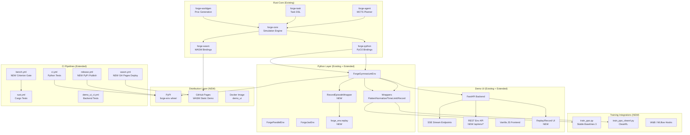
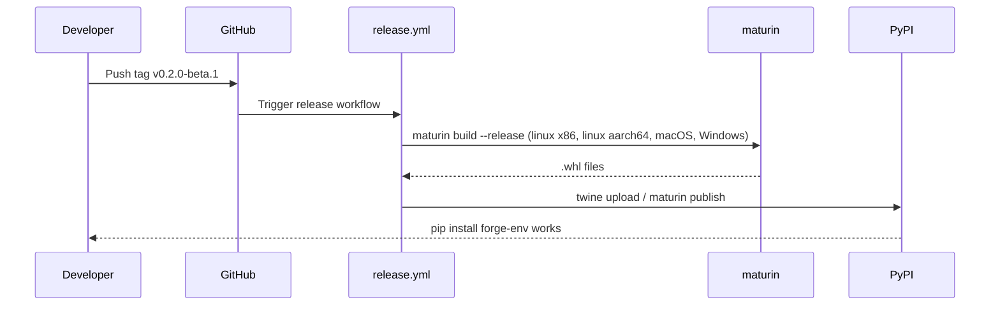
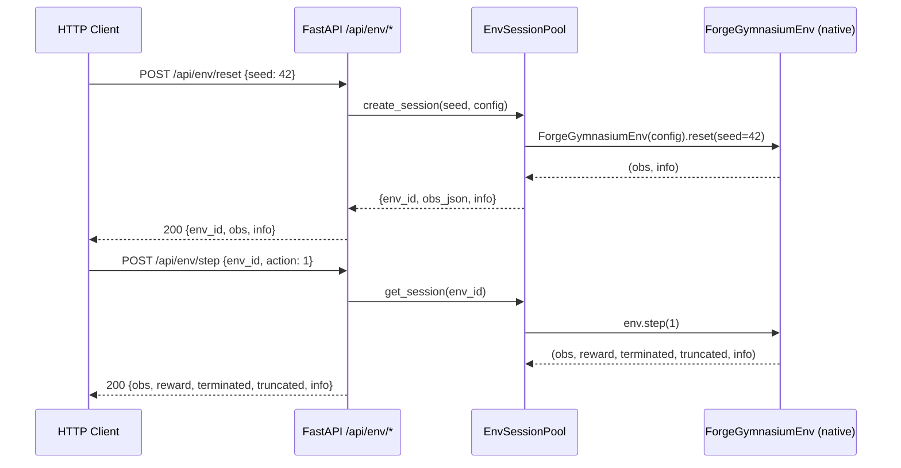
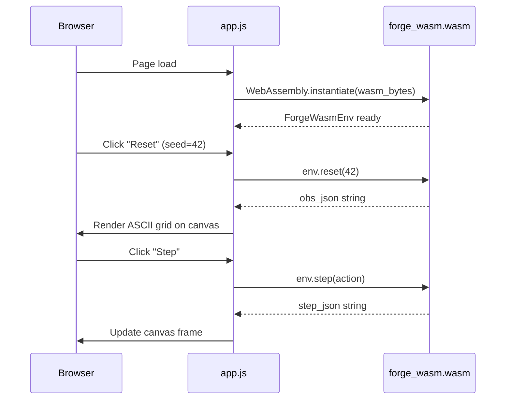

# ADR-001: FORGE Beta Release Architecture

**Feature Slug**: `beta-release`  
**Status**: Proposed  
**Date**: 2026-02-27  
**Author**: Antigravity

---

## 1. Context

FORGE v0.1.0 is a fully functional RL simulation platform. For beta release (v0.2.0-beta), we are adding five major capabilities:

1. PyPI distribution (maturin wheels)
2. GitHub Pages WASM live demo
3. RL training integrations (SB3, CleanRL)
4. REST Environment API
5. Replay/Record mode

This ADR documents architecture decisions for these additions and identifies where they integrate into the existing system.

---

## 2. System Components (Current + Beta)



---

## 3. Data Flow Diagrams

### 3a. PyPI Release Flow



### 3b. REST API Request Flow



### 3c. WASM Demo Flow



---

## 4. Technology Choices & Rationale

| Decision | Choice | Alternatives Considered | Rationale |
|---|---|---|---|
| PyPI distribution | `maturin publish` | `setuptools-rust`, manual | Maturin is the de-facto standard for PyO3; already in use |
| WASM build | `wasm-pack` | `trunk`, manual | `wasm-pack` targets npm + web; integrates with wasm-bindgen |
| GH Pages deploy | `peaceiris/actions-gh-pages` | Manual `git push` | Declarative, supports custom domains, official action |
| REST session store | In-memory `Dict[UUID, Env]` | Redis, SQLite | Zero-dependency for beta; Redis post-beta for multi-process |
| REST session TTL | 30-minute idle expiry | Never expire / per-request | Balances usability (long sessions) vs memory (bounded) |
| GIF export | `gif.js` (browser) | `Pillow` (Python) | Client-side; no server memory; no extra Python dep |
| Training examples | SB3 + CleanRL | RLlib, TorchRL | SB3 is most popular; CleanRL is research favourite |
| W&B/MLflow hooks | Optional via env var | Always-on | Research environments vary; optional = zero overhead by default |

---

## 5. API Contracts

### 5a. REST Env API (OpenAPI)

```yaml
openapi: "3.1.0"
info:
  title: FORGE Environment API
  version: "0.2.0-beta"
paths:
  /api/env/reset:
    post:
      summary: Create/reset a FORGE environment session
      requestBody:
        required: false
        content:
          application/json:
            schema:
              type: object
              properties:
                seed: {type: integer, default: 42}
                config: {type: object, description: "ForgeEnv config dict"}
      responses:
        "200":
          description: Environment reset successfully
          content:
            application/json:
              schema:
                $ref: "#/components/schemas/ResetResponse"
  /api/env/step:
    post:
      summary: Step the environment
      requestBody:
        required: true
        content:
          application/json:
            schema:
              type: object
              required: [env_id, action]
              properties:
                env_id: {type: string, format: uuid}
                action: {type: integer, minimum: 0}
      responses:
        "200":
          description: Step result
          content:
            application/json:
              schema:
                $ref: "#/components/schemas/StepResponse"
        "404":
          description: env_id not found
        "422":
          description: Action out of range
  /api/env/{env_id}/render:
    get:
      summary: Render current environment state
      responses:
        "200":
          content:
            application/json:
              schema:
                type: object
                properties:
                  ascii: {type: string}
                  grid: {type: array}

components:
  schemas:
    ResetResponse:
      type: object
      properties:
        env_id: {type: string, format: uuid}
        obs: {type: object}
        info: {type: object}
    StepResponse:
      type: object
      properties:
        obs: {type: object}
        reward: {type: number}
        terminated: {type: boolean}
        truncated: {type: boolean}
        info: {type: object}
```

### 5b. Replay File Schema

```json
{
  "forge_version": "0.2.0",
  "created_at": "2026-02-27T17:00:00Z",
  "seed": 42,
  "config": {"world": {"width": 64, "height": 64}},
  "actions": [0, 1, 2, 1, 4, 26],
  "obs_hashes": ["sha256:abc...", "sha256:def..."],
  "timestamps_ms": [0, 7, 14, 21, 28, 35]
}
```

---

## 6. Non-Functional Requirements

| NFR | Target | Current |
|---|---|---|
| Step throughput (Python) | ≥ 130,000 steps/sec | 136,419 steps/sec ✅ |
| REST API step latency | < 10ms p99 (localhost) | N/A (new) |
| WASM initial load | < 3s on broadband | N/A (new) |
| WASM bundle size | < 5 MB post opt | N/A (new) |
| RecordEpisodeWrapper overhead | < 1% per step | N/A (new) |
| Python test coverage | ≥ 80% | ~63% (needs enforcement) |
| CI total run time | < 10 minutes | ~5 min currently |
| PyPI install time | < 30 seconds | N/A (new) |

---

## 7. Architectural Risks & Remediation

| Risk | Severity | Remediation |
|---|---|---|
| WASM JSON I/O becomes bottleneck (large obs) | Medium | Profile; if > 5ms/step, consider binary encoding (MessagePack) |
| In-memory REST session store leaks on crash | Medium | Add `asyncio` background task to evict sessions after 30min TTL |
| maturin cross-compilation fails for musl Linux | High | Use `manylinux2014_x86_64` docker image in CI; pin maturin version |
| SB3 version conflicts with training users' existing installs | Medium | Use loose version bounds `stable-baselines3>=2.0,<3.0` |
| Replay file format breaks across versions | Low | Version field + migration functions in `replay.py` |
| WASM panics silently crash demo | Medium | Wrap all WASM calls in `try/catch`; display error in UI |
| CI benchmark noise causes flaky gates | High | Use 10% threshold (not 5%); require 5 repeat runs; Linux runner only |

---

## 8. Decisions Requiring Human Sign-off

> [!IMPORTANT]
> The following decisions require explicit user approval before implementation begins:

1. **PyPI package name**: `forge-env` vs `forge-rl` vs `forgerl` — the name must not conflict with existing PyPI packages
2. **WASM performance target**: Accept 3-second load or invest in `wasm-opt` / partial lazy loading?
3. **REST API session persistence**: In-memory (simple) vs Redis (scalable) for beta — this affects Docker Compose complexity
4. **Windows wheel support**: Include in initial release matrix or defer to post-beta?
5. **Benchmark gate threshold**: 10% (recommended) vs 5% (strict) — 5% will cause false failures on shared CI runners
