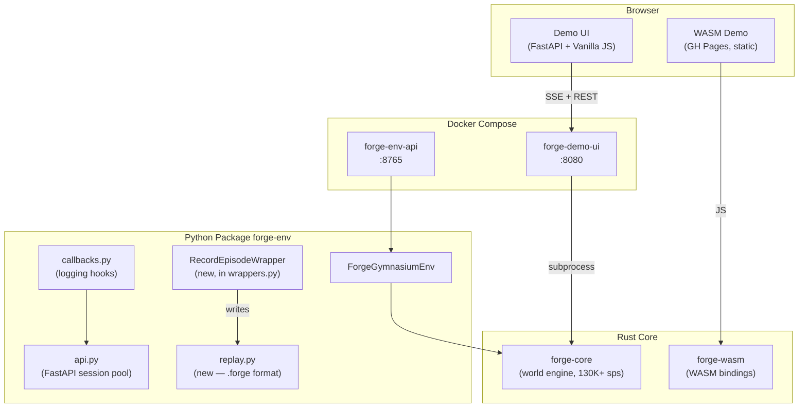

# ADR-003: Multi-Agent Dashboard, Replay/Record, Docker Compose, and Mypy Strict

**Status**: Proposed
**Date**: 2026-02-27
**Author**: Antigravity (engineering agent)
**Branch**: `feat/beta-release-planning`
**Epics covered**: E11 (Replay/Record), E13 (Multi-Agent Dashboard), E16 (Docker), E17 (Mypy Strict)

---

## Context

Sprint 3-5 delivered the WASM live demo, CleanRL/SB3 training scripts, the `callbacks` module, and the FastAPI REST session-pool API. The next sprint block (Sprint 6-7) addresses four parallel workstreams raised in the FORGE beta planning backlog:

1. **Multi-Agent Dashboard UI** — the demo UI renders a monolithic world with no per-agent signal
2. **Replay / Record** — no first-class episode persistence; users log manually
3. **Docker Compose stack** — evaluators need a zero-setup path (no Rust/maturin)
4. **Mypy Strict cleanup** — two dangerous overrides suppress real type errors

---

## System Components (Post-Sprint 7)



---

## Decision 1: Replay File Format — `.forge` JSON (v1)

**Options considered:**

- A. Seed + actions only (small files, requires re-run)
- B. Seed + actions + observations (larger, self-contained) ← **chosen**
- C. Binary protobuf (compact, complex tooling)

**Decision**: Option B. The `observations` field is optional (clients may omit to save space). Self-contained replays are more portable and support GIF export without re-running the environment. Post-beta we evaluate `zstd` compression.

---

## Decision 2: Multi-Agent Dashboard — No Backend Changes

**Rationale**: The REST API (`/step`) already returns `info` dict. All rendering logic lives in `demo_ui/frontend/app.js`. Adding a backend "agent state" endpoint is unnecessary — the client assembles the per-agent state from step responses.

**Color palette**: 8 WCAG-AA-accessible Oklab-rotated colors defined as CSS custom properties `--agent-0-color` … `--agent-7-color`. Avoids hardcoded hex values.

**Sparklines**: SVG `<polyline>` (not canvas) for accessibility and crisp scaling. Up to 200 data points buffered per agent (rolling window).

---

## Decision 3: Docker — Multi-Stage, Two Services

**Options considered:**

- A. Single image serving both demo-ui and env-api (simpler)
- B. Two separate images built from a multi-stage `Dockerfile` ← **chosen**

**Decision**: Option B. `forge-env-api` must include the compiled `.pyd` wheel; `forge-demo-ui` does not need it. Separate images allow independent scaling and image pulls. Both images share the `builder` stage (maturin wheel build) to avoid double compilation.

**Builder stage**: `rust:1.75-slim` → install maturin → `maturin build --release` → `.whl` artifact.
**Runtime stages**: `python:3.11-slim` COPY wheel, pip install.

---

## Decision 4: Mypy — Remove `warn_unused_ignores = false` Override

**Immediate risk**: The override `warn_unused_ignores = false` for `tests.*` and `demo_ui.*` silently allows `# type: ignore` comments to remain after the underlying error is fixed, creating a false sense of correctness.

**Decision**: Remove the `warn_unused_ignores = false` line. Address the resulting ~12 stale `# type: ignore` comments by:

1. Replacing with `TYPE_CHECKING` guards for optional SB3/torch/wandb/mlflow imports
2. Properly typing `_fh: IO[str] | None` in `callbacks.py`
3. Using `asyncio.Task[None]` in `api.py`

Do **not** move to full `--strict` (which adds `disallow_any_generics`, `disallow_any_explicit`, etc.) — that would require hundreds of changes to test files using `dict[str, Any]`.

---

## API Contracts

### Replay CLI

```
forge-replay <path.forge> [--fps 10] [--start-frame 0] [--export-gif out.gif]
```

### Docker Compose env vars

| Variable | Default | Description |
|---|---|---|
| `DEMO_UI_PORT` | `8080` | Host port for demo UI |
| `API_PORT` | `8765` | Host port for env API |
| `FORGE_MAX_SESSIONS` | `64` | Max concurrent env sessions |
| `FORGE_SESSION_TTL` | `3600` | Session TTL in seconds |
| `FORGE_CORS_ORIGINS` | `*` | Allowed CORS origins |

---

## Non-Functional Requirements

| Concern | Target |
|---|---|
| Replay step overhead | ≤ 1% vs bare env |
| GIF export memory | ≤ 200 MB for 2000 frames |
| Docker image size | ≤ 800 MB total (demo-ui + api) |
| Agent panel render | ≤ 16 ms per step (60 fps) |
| Mypy CI gate | Zero errors on `python/ demo_ui/ tests/ examples/` |

---

## Architectural Risks

| Risk | Probability | Impact | Mitigation |
|---|---|---|---|
| GIF export via `Pillow` slow for large episodes | Medium | Poor UX | Stream frames progressively; gate at 2000 frame limit |
| Multi-stage Docker build cold-start time >5 min | High | CI slowness | Cache `cargo registry` and pip via GH Actions cache |
| Mypy strict breaks 3rd-party stubs for optional deps | Medium | CI failure | Add missing stubs as `[[tool.mypy.overrides]]` with `ignore_missing_imports = true` scoped narrowly |
| `.forge` format churn before v1.0 | Medium | Compat burden | Embed `format_version: 1`; write migration guide in `docs/` |
| `warn_unused_ignores = false` removal surfaces real errors | High | Short-term noise | Fix all errors in a single "mypy-cleanup" PR before enabling CI gate |

---

## Human Sign-Off Required

> [!IMPORTANT]
> **Decision 1**: Should `.forge` files store full observations by default, or only seed + actions? This affects file sizes significantly for large environments.

> [!IMPORTANT]
> **Decision 3**: Should both `forge-demo-ui` and `forge-env-api` be published to `ghcr.io` on every push to `main`, or only on tagged releases?

> [!CAUTION]
> Removing `warn_unused_ignores = false` (Decision 4) will cause CI to fail until all stale `# type: ignore` comments are resolved. This must be done in a single coordinated PR.
